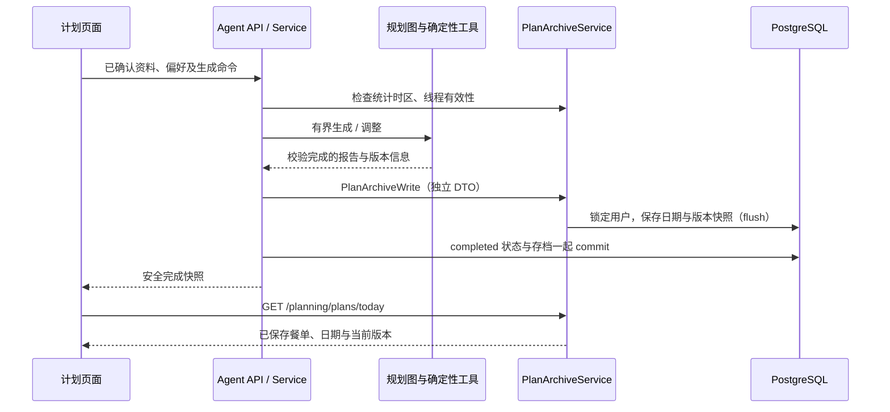

# 今日计划为什么要独立存档

## 原先保存了什么

Agent 事件保存安全报告，Checkpoint 保存短期可恢复的图状态；两者会按运行保留策略清理。原来的 `planning_completion_projections` 只保存看板目标资格，不保存完整三餐。React 的局部状态在页面卸载后也会丢失。因此“生成结果存在数据库里”并不等于“用户能长期重新打开今日计划”。

## 数据归属与请求链路

正式存档归 `app/planning/`，沿用 PostgreSQL。`diet_plans` 保存用户、日期、IANA 时区和当前版本号；`diet_plan_versions` 保存完整报告、确定性营养合计与规则/菜谱版本证据。它没有指向 Agent 或菜谱的级联外键，因此临时运行清理和菜谱目录修改不会改变历史餐单。

HTTP 层不接受客户端提交的营养结果；只有完成边界能写存档。营养合计从确定性工具生成的三餐值用 Decimal 求和，模型不能提交数值真相。个人资料保存与餐单存档分离：不勾选保存身体资料仍会保存成功餐单，但身体资料、原始对话与模型输出不会进入餐单快照。

## 日期、并发与失败

日期取线程开始时间转换到已确认的统计时区；跨午夜完成不会被错归到下一天。同线程调整绑定原计划日期。没有确认时区时前端显示确认入口，复用 records 公开 API；后端返回 409，不能悄悄采用服务器时区。

写入先锁定稳定的 user 行，避免“当天还没有 plan 行”时两个请求都认为自己能创建首版。数据库同时提供活跃用户日期唯一索引、用户运行唯一约束和计划版本唯一约束。相同运行重复完成不会增加版本；不同生成结果形成连续版本，读取旧版本不依赖当前菜谱目录。

ArchiveService 只 flush，AgentService 统一 commit；写入异常会 rollback 并返回 `PLAN_ARCHIVE_FAILED`。因此失败生成、失败调整或保存故障都不替换旧的成功版本。重新生成后旧线程不能覆盖新餐单。

## 读取、页面与删除

- `GET /api/v1/planning/plans/today`：返回服务端日期、统计时区和今日计划；尚未确认时区时三者为空。
- `GET /api/v1/planning/plans?before=YYYY-MM-DD&limit=20`：按日期降序的 keyset 分页，默认 20 条、最多 50 条。
- `GET /api/v1/planning/plans/{id}?version=1`：读取当前或指定版本；不存在、他人资源和已删除资源统一 404。
- `DELETE /api/v1/planning/plans/{id}`：删除这天全部版本的报告、合计和来源快照，保留不含餐单的幂等墓碑。

H5 仍然是四个 Tab；计划页加载今日存档，成功后显示自动保存，重新生成时展开资料复核。历史和详情使用独立 DetailLayout。详情通过上一版/下一版查看历史，删除必须确认。TanStack Query 管理服务端存档，React 局部状态仅用于生成中的报告和交互反馈；不把健康资料写入 localStorage。

墓碑阻止旧线程和删除前已发出的生成请求让餐单复活；删除后用户重新发起的生成可以建立新的计划。删除餐单存档不删除已确认餐食，也不改变 Agent 临时数据的独立保留策略。存档餐单从不直接计入实际摄入。

只有今天的当前版本且运行事件仍可用时，才返回可调整线程。临时会话过期后仍可阅读完整餐单，页面提示重新生成。此功能不会从旧 Checkpoint 自动回填历史：升级前未正式存档的结果需要重新生成。

## 如何验证

- `tests/planning/test_plan_archive.py` 用 fake repository 与注入时钟验证跨日、旧版、去重、删除、防复活、分页和隔离。
- `tests/integration/test_diet_planning_agent_api.py` 使用独立 PostgreSQL，覆盖真实生成和公开读/删 API；注入写入异常验证 rollback；两个并行连接验证同日唯一性和连续版本。
- 前端 PlanPage 和 SavedPlanPages 测试覆盖恢复、确认时区、加载失败重试、版本导航、删除确认和空态。
- `tests/e2e/plans.spec.ts` 真实注册登录，通过后台公开页面启用 Fake Provider 配置，然后生成、刷新、查看历史、调整、切换版本、取消/确认删除；不能用伪造 token 替代页面验收。
- 实际运行结果与内置浏览器证据写入本次 quick SUMMARY，不把测试代码存在等同于验证通过。

## 常见错误

1. 只缓存 thread_id：线程清理后依然没有餐单，且不能跨设备恢复。
2. 只存 recipe_id：目录变更后历史营养会漂移；需要不可变快照与版本证据。
3. 先把旧版删除再生成：失败会把用户已有计划一起丢掉。
4. 用浏览器日期作为业务权威：跨时区/午夜会错日，应由服务端使用确认的统计时区。
5. 完成事件发出后再另开事务存档：界面可能显示成功，数据却没保存。
6. 用户点击删除后只隐藏列表：后台旧请求仍可能复活餐单，必须保留防重放墓碑。
