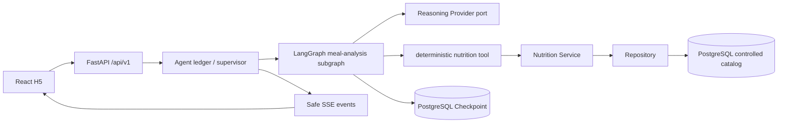
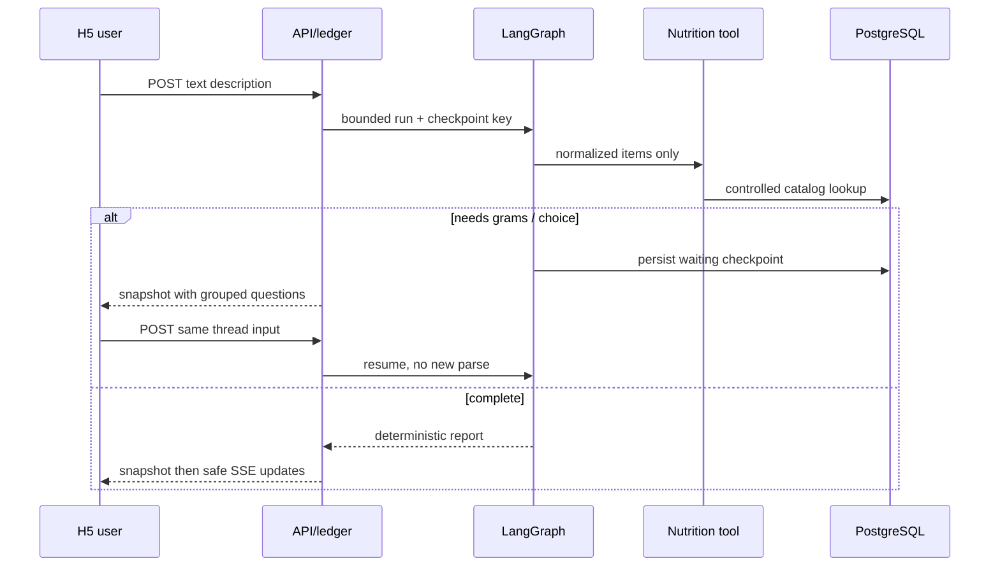

# Phase 2：可追问餐食分析的工程导读

> 本文只说明已经实现的文字餐食分析链路。图片识别、餐食确认保存、长期记忆、饮食规划和后台管理仍不在 Phase 2 范围内。当前唯一 release report 为 [`phase2-release.json`](../../backend/evals/phase2-release.json)，其结果是 `FAIL`：不是产品功能失败，而是五个 Medium 的真人/Judge 配对评分均为常数，Spearman 数学上未定义，发布门按合同 fail-closed。

## 为什么这样分层

模型负责把自然语言转成受校验的候选结构，绝不负责营养数值真相。数值只来自受版本和 hash 控制的营养目录，克数、热量和三大营养素由确定性工具计算；这使同一输入可复算、可审计，也能在信息不够时明确追问而非猜测。



依赖方向始终是 API → application/service → repository → model；Graph 只能经工具调用领域服务，不能越过服务层查表。Provider DTO、Graph state、API schema 分开校验，避免把模型返回值误当持久化或公开 API 合同。

## 一次请求如何流动

1. 已登录 H5 向公开 `/api/v1/agent/threads` 提交文字；access token 只在运行时内存，refresh token 只在 HttpOnly Cookie。
2. API 建立 tenant-bound thread 和 ledger run，再由 supervisor 设定循环、工具、时间和成本上限。
3. LangGraph 调用 Provider port 解析候选；Fake Provider 支撑测试，真实 Provider 仍通过同一 DTO/错误分类边界。
4. 工具向 Nutrition Service 查询受控目录、规范化克数并做确定性计算。找不到可靠克数或食物候选时，Graph 写入 checkpoint 并返回集中追问。
5. 用户补充后仍恢复同一 thread；已完成的 parse/工具工作不重复。定向修正只重算脏项目。
6. API 先返回 ledger-owned snapshot，再提供仅含安全摘要的 SSE。断线后从 snapshot 恢复，前端至多一次事件重连；未知 outcome 不会被静默当作成功。



## Checkpoint 与业务账本不是同一件事

- PostgreSQL Checkpoint 保存短期图状态，解决 interrupt/resume 和 worker 重开。
- Agent ledger/run/event 是业务审计边界：控制租约、幂等命令、删除、保留和安全事件序号。
- D-18 清理 worker 通过数据库租约执行 24h/7d/30d 保留；删除先关闭分析与事件流，再按策略异步清理。

这两个存储都需要，因为“图能继续”不等于“业务命令可去重、可授权、可删除”。

## 前端合同与可观察性

OpenAPI 是后端公开边界；`frontend/src/features/agent/api/generate-contracts.mjs` 生成 TypeScript、Zod schema 和 client，漂移测试阻止手工类型滞后。页面把 URL 的 `thread` 当作可丢弃引用：foreign 或已删除 thread 收到 404 时清理 URL，绝不显示他人状态。

Phoenix 只接收脱敏追踪；评测、日志和证据不保存原始餐食、图片、API key、token、Provider 原始响应或完整 reasoning。SSE 事件只有安全摘要，前端不把事件文本作为权威报告。

## 启动、调试与测试

常规本地启动仍以根 README 为准。Phase 2 的关键验证分层如下：

```bash
# 真实 PostgreSQL + Fake Provider：冻结 24-case 机器证据
cd backend
uv run python tests/run_pg.py --env-file .env.test.example -- \
  uv run python evals/evaluate_phase2.py verify-code-eval \
  --dataset evals/phase02-cases.jsonl --result evals/phase2-code-eval.json

# formal signoff 与唯一 release report（当前 verify-release 应非零，因为 report 为 FAIL）
uv run python evals/evaluate_phase2.py validate-signoff \
  --dataset evals/phase02-cases.jsonl --code-eval evals/phase2-code-eval.json \
  --signoff evals/expert-signoff-phase2.json
uv run python evals/release_phase2.py verify-release evals/phase2-release.json

# 跨栈 H5 路径（会启动本地 test PostgreSQL/Mailpit）
cd ../frontend
npm run test:e2e -- --grep "phase 2 direct grams contract|phase 2 visual candidate"
```

已通过的 Playwright 路径包括：克数直算、同 thread 的集中追问恢复、定向修正、重载后零二次 POST、删除、foreign-thread 404 与获批准的 430×932 视觉 baseline。内置浏览器已确认本地公开首页；认证后的浏览器成功/错误/空态仍需在浏览器安全策略允许输入测试凭据时再次人工验收，不能拿自动化 E2E 冒充它。

## 常见错误

| 错误 | 为什么错 | 正确做法 |
|---|---|---|
| 让模型直接报 kcal | 不可复算且会漂移 | 只解析候选，数值走 deterministic nutrition tool |
| 缺克数时默认 100g | 制造伪精确 | checkpoint 后集中追问 |
| 断线时再 POST 分析 | 会重复收费/重复写账 | 读 snapshot，再受限重连 SSE |
| 用 thread URL 当授权 | 会泄漏他人数据 | 后端 tenant RBAC 返回 404，前端清理引用 |
| 改真人分数刷评测 | 破坏审计 | 只物化真实模板；常数 Spearman 必须 FAIL |
| `--update-snapshots` 覆盖视觉基线 | 绕过人工审查 | 新 candidate + 精确 SHA 批准 + `cmp` 机械晋升 |

## 面试深挖题

1. 为什么 checkpoint 不能替代业务 ledger？
2. 如何证明恢复没有重新调用解析模型？
3. 受控目录和模型候选在数据责任上怎样分工？
4. 为什么 foreign thread 用 404 而不是 403？
5. 常数评分为什么不能被当作“完美一致”而通过 Spearman？
6. SSE 为什么必须 snapshot-first，且客户端重连次数要有限？
