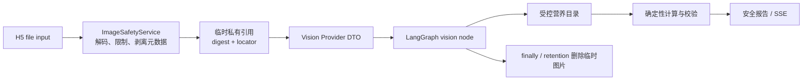
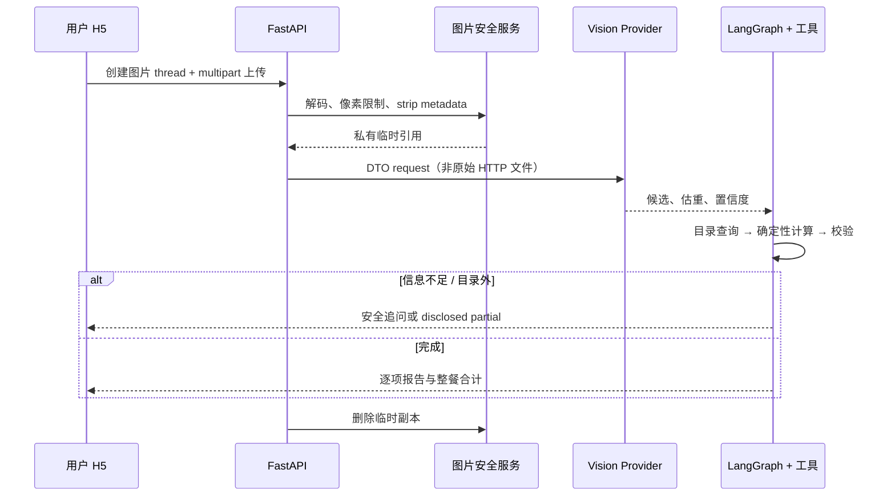

# Phase 3：多模态餐食分析闭环

> 本文记录已经实现的本地图片分析链路。它不承诺任意图片都能识别正确，也不把模型的估重当作营养真相。当前冻结证据见 [`phase03-release.json`](../../backend/evals/phase03-release.json)。

## 为什么图片不能直接交给模型

浏览器提供的 MIME、文件名和 `accept` 属性都可以伪造。后端先在 `ImageSafetyService` 做大小、真实解码、像素、规范 MIME 和元数据剥离检查，图片只以随机 locator 和 SHA-256 摘要短期存在于应用控制目录。原图、base64、EXIF、原始文件名、公开 URL、Provider 原文和完整推理过程均不进入业务数据库、Graph State、SSE 或评测文件。

Qwen-VL 的职责只是给出菜名候选、估重和置信度。它的结果先经过 `VisionMealResult` 的 Pydantic 校验；随后仍由 LangGraph 通过受控目录查询、确定性营养计算与校验工具生成公开数字。模型没有写 kcal、蛋白质或目录真相的权限。



## 端到端请求链

1. 已登录用户先创建 `POST /api/v1/agent/threads/image`，再以 multipart 和 `Idempotency-Key` 上传到对应 thread。
2. API 在读图前验证 thread 的用户归属；foreign thread 返回 404，不能用 URL 猜测访问其他人的任务。
3. 图片通过安全校验后，Graph 只拿到最小化 `StateImageReference`。Vision Provider 接口接收的是已验证引用，不接收 HTTP 文件或 ORM。
4. Qwen 或 Fake Provider 返回经 DTO 校验的 `food_name`、`estimated_grams`、`confidence`。混合菜会优先映射受控成品菜；例如“辣椒炒肉”命中参考配方目录。
5. 缺份量、低置信或目录外时，Graph 返回追问或 partial 报告；不能把未知菜静默计为 0，也不能把估重展示成精确称量。
6. 成功、显式失败、过期和用户删除都删除本应用的临时副本。第三方模型仍会按所选区域、业务空间和其服务条款处理请求；“应用已删除临时副本”不等于“Provider 零留存”。



## Provider 失败为什么不能随便重试

- `TRANSIENT`：在有界调用和成本预算内最多重试一次。
- `PERMANENT / PROVIDER_SCHEMA_INVALID`：结构不符合 DTO，直接停止；不把原始返回暴露给页面。
- `OUTCOME_UNKNOWN`：网络中断时无法确定供应商是否已计费或已完成，绝不盲重试。保留安全状态，要求用户明确发起新尝试。

这个分类防止“刷新页面、自动再试”把一张图重复计费。SSE 只展示稳定状态和恢复动作，最终数值始终以 thread snapshot 的报告为准。

## 如何测试和调试

```bash
cd backend

# Vision DTO、Graph 路由与冻结评测合同
.venv/bin/python -m pytest \
  tests/test_qwen_vision_provider.py \
  tests/unit/test_agent_multimodal.py \
  tests/unit/test_phase03_eval_contract.py -q

# 真实 PostgreSQL 的上传归属、幂等与删除链
.venv/bin/python tests/run_pg.py --env-file .env.test.example -- \
  .venv/bin/python -m pytest tests/integration/test_agent_multimodal.py -q

# 12 条合成、hash-bound 的 Phase 3 回放；不调用付费模型
.venv/bin/python evals/evaluate_phase3.py \
  --dataset evals/phase03-cases.jsonl \
  --output evals/phase03-release.json
```

冻结集覆盖单/多菜、模糊、目录外、高低估重、危险图片、schema invalid、transient、`OUTCOME_UNKNOWN`、过期和删除。它会在哈希漂移、缺少类别、未经授权目录项、零分母或任一关键安全断言失败时 fail closed。

已在内置浏览器走过真实登录、相册选择和报告恢复路径；当前本地配置的一次辣椒炒肉图片验证命中参考配方并显示估算 350g、551.4 kcal。它是端到端可用性证据，不是对真实世界准确率的统计结论。

## 常见错误

| 错误 | 后果 | 正确做法 |
|---|---|---|
| 直接用模型输出 kcal | 数值不可复算 | 模型只输出候选，营养走受控目录和工具 |
| 前端只靠 `accept=image/*` | 可上传伪造或损坏文件 | 后端真实解码、大小和像素限制 |
| 图片失败后无限重试 | 重复调用、重复费用 | 按失败分类和预算处理，unknown 不自动重试 |
| 目录外项目显示 0 kcal | 把未知伪装成完整 | partial 报告明确未计入项目 |
| 说“上传即删除，因此第三方不留存” | 超出本应用控制边界 | 只说明本地临时副本删除，另列 Provider 区域/条款 |
| 保存原图或模型原文来调试 | 扩大隐私面 | 仅保存最小审计元数据和安全错误码 |

## 面试深挖题

1. 为什么 Vision DTO、Graph State、ORM 和 API schema 要分开？
2. `OUTCOME_UNKNOWN` 为什么比 transient 更危险？
3. 如何证明模型没有成为营养数值真相来源？
4. 删除临时文件为什么还需要过期清理 worker？
5. 为什么冻结评测必须同时覆盖危险图片和目录外菜，而不只测识别成功？
