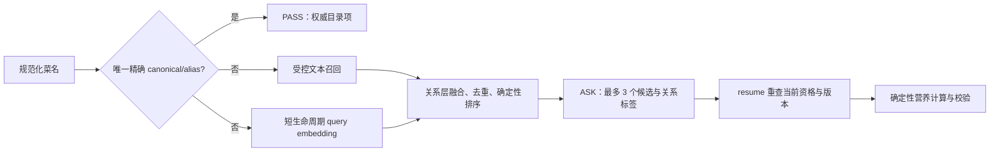
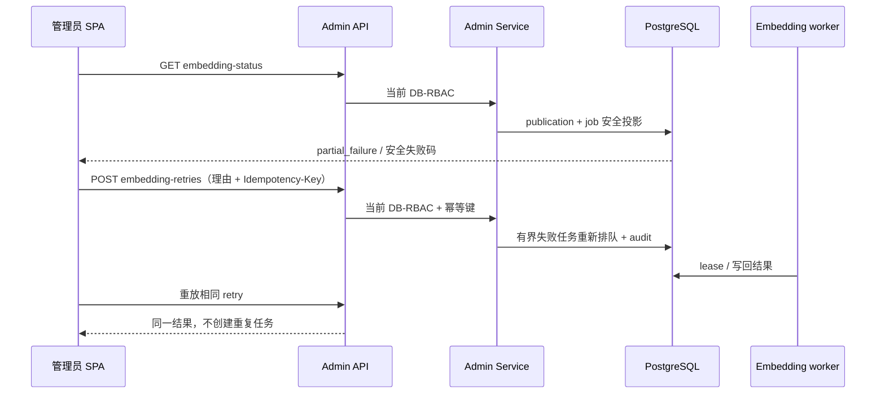

# Phase 06.3：受控菜品混合检索

> 本文解释受控营养目录如何在“唯一精确命中”与“需要用户确认的非精确召回”之间划清边界。它不承诺任意输入都能找到正确菜品，更不允许模型、向量或 Langfuse 成为营养数值真相。

## 精确优先与确认恢复

PostgreSQL 中已发布且当前合格的目录是业务真相；`pg_trgm` 和 pgvector 是可重建派生检索层。唯一精确 canonical name/alias 命中可直接 `PASS`；其余文本或语义候选最多三个且一律 `ASK`。因此“米饭”绝不被“蛋炒饭”覆盖。变体召回的前提是目标菜品存在于当前合格目录；不存在的菜品不能作为必须召回的验收目标。当前真实目录没有“番茄炒蛋”和“西红柿炒鸡蛋”，已撤销这组菜名的真实验收要求；自动化测试中的同名数据仅是自建合成 fixture。

冻结评测也必须跟随真实入口更新。当前规划图要求完整餐单和目标，调整输入使用 `feedback`；直接给空状态传旧的 `food_query` 不会执行检索。评测在隔离事务中通过真实目录、规划服务和规划图生成三餐，再提交“午餐换成…”；同时检查没有菜谱的检索目标被规划资格门拒绝，原餐单不变。三入口的相同检索结果不能被解读成最终页面候选相同。

报告绑定评测源码哈希。评分、脱敏单测可显式使用历史报告的源码基线验证历史合同，但当前激活集成测试必须真实生成新的临时报告，并验证源码变化后拒绝旧证据；不得仅重写历史报告哈希来让检查变绿。



模型只能通过 Agent tool 调用 `NutritionService`。Graph 不直接查询目录或调用 embedding SDK；工具结果、Graph State、HTTP Schema 和 ORM 均分离并运行时校验。Provider 只接收规范化的单项受控菜名，不发送用户身份、餐食描述、份量、身体或健康数据，也不持久化用户查询向量。

非精确候选按“名称变体 → 地域/做法变体 → 同类成品菜”分层；分数只能在同层参与排序，不能为凑 Top 3 引入低质量结果。页面显示可理解的关系理由，不显示距离或融合分数。用户选择后必须在 resume 再读取 publication、资格和版本；撤销、失格、版本切换或无效 ID 都 fail closed，不能把旧页面候选当事实。

## 发布、worker、重试和激活

发布后精确和文本检索立即按 PostgreSQL 当前资格可用；embedding job 异步生成。worker 以 PostgreSQL lease 领取 immutable vector-space/build 的单项任务，provider 结果回写为 embedding 或安全失败码。进程重复启动或多进程竞争都不能绕过数据库 lease。

管理员读取 publication 级安全聚合：`pending`、`processing`、`partial_failure`、`failed` 或 `ready`。投影只含 job ID、尝试次数和安全失败码，不含菜名、向量或 Provider 原文。对剩余尝试次数内的 failed job，管理员填写理由并发送 `Idempotency-Key` 的 publication 级 retry；同命令重放不得新增 job 或额外 Provider 成本。普通用户对状态 GET 和 retry POST 都必须得到 403，隐藏菜单不是授权。



模型、维度、adapter 或 `retrieval_version` 改变时必须创建独立 immutable vector space/build，绝不能混用。完成 embedding 不等于可切换：激活必须同时提供数据库管理员身份、明确 `vector_space_id` 和 `build_id`、原因、幂等键与 hash-bound 的 PASS release。服务端复算冻结 dataset、评测器和策略版本，核对该 build 的 manifest/completion evidence 与 ready embedding，最后在同一事务更新 active pointer 和审计。任一证据漂移、缺失或 FAIL 都不会切换。

## Phoenix 与 Langfuse

Phoenix 是应用运行时 tracing，只记录 allowlist 的工具名、耗时、费用、调用数、版本和安全摘要。Langfuse 仅用于显式、隔离的冻结 Dataset Experiment；日常启动、普通测试、CI 和 release 均不依赖它。Langfuse 允许 dataset/hash、代码/检索/embedding 版本、候选安全投影、耗时和锁定评分；禁止真实用户输入、图片、完整提示词、Provider 原文、密钥或思维链。

成功和失败 trace/score 同样保留 30 天。`purge` 只按 UTC 年龄和固定 trace 标签清理，并对异步删除回查；不检查 payload 或 PASS/FAIL，也不写永久明细 artifact。冻结数据、汇总 release report 与 hash 则永久保存在 Git；可选 Langfuse 镜像从不构成 release 证据。

## 启动、调试和验收

先启动隔离依赖；以下命令不调用付费 Provider。`run_pg.py` 只允许测试配置指向 `postgres-test`，不能把开发库当作清空目标。

```bash
docker compose up -d --wait postgres postgres-test mailpit

cd backend
uv sync --extra dev --locked
uv run alembic upgrade head
uv run uvicorn app.main:app --reload
uv run ruff check app tests evals
uv run mypy app
uv run python tests/run_pg.py --env-file .env.test.example -- uv run pytest
uv run python tests/run_pg.py --env-file .env.test.example -- \
  uv run python evals/phase_06_3/evaluate.py --verify-release

# 仅 hash-bound PASS release、DB 管理员和明确 build 同时成立时可请求激活。
# 受控 CLI 在互斥的 --actor-user-id / --actor-email 中二选一；email
# 只在本地查出 UUID，AdminService 仍重新校验数据库 RBAC 并审计 UUID。
uv run python evals/phase_06_3/activate.py --help

# 可选、本地且独立的 Langfuse；绝不能替代 release。
docker compose -f ../docker-compose.langfuse.yml --env-file .env.langfuse.example up -d
uv run python evals/phase_06_3/evaluate.py --help
uv run python evals/phase_06_3/langfuse_retention.py purge --older-than 30d --verify --format json

cd ../admin-frontend
npm ci
npm test -- --run
npm run build
npm run test:e2e -- tests/e2e/admin-management.spec.ts \
  --grep "embedding status and batch retry"
```

Playwright 启动独立 FastAPI、用户 SPA、后台 SPA、Mailpit 与测试 PostgreSQL。路径必须经过注册/验证、首次管理员 bootstrap、真实后台登录、公开 `/api/v1/admin/*` 接口和可见页面；除首次管理员角色 bootstrap 外，禁止直写数据库、token/Cookie 注入、浏览器存储读取、内部 service/repository 或 mock endpoint 构造目录或索引状态。

## 常见错误

| 错误 | 后果 | 正确做法 |
| --- | --- | --- |
| 非精确候选自动选中 | 把召回误当事实 | 始终 `ASK`，resume 重查资格和版本 |
| 把向量结果当营养数值 | 不可复算 | 数值只由受控目录和确定性工具计算 |
| 发布失败就回滚目录 | 检索通道被错误耦合 | 发布有效；索引状态独立可见、有限重试 |
| 旧空间激活新规则 | 跨版本混检索 | 按 identity 新建 immutable build |
| 把 Langfuse 当 release | 外部服务掩盖门禁 | release 只看真实 PG 冻结评测和 hash |
| E2E seed 或复制 token | 未验证真实路径/RBAC | 仅公开 UI/API；bootstrap 只建首位角色 |

## 面试深挖题

1. 为什么唯一精确 alias 可 PASS，非精确通道必须 ASK？
2. 为什么用户选择后还要重查 publication eligibility？
3. current-qualified SQL 如何让失格菜立刻退出向量召回？
4. 为什么切换 active vector space 需要 manifest、completion evidence 和 release hash？
5. Phoenix 与 Langfuse 的触发时机和发布证据有什么不同？
