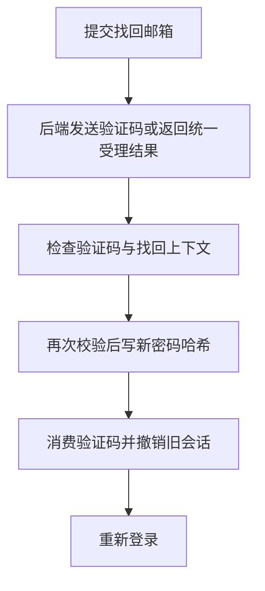

# 02 密码找回与登录设备管理

[返回功能学习总目录](README.md)

这个功能让忘记密码的用户通过邮件验证重设密码，并撤销旧登录关系。已登录用户也能查看、撤销自己的其他会话。它不调用 AI，但保护个人餐食和 AI 对话的访问入口。

## 1. 核心能力

确认邮箱控制权后更改密码；让旧会话失效；设备管理只能操作自己的登录关系。

## 2. 业务背景

小林设了新密码后，如果旧设备还可以一直刷新登录状态，修改密码就没有完成保护。因此新密码和旧会话撤销要作为一组业务操作处理。

## 3. 整体执行流程



流程图展示主线；失败、追问等分支在下面对应步骤中说明。

## 4. 关键代码与设计理由

### 4.1 先受理，不暴露邮箱是否存在

位置：[service.py](../../backend/app/accounts/service.py) 的 `RecoveryService.request_reset`。不存在、未启用或未验证的账号返回外形一致的受理结果，但没有可用于改密码的真实验证记录。这样不能通过响应轻易枚举注册邮箱。

`verify` 只检查验证码；真正改密码的 `reset` 会再次校验，不能只信任上一页“验证成功”的显示。

### 4.2 密码和会话一起改变

位置：同文件的 `reset`。

```python
user.password_hash = hash_password(new_password)
user.updated_at = now
challenge.consumed_at = now
self._session_family_revoker.revoke_all_session_families(
    user_id=user.id, revoked_at=now
)
self._commit()
```

先写新哈希，再消费验证码、撤销全部登录会话系列，最后提交。失败时回滚数据库操作。这里没有找回旧密码原文的过程。

### 4.3 设备管理是已登录后的独立操作

[service.py](../../backend/app/auth/service.py) 的 `list_sessions` 和 `revoke_session` 按用户 ID 查询和撤销。当前会话要通过退出登录处理。访问令牌与撤销检查的具体范围见[登录注册](feature-auth.md)。

## 5. 难懂语法

`try / except` 是尝试执行与失败处理；`raise` 把错误交给上层。函数名中的 `session family` 表示一次登录及其轮换产生的一组刷新凭证。

## 6. 怎么验证、怎么继续读

读 [test_account_recovery.py](../../backend/tests/accounts/test_account_recovery.py) 的验证码、修改密码和撤销用例，再看 [test_refresh_service.py](../../backend/tests/auth/test_refresh_service.py) 的用户归属用例。替换邮件服务可避免发真实邮件。

读完试着回答：**为什么修改密码接口必须再次验证验证码？**

---

本文解释当前代码行为；代码块为源码节选，省略外围逻辑，不能单独运行。示例用于讲解，不代表真实模型必然输出相同结果。测试执行范围见总目录。
