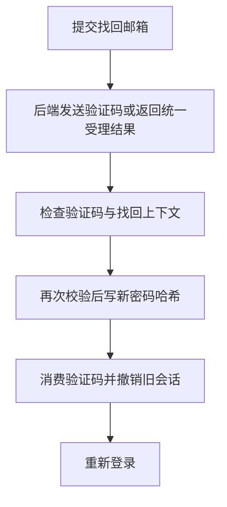

# 02 密码找回与登录设备管理

[返回功能学习总目录](README.md)

这个功能让忘记密码的用户通过邮件验证重设密码，并撤销旧登录关系。已登录用户也能查看、撤销自己的其他会话。它不调用 AI，但保护个人餐食和 AI 对话的访问入口。

## 1. 先看一个实际例子

小林忘记密码，通过邮件验证码设新密码，并要求旧设备不能再续期。主线是：受理邮箱 → 验证控制权 → 密码与旧会话一起更改。

这个例子贯穿下面的执行过程。示例数据用于理解代码，不是线上测量或真实模型效果证明。

## 2. 为什么需要这样实现

小林设了新密码后，如果旧设备还可以一直刷新登录状态，修改密码就没有完成保护。因此新密码和旧会话撤销要作为一组业务操作处理。

## 3. 一张图看懂全过程



图展示主线，失败与追问分支在第 5 节对照阅读。

## 4. 跟着这个例子读代码

以下为当前源码的连续节选，省略外围处理，不能单独运行。每一步都说明调用位置和数据去向。

### 4.1 受理邮箱，不泄露账号是否存在

**收到什么**

找回 API 收到小林填写的邮箱。

**代码在哪里**

[backend/app/accounts/service.py](../../backend/app/accounts/service.py) 的 `RecoveryService.request_reset`。

```python
now = self._now()
user = self._repository.get_user_by_email(email.strip().lower())
if user is None or not user.is_active or user.email_verified_at is None:
    # Keep body and cookie shapes indistinguishable. This context has no DB row,
    # hence cannot be used to verify or reset a password.
    return self._decoy_dispatch(now=now)
```

**为什么这样写**

无效账号也返回外形一致的受理结果，不能用接口枚举用户。替代上下文没有可用于修改密码的真实记录。

**处理后变成什么，交给谁**

有效账号继续发验证码；无效账号不能借替代上下文改任何密码。前端进入验证码步骤。

### 4.2 预验证不能代替重设时的校验

**收到什么**

小林输入验证码，页面要判断能否进入新密码步骤。

**代码在哪里**

[backend/app/accounts/service.py](../../backend/app/accounts/service.py) 的 `RecoveryService.verify`。

```python
def verify(self, *, context_token: str, code: str) -> None:
    """Check a code without consuming it; reset remains the single use operation."""

    try:
        challenge = self._current_challenge(context_token)
    except RecoveryContextInvalid:
        if self._decoy_context_is_valid(context_token):
            raise InvalidRecoveryCode
        raise
    self._validate_code(challenge=challenge, context_token=context_token, code=code)
```

**为什么这样写**

这里只检查，不消费验证码。reset 仍会重新查验证记录，不能相信前端声称“已经验证”。

**处理后变成什么，交给谁**

验证通过但密码尚未变化；下一次请求仍要提交可校验的上下文与验证码。

> 语法小注：`raise` 将错误交给上层 API 处理。

### 4.3 新密码与撤销旧会话一起提交

**收到什么**

reset 收到新密码并重新验证验证码。

**代码在哪里**

[backend/app/accounts/service.py](../../backend/app/accounts/service.py) 的 `RecoveryService.reset`。

```python
self._validate_code(challenge=challenge, context_token=context_token, code=code)
user = self._user_for(challenge)
try:
    user.password_hash = hash_password(new_password)
    user.updated_at = now
    challenge.consumed_at = now
    self._session_family_revoker.revoke_all_session_families(
        user_id=user.id, revoked_at=now
    )
    self._commit()
except Exception:
    self._rollback()
    raise
```

**为什么这样写**

哈希更新、验证码消费和全部会话撤销必须一起成功；撤销失败就回滚，避免修改一半。

**处理后变成什么，交给谁**

新密码可以用于重新登录，旧刷新关系失效。系统从来不需要找回旧密码明文。

> 语法小注：`try/except` 处理失败，`rollback` 撤回尚未成功提交的修改。

## 5. 换一种输入，会走哪条路

| 情况 | 判断与处理 | 应观察的结果 |
|---|---|---|
| 未知邮箱 | 返回替代受理形状 | 不能探测账号 |
| 验证码过期 | reset 拒绝 | 原密码不变 |
| 会话撤销失败 | 回滚 | 不留下部分修改 |

## 6. 自己验证一次

在仓库根目录执行现有测试，使用后端已安装的测试环境：

```bash
cd backend
.venv/bin/python -m pytest tests/accounts/test_account_recovery.py::test_verify_and_reset_are_single_use_and_revoke_all_families tests/accounts/test_account_recovery.py::test_reset_rolls_back_when_session_family_revoke_fails -q
```

一个测试检查单次使用和会话撤销，另一个故意让撤销失败，观察事务回滚。依赖可控，不发送真实邮件。

本轮运行范围与结果见[总目录验证记录](README.md)。替身测试证明指定输入下的代码行为，不能替代真实模型效果、数据库并发或页面验收。

## 7. 读完应该能回答什么

1. 为什么要再次验证？
2. 怎样避免只改了一半？
3. 撤销全部会话与退出一个设备有何区别？

源码阅读顺序：[accounts/service.py](../../backend/app/accounts/service.py)。先跟本例函数走一遍，再展开旁支。
