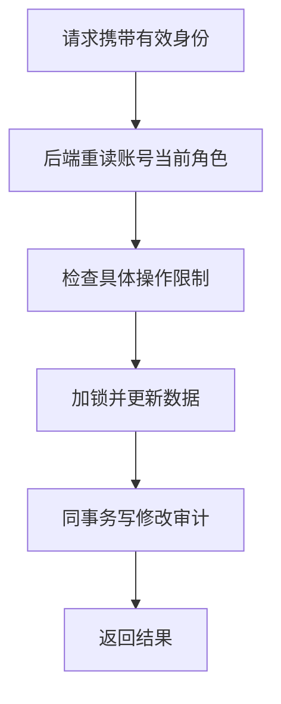

# 20 管理员权限与审计：后端决定谁能改数据

[返回功能学习总目录](README.md)

管理员通过独立后台管理目录与账号角色。后端每次操作核对数据库中的当前角色，并记录重要修改的原因和前后值。

## 1. 核心能力

普通用户不能调用管理员能力；角色改变及时影响后续后台访问；禁止自己改自己或移除最后一个有效管理员。

## 2. 业务背景

如果只隐藏页面菜单，普通用户仍可直接请求后台接口。管理员被降权后，旧访问令牌也可能还未过期，因此后台不能只相信令牌里曾经写过 admin。

## 3. 整体执行流程



流程图展示主线；失败、追问等分支在下面对应步骤中说明。

## 4. 关键代码与设计理由

### 4.1 令牌证明身份，数据库决定当前权限

[service.py](../../backend/app/admin/service.py) 的 `require_role`：

```python
user = self._repository.get_user_by_id(user_id)
if user is None or not user.is_active or user.role != required_role.value:
    raise AdminPermissionDenied("database role does not permit this operation")
return user
```

管理员资格来自当前数据库。撤销管理员角色后，旧令牌不能继续通过这个检查，但普通用户登录会话不因此自动删除。

### 4.2 角色修改不是随便改一个字段

`change_user_role` 检查原因和命令键，加锁后重新核对操作者角色，再检查不能自改、晋升目标必须有效且已验证、不能降权最后一个有效管理员。

这样规则与数据修改处在受控事务中，避免两个管理员同时操作把系统变成没有管理员。

### 4.3 审计记录修改，而不是记录敏感原文

角色修改写入操作者、目标、原角色、新角色、原因与时间，并与角色变更一起提交。`list_audit_events` 提供读取入口。数据结构见 [models.py](../../backend/app/admin/models.py)。

AI 不能通过一句“我现在是管理员”改变这个流程，角色也不能由模型输出自行授予。

## 5. 难懂语法

`PermissionError` 表示权限拒绝。`required_role.value` 取枚举对应的存储字符串。这里的 RBAC 就是“按角色分配权限”，先理解检查流程再记缩写。

## 6. 怎么验证、怎么继续读

读 [test_admin_user_management_api.py](../../backend/tests/unit/test_admin_user_management_api.py)、[test_admin_rbac_api.py](../../backend/tests/unit/test_admin_rbac_api.py) 的接口拒绝与输入约束。并发下最后管理员保护还需数据库层验证。

读完试着回答：**为什么一个签名正确、包含 admin 的旧令牌仍可能没有后台权限？**

---

本文解释当前代码行为；代码块为源码节选，省略外围逻辑，不能单独运行。示例用于讲解，不代表真实模型必然输出相同结果。测试执行范围见总目录。
