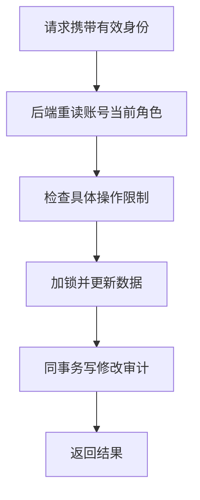

# 20 管理员权限与审计：后端决定谁能改数据

[返回功能学习总目录](README.md)

管理员通过独立后台管理目录与账号角色。后端每次操作核对数据库中的当前角色，并记录重要修改的原因和前后值。

## 1. 先看一个实际例子

管理员小周撤销另一位管理员的权限。对方旧访问令牌还没到期，下一次后台请求仍应被拒绝；普通用户功能不因此自动注销。

这个例子贯穿下面的执行过程。示例数据用于理解代码，不是线上测量或真实模型效果证明。

## 2. 为什么需要这样实现

如果只隐藏页面菜单，普通用户仍可直接请求后台接口。管理员被降权后，旧访问令牌也可能还未过期，因此后台不能只相信令牌里曾经写过 admin。

## 3. 一张图看懂全过程



图展示主线，失败与追问分支在第 5 节对照阅读。

## 4. 跟着这个例子读代码

以下为当前源码的连续节选，省略外围处理，不能单独运行。每一步都说明调用位置和数据去向。

### 4.1 先查数据库当前角色

**收到什么**

请求已经通过身份认证，Service 知道操作者 ID，但还不知道他现在是否有管理员权限。

**代码在哪里**

[backend/app/admin/service.py](../../backend/app/admin/service.py) 的 `require_role`。

```python
user = self._repository.get_user_by_id(user_id)
if user is None or not user.is_active or user.role != required_role.value:
    raise AdminPermissionDenied("database role does not permit this operation")
return user
```

**为什么这样写**

令牌里过去签发的角色可能过时，必须重读有效账号和当前角色。前端隐藏菜单不能代替后端拒绝。

**处理后变成什么，交给谁**

只有当前管理员继续操作；被降权者即使令牌还有效也过不了检查。AI 文本不能改变这个结果。

> 语法小注：`required_role.value` 是枚举实际存储的角色值。

### 4.2 检查不能自改或移除最后管理员

**收到什么**

变更函数已加锁，并在锁内再次检查操作者身份；目标是另一位管理员。

**代码在哪里**

[backend/app/admin/service.py](../../backend/app/admin/service.py) 的 `change_user_role`。

```python
if actor_user_id == target_user_id:
    raise AdminRoleChangeDenied("an actor cannot change its own role")
target = self._repository.get_user_for_update(target_user_id)
if target is None:
    raise KeyError(target_user_id)
if target.role == after_role.value:
    raise AdminRoleChangeDenied("target already has requested role")
if after_role is UserRole.ADMIN and (not target.is_active or target.email_verified_at is None):
    raise AdminRoleChangeDenied("target must be an active verified user")
if after_role is UserRole.USER and self._repository.count_active_admins() <= 1:
    raise AdminRoleChangeDenied("the last active administrator cannot be demoted")
```

**为什么这样写**

角色字段虽简单，业务约束不能省。自改禁止，晋升需已验证有效账号，降权不能移除最后一个有效管理员。

**处理后变成什么，交给谁**

本例若仍有其他有效管理员则继续；违反限制就抛出冲突，角色保持原值。

> 语法小注：`count_active_admins() <= 1` 在锁保护的操作流程中才有协调意义，不能只在页面上提前数一次。

### 4.3 角色与审计一起提交

**收到什么**

角色变更规则已通过，需要写 after_role 和操作原因。

**代码在哪里**

[backend/app/admin/service.py](../../backend/app/admin/service.py) 的 `change_user_role`。

```python
before_role = target.role
occurred_at = self._now()
target.role = after_role.value
target.updated_at = occurred_at
self._repository.add_audit(AdminRoleAudit(id=uuid.uuid4(), actor_identifier=str(actor.id), target_user_id=target.id, before_role=before_role, after_role=after_role.value, occurred_at=occurred_at, reason=normalized_reason))
event = self._repository.add_audit_event(AdminAuditEvent(id=uuid.uuid4(), actor_identifier=str(actor.id), occurred_at=occurred_at, action=action, object_type="user", object_id=str(target.id), reason=normalized_reason, before_diff={"role": before_role}, after_diff={"role": after_role.value}, related_version=None, command_key=command_key.strip()))
try:
    self._commit()
except Exception:
    self._rollback()
    raise
return AdminRoleChangeResponse(audit_id=event.id, target_user_id=target.id, before_role=cast(Literal["user", "admin"], before_role), after_role=after_role.value, occurred_at=occurred_at)
```

**为什么这样写**

先保留原角色，再记录目标新角色、操作者、原因和时间。提交失败回滚，避免改了权限却没有证据。

**处理后变成什么，交给谁**

成功后返回审计信息。下一次后台 require_role 立即读到新角色；不需要为了撤销管理员角色而删除普通用户全部会话。

> 语法小注：事务把角色和审计视作一组修改；不是先响应成功再补日志。

## 5. 换一种输入，会走哪条路

| 情况 | 判断与处理 | 应观察的结果 |
|---|---|---|
| 用户自己改自己 | 拒绝 | 角色不变 |
| 最后一个管理员被降权 | 拒绝 | 保留管理入口 |
| 被降权后旧令牌访问 | 重读角色失败 | 后台拒绝 |

## 6. 自己验证一次

在仓库根目录执行现有测试，使用后端已安装的测试环境：

```bash
cd backend
.venv/bin/python -m pytest tests/unit/test_admin_user_management_api.py tests/unit/test_admin_rbac_api.py -q
```

观察普通用户拒绝、确认原因等输入约束，以及角色冲突映射。真实并发和最后管理员锁保护需要数据库验证。

本轮运行范围与结果见[总目录验证记录](README.md)。替身测试证明指定输入下的代码行为，不能替代真实模型效果、数据库并发或页面验收。

## 7. 读完应该能回答什么

1. 身份验证与权限判断有什么区别？
2. 为什么不能信令牌中的旧角色？
3. 审计与角色为何一起提交？

源码阅读顺序：[admin/service.py](../../backend/app/admin/service.py)。先跟本例函数走一遍，再展开旁支。
