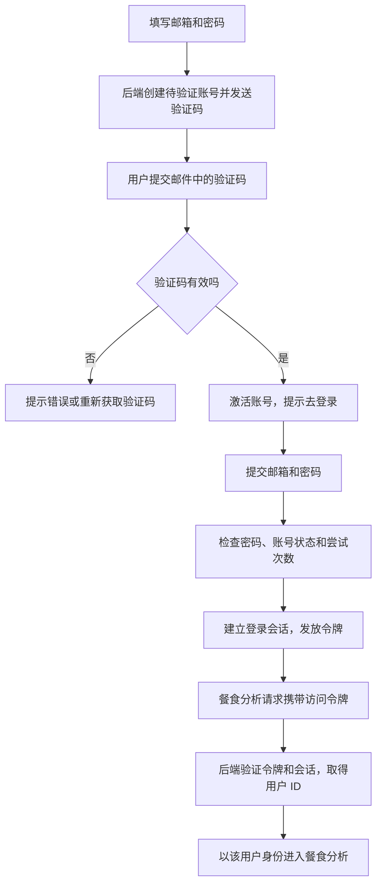

# 01 登录注册：让后端知道“这是谁的数据”

[返回功能学习总目录](README.md)

这个功能让用户用邮箱创建账号、验证邮箱、登录，并在后续请求中证明自己的身份。它还负责续期登录状态和退出登录。

本篇先用“新用户注册，随后发起一次餐食分析”串起主流程，再看少量关键代码。认证本身不调用 AI；它给 AI 功能提供可信的用户身份。

## 1. 核心能力：解决什么问题

后端收到“分析这顿饭”时，必须知道是谁发来的，才能把会话、餐食和偏好归到正确的用户。

这个模块提供三个结果：

- **可以登录的账号**：邮箱通过验证，密码只保存哈希，不保存原文。
- **后续请求的身份证明**：登录成功后取得短期访问令牌，也就是 `access token`。
- **可管理的登录会话**：访问令牌到期后可以续期；用户可以退出，或撤销其他会话。

这里的“会话”表示一次登录关系，不是和 AI 聊天的对话线程。一个登录会话可以发起多次 AI 对话。

## 2. 业务背景：为什么需要这些代码

假设小林注册后告诉 AI：“记住，我不吃香菜。”第二天再打开应用，系统需要把这条偏好认回小林，而不能认给另一个用户。

不能让请求直接填写一个 `user_id` 就相信它：别人也可以填小林的 ID。正确做法是先验证登录凭证，再由后端得出用户 ID。后续业务服务还要检查会话或记录是否属于这个用户。

同样，用户在聊天里说“我是管理员”，也不应该改变权限。身份验证和数据归属由后端代码处理，不交给模型判断。

## 3. 整体执行流程



**注意：邮箱验证成功不会自动登录。** 当前代码明确返回“邮箱验证成功，请登录”，登录接口才创建会话。

下面分四步看代码，不需要先读完整个认证目录。

## 4. 关键代码：从输入走到用户身份

### 4.1 注册：检查输入，保存待验证账号

代码入口：[schemas.py](../../backend/app/auth/schemas.py) 的 `RegisterRequest`；[api.py](../../backend/app/auth/api.py) 的 `register`。

```python
class RegisterRequest(BaseModel):
    email: EmailAddress
    password: str = Field(min_length=12, max_length=128)
```

这是实际代码。FastAPI 用这份 Pydantic 规则检查请求：邮箱要符合定义的格式，密码长度必须在 12～128 之间。不符合时，请求不会进入正常注册流程。

真正创建账号的代码在 [service.py](../../backend/app/auth/service.py) 的 `RegistrationService.register`。下面是**删去查询、时间戳和验证码处理后的节选**：

```python
user = User(
    id=uuid.uuid4(),
    email=normalized_email,
    password_hash=hash_password(password),
    role=UserRole.USER.value,
    is_active=False,
    email_verified_at=None,
    # 省略时间戳字段
)
self._repository.add_user(user)
```

这里要读懂三个决定：

- `hash_password` 把密码变成用于核对的哈希值。登录时验证是否匹配，不把它“解密回密码”。具体封装在 [security.py](../../backend/app/auth/security.py)。
- 新用户固定是普通用户，不能在注册请求里自行选择管理员。
- 账号先不激活，等邮箱验证成功再开启。

`repository` 负责实际保存。对应 [repository.py](../../backend/app/auth/repository.py) 的 `add_user` 会把对象交给数据库连接，并执行 `flush()`；最终提交由 Service 控制。这样一组业务操作可以放在同一事务中处理。

### 4.2 邮箱验证：确认这次注册的人能收到邮件

代码位置：[service.py](../../backend/app/auth/service.py) 的 `_dispatch` 和 `verify`。

`_dispatch` 生成六位验证码，通过邮件接口发送；数据库保存验证码摘要。浏览器还会收到一个 HttpOnly Cookie，标识“正在验证哪一次注册”。因此提交六位数字时，后端有上下文可以找到对应记录。

`verify` 先检查有效期、尝试次数和验证码是否匹配，通过后执行以下实际代码：

```python
user = self._user_for(challenge)
challenge.consumed_at = now
user.email_verified_at = now
user.is_active = True
user.updated_at = now
self._commit()
```

`challenge` 是“一次验证码验证记录”。标记 `consumed_at` 表示它已经用过，不能再次拿来验证；随后把用户标记为邮箱已验证、账号已激活，并提交数据库修改。

当前规则是：验证码 10 分钟有效，最多尝试 5 次，重发需等 60 秒，新验证码使旧验证码失效。这些规则写在服务代码中，不由模型决定。

### 4.3 登录：核对密码，再发放两种凭证

代码位置：[service.py](../../backend/app/auth/service.py) 的 `AuthenticationService.login`。

下面是**省略限流处理后的核心节选**：

```python
user = self._repository.get_user_by_email(normalized_email)
password_valid = password_matches(
    password=password,
    password_hash=user.password_hash if user is not None else None,
)
```

接下来代码检查：用户是否存在、密码是否匹配、邮箱是否已验证、账号是否启用。任一条件不满足，都不会创建会话。对外统一提示“邮箱或密码不正确，或账号尚不可登录”，避免直接暴露某个邮箱有没有注册。

通过后创建 `AuthSession`，保存刷新令牌摘要，再签发访问令牌。两种凭证分工如下：

| 凭证 | 用途 | 当前代码如何交给浏览器 |
|---|---|---|
| access token，访问令牌 | 请求受保护接口时证明身份；有效期 15 分钟 | 登录响应的 JSON |
| refresh token，刷新令牌 | 访问令牌到期后换取新令牌；到期时间与会话一致，登录时设为 30 天 | HttpOnly Cookie |

HttpOnly 的意思是浏览器脚本不能直接读取这个 Cookie，但浏览器仍可在符合条件的请求中携带它。设置位置是 [api.py](../../backend/app/auth/api.py) 的 `_set_refresh_cookie`。

访问令牌采用 JWT：后端给包含用户 ID、过期时间等字段的数据签名，收到请求后验证签名与有效期。**签名不等于加密，令牌里不能放密码或健康隐私。**

### 4.4 进入 AI 功能：从凭证取得身份，再传给业务服务

代码位置：[api.py](../../backend/app/auth/api.py) 的 `get_authenticated_principal`。下面是**省略异常响应的主流程节选**：

```python
user_id, _session_id = service.authenticated_session(credentials.credentials)
return user_id
```

`authenticated_session` 先验证令牌，再查询对应登录会话，拒绝不存在、已撤销或过期的会话。API 把得到的用户 ID 提供给餐食分析接口。

在 [agent/api.py](../../backend/app/agent/api.py) 中可以找到这句实际代码：

```python
thread = service.create_thread(user_id=principal)
```

这里的 `principal` 就是前面验证得到的用户 ID。创建 AI 对话时，后端已经明确它属于谁。之后还要由业务服务按用户检查资源归属；仅仅“登录过”并不代表能读取所有人的记录。

## 5. 令牌过期或退出时，会发生什么

访问令牌到期后，浏览器可以调用 `POST /api/v1/auth/refresh`。后端验证刷新令牌，将旧令牌标记为已使用，再发一个新的刷新令牌和访问令牌。这叫“轮换”。

实现位置：[service.py](../../backend/app/auth/service.py) 的 `refresh`，核心更新是：

```python
token.consumed_at = now
token.replaced_by_id = successor.id
session.last_seen_at = now
```

这里是实际节选，前面已经完成新令牌的创建。旧刷新令牌再次出现时，代码会撤销这次会话关联的刷新令牌并拒绝请求。

退出则通过 `logout` 撤销当前登录会话，并清除刷新 Cookie。前面讲的 AI 认证入口会检查会话，所以不能只在前端删一个“已登录”标记就算完成退出。

一个需要留意的实现区别：当前 `/api/v1/users/me` 走 `current_user`，验证令牌并重读账号启用状态；它没有走上述会话撤销检查。因此不能笼统地说“所有接口退出后都会立即拒绝旧访问令牌”。

## 6. 代码分层：遇到问题先去哪里看

| 你想弄清楚的问题 | 代码位置 | 作用 |
|---|---|---|
| 输入为什么被拒绝 | [schemas.py](../../backend/app/auth/schemas.py) | 检查输入格式与长度 |
| 请求进来先做什么、Cookie 怎么设置 | [api.py](../../backend/app/auth/api.py) | 接收请求、调用服务、返回结果 |
| 为什么不能登录、何时激活或续期 | [service.py](../../backend/app/auth/service.py) | 决定业务规则和提交时机 |
| 密码和令牌怎么处理 | [security.py](../../backend/app/auth/security.py) | 哈希、签发与验证 |
| 数据怎么查、怎么写 | [repository.py](../../backend/app/auth/repository.py) | 执行数据库操作 |
| 数据库存了哪些字段 | [models.py](../../backend/app/auth/models.py) | 定义账号、验证记录与会话等表结构 |

先跟着一个请求读 `api → service → repository`，需要时再跳到密码处理或数据结构，比一次读完整个目录更容易理解。

## 7. 难懂语法，单独解释

| 写法 | 通俗解释 |
|---|---|
| `service = Depends(get_registration_service)` | 告诉 FastAPI：调用接口前，先准备好这个服务对象并传进来。不是让用户提交一个 service。 |
| `user.password_hash if user is not None else None` | 用户存在就取密码哈希；不存在就传空值，避免访问不存在的对象。 |
| `user_id, _session_id = ...` | 函数返回两个值，分别接住；前导下划线提示第二个值在这里暂时不用。 |
| `self._commit()` | 调用事先传入的提交函数。真实请求绑定数据库提交，测试可以换成一个记录“是否调用过”的函数。 |
| `flush()` 与 `commit()` | 前者把待执行修改送到数据库，但事务还没最终提交；后者确认这批事务修改。 |

## 8. 如何确认自己读懂了

可以沿着以下已有测试阅读输入和断言：

| 场景 | 测试文件及函数 |
|---|---|
| 验证成功后仍需登录 | [test_registration_verification.py](../../backend/tests/auth/test_registration_verification.py)：`test_success_consumes_code_once_and_never_creates_a_session` |
| 登录生成会话和两种令牌 | [test_login_me_service.py](../../backend/tests/auth/test_login_me_service.py)：`test_login_creates_session_and_minimal_access_and_opaque_refresh_tokens` |
| 用过的刷新令牌再次出现 | [test_refresh_service.py](../../backend/tests/auth/test_refresh_service.py)：`test_replay_revokes_entire_session_family_before_rejecting` |

Service 测试用 Fake Repository，也就是用内存对象代替数据库访问。这样可以专门验证“什么条件允许登录”，不必先启动数据库；但它不能证明真实数据库的事务和并发正确，后者需要 PostgreSQL 集成测试。

读完后尝试回答：**为什么 AI 对话的用户 ID 要来自后端认证，而不能来自用户的聊天内容？为什么邮箱验证成功还不等于登录成功？** 能沿代码回答这两个问题，就抓住了本篇主线。

---

本文依据当前源码编写；代码节选的删减已明确标注。此次只调整学习文档，不修改认证实现，也不把源码阅读当作浏览器验收。
