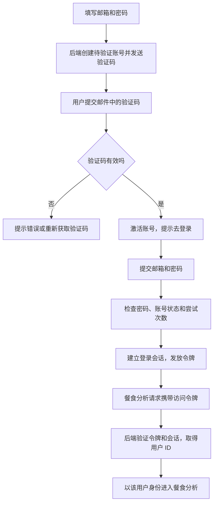

# 01 登录注册：让后端知道“这是谁的数据”

[返回功能学习总目录](README.md)

这个功能让用户用邮箱创建账号、验证邮箱、登录，并在后续请求中证明自己的身份。它还负责续期登录状态和退出登录。

本篇先用“新用户注册，随后发起一次餐食分析”串起主流程，再看少量关键代码。认证本身不调用 AI；它给 AI 功能提供可信的用户身份。

## 1. 先看一个实际例子

小林第一次使用应用：填写邮箱和密码 → 输入邮件验证码 → 看到“请登录” → 登录后发起餐食分析。我们看用户身份怎样从待验证账号变成接口可用的用户 ID。

这个例子贯穿下面的执行过程。示例数据用于理解代码，不是线上测量或真实模型效果证明。

## 2. 为什么需要这样实现

假设小林注册后告诉 AI：“记住，我不吃香菜。”第二天再打开应用，系统需要把这条偏好认回小林，而不能认给另一个用户。

不能让请求直接填写一个 `user_id` 就相信它：别人也可以填小林的 ID。正确做法是先验证登录凭证，再由后端得出用户 ID。后续业务服务还要检查会话或记录是否属于这个用户。

同样，用户在聊天里说“我是管理员”，也不应该改变权限。身份验证和数据归属由后端代码处理，不交给模型判断。

## 3. 一张图看懂全过程



图展示主线，失败与追问分支在第 5 节对照阅读。

## 4. 跟着这个例子读代码

以下为当前源码的连续节选，省略外围处理，不能单独运行。每一步都说明调用位置和数据去向。

### 4.1 注册先创建待验证账号

**收到什么**

API 已检查邮箱格式和密码长度，Service 收到小林的邮箱与密码；此前没有这个账号。

**代码在哪里**

[backend/app/auth/service.py](../../backend/app/auth/service.py) 的 `RegistrationService.register`。

```python
normalized_email = email.strip().lower()
now = self._now()
user = self._repository.get_user_by_email(normalized_email)
if user is None:
    user = User(
        id=uuid.uuid4(),
        email=normalized_email,
        password_hash=hash_password(password),
        role=UserRole.USER.value,
        is_active=False,
        email_verified_at=None,
        created_at=now,
        updated_at=now,
    )
    self._repository.add_user(user)
```

**为什么这样写**

邮箱统一大小写和空白。密码只保存哈希，新用户固定普通角色且未启用。后续 _dispatch 创建验证码记录并发邮件，不能通过注册请求自己选择管理员。

**处理后变成什么，交给谁**

得到用户 ID，但不能登录。API 设置注册上下文 Cookie，让验证码请求能找到这次注册；此时尚无登录会话。

> 语法小注：`None` 表示没查到用户；`uuid.uuid4()` 生成标识。

### 4.2 验证码正确后激活，不自动登录

**收到什么**

已通过有效期、次数和验证码匹配检查。下面是成功分支。

**代码在哪里**

[backend/app/auth/service.py](../../backend/app/auth/service.py) 的 `RegistrationService.verify`。

```python
user = self._user_for(challenge)
challenge.consumed_at = now
user.email_verified_at = now
user.is_active = True
user.updated_at = now
self._commit()
return PublicUser.model_validate(user)
```

**为什么这样写**

消费验证码与启用账号一起提交，防止复用。邮箱验证只证明邮箱控制权，不代替下一次密码登录。

**处理后变成什么，交给谁**

账号变为 is_active=True，记录验证时间。返回“请登录”，小林随后提交邮箱密码。

> 语法小注：`model_validate` 按响应结构读取字段，不直接公开整条数据库记录。

### 4.3 登录建立可撤销的会话

**收到什么**

密码、邮箱验证、账号启用状态和限流已检查通过。

**代码在哪里**

[backend/app/auth/service.py](../../backend/app/auth/service.py) 的 `AuthenticationService.login`。

```python
self._repository.reset_login_attempts(bucket_digests=bucket_digests)
session = self._repository.add_session(
    AuthSession(
        id=uuid.uuid4(),
        user_id=user.id,
        family_id=uuid.uuid4(),
        created_at=now,
        last_seen_at=now,
        expires_at=now + SESSION_EXPIRY,
        revoked_at=None,
        device_label=None,
    )
)
```

**为什么这样写**

把一次登录建成独立会话，后续才能退出或撤销。随后创建刷新凭证摘要并签发访问令牌，二者绑定这次会话。

**处理后变成什么，交给谁**

API 返回 15 分钟访问令牌，并把刷新令牌放入 HttpOnly Cookie。会话登录时设为 30 天；前者用于访问，后者用于续期。

> 语法小注：HttpOnly 表示浏览器脚本不能读取 Cookie，浏览器仍可按规则携带。

### 4.4 AI 入口从凭证取得用户 ID

**收到什么**

餐食请求携带访问令牌，统一认证依赖调用这个方法。

**代码在哪里**

[backend/app/auth/service.py](../../backend/app/auth/service.py) 的 `AuthenticationService.authenticated_session`。

```python
user_id, session_id = verify_access_token_session(
    token=access_token,
    secret_key=self._secret_key,
    issuer=self._issuer,
    audience=self._audience,
    now=self._now,
)
session = self._repository.get_session_for_user(
    session_id=session_id, user_id=user_id
)
if session is None or session.revoked_at is not None or session.expires_at <= self._now():
    raise AuthenticatedUserUnavailable
return user_id, session_id
```

**为什么这样写**

签名正确不代表会话未撤销，所以还要查数据库。不能信任聊天内容里的“我是另一个用户”。

**处理后变成什么，交给谁**

返回用户与会话 ID，用户 ID 交给 AgentService 建立归属。业务仍要检查具体资源属于谁。当前 /users/me 走另一个 current_user 方法，不能据此概括所有接口的撤销检查。

> 语法小注：赋值左侧两个变量分别接住返回值。

续期与退出接在这条身份链后：访问令牌到期时，用刷新 Cookie 调用刷新接口。后端消费旧刷新令牌并发新凭证；用过的旧刷新令牌再次出现时会撤销对应会话系列。退出登录则撤销当前会话并清除刷新 Cookie，不能只清掉前端“已登录”标记。

## 5. 换一种输入，会走哪条路

| 情况 | 判断与处理 | 应观察的结果 |
|---|---|---|
| 验证码错误 | 增加尝试次数并拒绝 | 账号不激活 |
| 未验证邮箱 | login 拒绝 | 不建立会话 |
| 会话已撤销 | 认证依赖拒绝 | 不能进入相应 AI 接口 |

## 6. 自己验证一次

在仓库根目录执行现有测试，使用后端已安装的测试环境：

```bash
cd backend
.venv/bin/python -m pytest tests/auth/test_login_me_service.py tests/auth/test_refresh_service.py -q
```

观察创建的会话数量、凭证与摘要，以及刷新令牌使用后再重放时的拒绝。注册验证码可另读 test_registration_verification.py，本条命令验证登录和刷新服务。

本轮运行范围与结果见[总目录验证记录](README.md)。替身测试证明指定输入下的代码行为，不能替代真实模型效果、数据库并发或页面验收。

## 7. 读完应该能回答什么

1. 注册和登录分别新增了什么？
2. 为什么要两种令牌？
3. 模型为什么不能决定用户身份？

源码阅读顺序：[auth/service.py](../../backend/app/auth/service.py)。先跟本例函数走一遍，再展开旁支。
