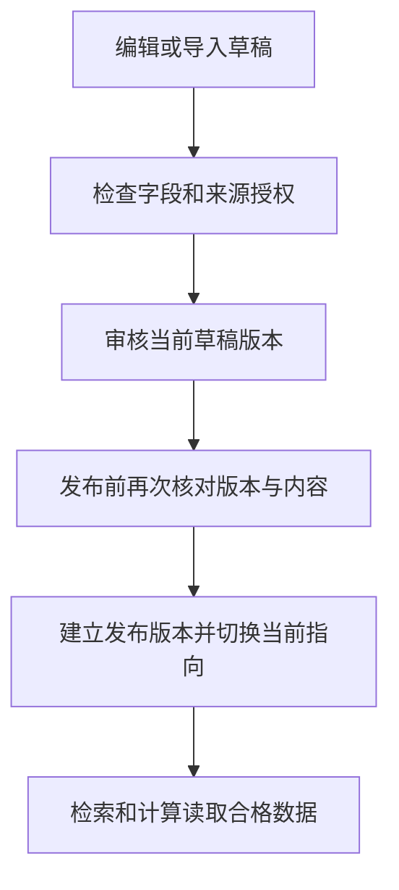

# 17 后台营养目录：给 AI 工具维护可信的数据来源

[返回功能学习总目录](README.md)

管理员维护菜名、别名、每 100g 营养及来源授权，经过审核后发布。只有当前合格数据才能进入查询与计算。

## 1. 先看一个实际例子

管理员为一道菜修改每 100g 营养，提交审核后又改了一处内容。他点击发布时，系统应该拒绝旧审核，直到新的内容重新审核。

这个例子贯穿下面的执行过程。示例数据用于理解代码，不是线上测量或真实模型效果证明。

## 2. 为什么需要这样实现

营养工具算得再稳定，输入数据错了仍会算错。因此目录修改不能一保存就直接影响用户结果，必须知道谁审核了哪一版，发布后还能追溯。

## 3. 一张图看懂全过程



图展示主线，失败与追问分支在第 5 节对照阅读。

## 4. 跟着这个例子读代码

以下为当前源码的连续节选，省略外围处理，不能单独运行。每一步都说明调用位置和数据去向。

### 4.1 先检查当前角色与草稿版本

**收到什么**

发布命令带草稿 ID、预期 revision、原因和操作键。草稿已由创建或 CSV 导入步骤建立。

**代码在哪里**

[backend/app/admin/service.py](../../backend/app/admin/service.py) 的 `publish_catalog_draft`。

```python
actor = self.require_role(user_id=actor_user_id, required_role=UserRole.ADMIN)
self._repository.acquire_catalog_publication_lock(draft_id)
replay = self._repository.get_catalog_publication_command(command_key.strip())
if replay is not None:
    return self._publication_response(replay, eligibility="eligible")
draft = self._repository.get_catalog_draft(draft_id, for_update=True)
if draft is None:
    raise KeyError("catalog draft not found")
if draft.revision != expected_revision:
    raise CatalogDraftConflict("catalog draft revision does not match If-Match")
if draft.authorization_status != "authorized":
    raise CatalogDraftConflict("only authorized drafts may be published")
review = self._repository.get_catalog_review(
    draft_id=draft_id, revision=draft.revision
)
if review is None:
    raise CatalogDraftConflict(
        "a current immutable review is required before publication"
    )
```

**为什么这样写**

加锁后核对版本、授权和当前 revision 的审核。前端显示通过不够，发布必须再次检查数据库。

**处理后变成什么，交给谁**

本例修改后 revision 已变化，旧审核不能满足条件；若检查通过，才继续比较审核快照。

> 语法小注：操作键用于重放同一操作，revision 用于发现内容并发变化，二者不是一回事。

### 4.2 确认发布内容就是审核内容

**收到什么**

已找到审核对象；仍需确保草稿内容与其一致。

**代码在哪里**

[backend/app/admin/service.py](../../backend/app/admin/service.py) 的 `publish_catalog_draft`。

```python
snapshot = self._publication_snapshot(draft)
content_hash = self._content_hash(snapshot)
if content_hash != review.content_hash or snapshot != review.snapshot:
    raise CatalogDraftConflict("draft changed after review")
publication = self._repository.add_catalog_publication(
    CatalogPublication(
        id=uuid.uuid4(),
        draft_id=draft.id,
        review_id=review.id,
        draft_revision=draft.revision,
        snapshot=dict(review.snapshot),
        content_hash=review.content_hash,
        actor_identifier=str(actor.id),
        reason=command.reason,
        command_key=command_key.strip(),
        published_at=self._now(),
    )
)
```

**为什么这样写**

内容 hash 和快照都比较，避免审核后内容悄悄变化。发布对象固定审核的那份数据，而不是保留一个会继续变化的草稿引用。

**处理后变成什么，交给谁**

创建 CatalogPublication 不可变发布版本，随后切换当前指向并建立 eligible 资格。检索计算据此读取当前可用内容。

> 语法小注：hash 是内容摘要；直接比较 snapshot 进一步核对结构内容。

### 4.3 发布同时准备派生任务和审计

**收到什么**

已创建发布与资格，仍在该发布事务中。

**代码在哪里**

[backend/app/admin/service.py](../../backend/app/admin/service.py) 的 `publish_catalog_draft`。

```python
self._enqueue_catalog_embedding_jobs(publication)
self._record_catalog_lifecycle_audit(
    actor_identifier=str(actor.id),
    action="catalog.publish",
    object_id=str(publication.id),
    reason=command.reason,
    command_key=command_key,
    before={"draft_revision": draft.revision},
    after={
        "content_hash": publication.content_hash,
        "publication_id": str(publication.id),
    },
    related_version=publication.content_hash,
)
self._commit_catalog_mutation()
return self._publication_response(publication, eligibility="eligible")
```

**为什么这样写**

把向量任务作为待处理记录一并建立，不在发布事务里等待模型。审计记录谁发了哪版；业务与记录一起提交。

**处理后变成什么，交给谁**

精确和文字检索可按发布资格读取；向量索引另外准备。旧餐食快照仍保留当时版本，不追溯重算。

> 语法小注：enqueue 表示排队记录，不表示此时向量已经生成。

## 5. 换一种输入，会走哪条路

| 情况 | 判断与处理 | 应观察的结果 |
|---|---|---|
| 审核后又修改 | revision 或快照不符 | 拒绝发布 |
| 未授权来源 | 发布检查失败 | 不能进入可计算目录 |
| 向量未完成 | 保留任务状态 | 不等于发布没发生 |

## 6. 自己验证一次

在仓库根目录执行现有测试，使用后端已安装的测试环境：

```bash
cd backend
.venv/bin/python -m pytest tests/admin/test_catalog_draft_service.py tests/admin/test_catalog_lifecycle_service.py -q
```

重点观察未审核发布、审核后改动和重复发布。前一轮生命周期测试曾因 Fake 缺少 add_catalog_search_version 失败；本轮结果以总目录为准，不能把旧绿灯当当前验证。

本轮运行范围与结果见[总目录验证记录](README.md)。替身测试证明指定输入下的代码行为，不能替代真实模型效果、数据库并发或页面验收。

## 7. 读完应该能回答什么

1. 草稿和发布版有什么区别？
2. 审核为什么绑定版本？
3. 发布完成为什么不等于向量准备完成？

源码阅读顺序：[admin/service.py](../../backend/app/admin/service.py)。先跟本例函数走一遍，再展开旁支。
