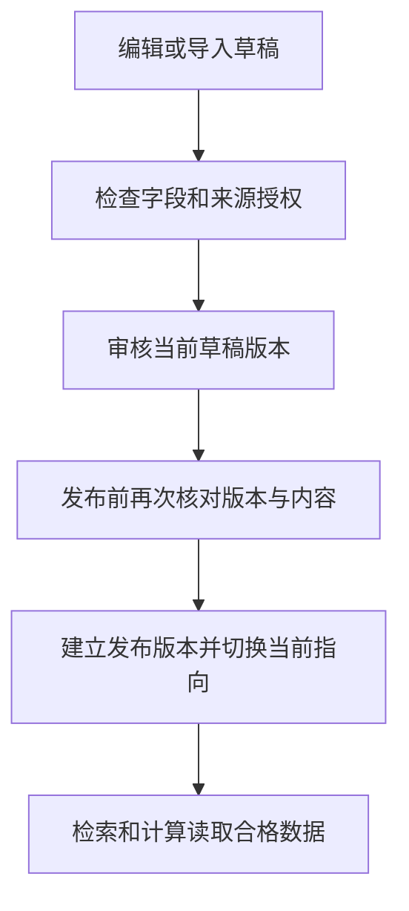

# 17 后台营养目录：给 AI 工具维护可信的数据来源

[返回功能学习总目录](README.md)

管理员维护菜名、别名、每 100g 营养及来源授权，经过审核后发布。只有当前合格数据才能进入查询与计算。

## 1. 核心能力

将可编辑草稿、审核快照和已发布版本分开，控制发布资格；支持批量导入和操作审计。

## 2. 业务背景

营养工具算得再稳定，输入数据错了仍会算错。因此目录修改不能一保存就直接影响用户结果，必须知道谁审核了哪一版，发布后还能追溯。

## 3. 整体执行流程



流程图展示主线；失败、追问等分支在下面对应步骤中说明。

## 4. 关键代码与设计理由

### 4.1 草稿不是线上计算数据

[service.py](../../backend/app/admin/service.py) 的 `create_catalog_draft`、`patch_catalog_draft` 管理草稿。CSV 解析在 [catalog_csv.py](../../backend/app/admin/catalog_csv.py)，导入前可预览错误。批量导入需要整批校验，不应把半份错误数据当作成功。

### 4.2 发布必须对应被审核的内容

`publish_catalog_draft` 会检查管理员、草稿 revision、授权及对应审核。核心比较为：

```python
snapshot = self._publication_snapshot(draft)
    content_hash = self._content_hash(snapshot)
    review = self._repository.add_catalog_review(
        CatalogDraftReview(
            id=uuid.uuid4(),
            draft_id=draft.id,
            draft_revision=draft.revision,
            snapshot=snapshot,
            content_hash=content_hash,
            actor_identifier=str(actor.id),
            reason=command.reason,
            command_key=command_key.strip(),
            reviewed_at=self._now(),
        )
    )
    self._record_catalog_lifecycle_audit(
        actor_identifier=str(actor.id),
        action="catalog.review",
        object_id=str(draft.id),
        reason=command.reason,
        command_key=command_key,
        before={"revision": draft.revision},
        after={"content_hash": content_hash, "revision": draft.revision},
        related_version=content_hash,
    )
    self._commit_catalog_mutation()
    return self._review_response(review)

def publish_catalog_draft(
    self,
    *,
    actor_user_id: uuid.UUID,
    draft_id: uuid.UUID,
    expected_revision: int,
    command: CatalogLifecycleCommand,
    command_key: str,
) -> CatalogPublicationResponse:
    """Atomically advance one pointer to a reviewed immutable publication."""

    actor = self.require_role(user_id=actor_user_id, required_role=UserRole.ADMIN)
    self._repository.acquire_catalog_publication_lock(draft_id)
    replay = self._repository.get_catalog_publication_command(command_key.strip())
    if replay is not None:
        return self._publication_response(replay, eligibility="eligible")
    draft = self._repository.get_catalog_draft(draft_id, for_update=True)
    if draft is None:
        raise KeyError("catalog draft not found")
    if draft.revision != expected_revision:
        raise CatalogDraftConflict("catalog draft revision does not match If-Match")
    if draft.authorization_status != "authorized":
        raise CatalogDraftConflict("only authorized drafts may be published")
    review = self._repository.get_catalog_review(
        draft_id=draft_id, revision=draft.revision
    )
    if review is None:
        raise CatalogDraftConflict(
            "a current immutable review is required before publication"
        )
    snapshot = self._publication_snapshot(draft)
    content_hash = self._content_hash(snapshot)
    if content_hash != review.content_hash or snapshot != review.snapshot:
        raise CatalogDraftConflict("draft changed after review")
```

审核后再改内容，即使改动很小，也不能拿旧审核直接发布；hash 和快照比对确保发的是审核过的那份。

### 4.3 发布、索引和历史快照是三件事

发布建立不可变版本并更新当前指向，同时创建合格状态和 embedding 任务。向量准备是异步工作，不等于发布事务要等待一次模型调用。

后续检索会过滤失格版本；已经确认保存的餐食保留原快照，不能因为目录改了就悄悄重算历史。失格处理在 `disqualify_catalog_publication`。

## 5. 难懂语法

`revision` 是草稿修订号，用来发现“我编辑时别人已经改过”。`content_hash` 是内容摘要，帮助核对是否同一份内容。快照固定审核时的数据。

## 6. 怎么验证、怎么继续读

读 [test_catalog_draft_service.py](../../backend/tests/admin/test_catalog_draft_service.py)、[test_catalog_lifecycle_service.py](../../backend/tests/admin/test_catalog_lifecycle_service.py)；真实资格事务见 [test_catalog_publish_eligibility.py](../../backend/tests/integration/test_catalog_publish_eligibility.py)。

本次运行上述生命周期服务测试时有 3 项失败：测试替身缺少检索版本写入方法，不能据此声称发布路径已经通过验证。详情见[总目录的验证记录](README.md)。

读完试着回答：**为什么审核通过后修改草稿，还必须重新审核再发布？**

---

本文解释当前代码行为；代码块为源码节选，省略外围逻辑，不能单独运行。示例用于讲解，不代表真实模型必然输出相同结果。测试执行范围见总目录。
