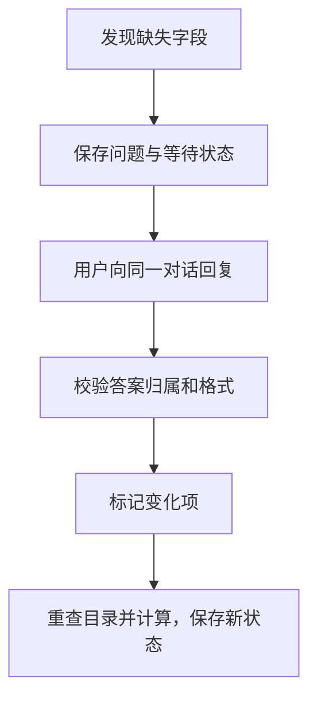

# 07 追问与恢复：保留进度，只重算受影响的项

[返回功能学习总目录](README.md)

缺信息时保存已知内容并追问，收到回复后沿同一对话继续。例如只缺米饭重量，就补克数，不重新识别整顿饭。

## 1. 先看一个实际例子

小林输入米饭但没写重量，系统已经暂停。他回复 150g。我们看后端怎样找回原来的米饭项，而不是重新把整段话交给模型。

这个例子贯穿下面的执行过程。示例数据用于理解代码，不是线上测量或真实模型效果证明。

## 2. 为什么需要这样实现

一顿饭有两道菜，其中一道缺克数。每次回复都把整顿饭交给模型重做，既浪费调用，也可能改坏原来正确的结果。

## 3. 一张图看懂全过程



图展示主线，失败与追问分支在第 5 节对照阅读。

## 4. 跟着这个例子读代码

以下为当前源码的连续节选，省略外围处理，不能单独运行。每一步都说明调用位置和数据去向。

### 4.1 先找回这条对话的状态

**收到什么**

Service 已校验用户拥有该对话；恢复请求带同一 thread_id 与图类型。

**代码在哪里**

[backend/app/agent/service.py](../../backend/app/agent/service.py) 的 `AgentService._load_checkpoint`。

```python
saver = checkpointer
checkpoint_tuple = await saver.aget_tuple(  # type: ignore[attr-defined]
    {"configurable": {"thread_id": str(thread_id), "checkpoint_ns": checkpoint_namespace_for_kind(graph_kind)}}
)
if checkpoint_tuple is None:
    return None
values = checkpoint_tuple.checkpoint.get("channel_values", {})
raw_state = values.get("agent_state")
return state_codec_for_kind(graph_kind).model_validate(raw_state) if isinstance(raw_state, dict) else None
```

**为什么这样写**

Checkpoint 用线程和命名空间定位进度，不能只靠一句回答猜对话。读出的字典还要用正确 State 类型校验。

**处理后变成什么，交给谁**

取回米饭项、未回答问题与预算；没有快照就没有这份可恢复进度，不能凭空假设前文。交给图的 resume 处理。

> 语法小注：`get(..., {})` 为缺失字段提供空对象；随后仍需要 model_validate。

### 4.2 先验证答案，再标记需要重算

**收到什么**

本例答案字典以米饭 item_id 为键。不是只传裸字符串让代码猜是哪道菜。

**代码在哪里**

[backend/app/agent/graph.py](../../backend/app/agent/graph.py) 的 `_apply_resume`。

```python
answers = payload.get("answers")
if not isinstance(answers, dict) or not answers:
    return state
questions = {question.item_id: question for question in state.clarification_questions}
if not set(answers).issubset(questions):
    return state
changed: dict[str, StateMealItem] = {item.item_id: item for item in state.items}
for item_id, answer in answers.items():
    question = questions[item_id]
    item = changed.get(item_id)
    if item is None or not isinstance(answer, dict):
        return state
```

**为什么这样写**

答案的 ID 必须属于当前问题，每个答案必须是对象。先构造 changed 副本，非法输入返回原状态，避免半套修改。

**处理后变成什么，交给谁**

后续 grams 分支写 grams=150、提高 input_version 并设 is_dirty=True；待回答列表去掉已补齐问题。下一动作是重新解析目录。

> 语法小注：`set(answers).issubset(questions)` 检查答案键是否全部在问题集合里。

### 4.3 只有变化项继续工作

**收到什么**

状态里可能同时有已算完的菜、被排除的菜和刚补重量的米饭。

**代码在哪里**

[backend/app/agent/graph.py](../../backend/app/agent/graph.py) 的 `_resolve`。

```python
for item in state.items:
    if item.item_id in unaccounted:
        updated.append(item.model_copy(update={"is_dirty": False, "nutrients": None}))
        continue
    if not item.is_dirty and item.nutrients is not None:
        updated.append(item)
        continue
    if item.grams is None and item.portion_description is None:
        questions.append(_grams_question(item))
        updated.append(item.model_copy(update={"is_dirty": False}))
        continue
```

**为什么这样写**

已算完且不脏的项直接保留；排除项不参与数值；仍缺重量的项继续提问。只有需要处理的项进入后面的目录和营养工具。

**处理后变成什么，交给谁**

米饭进入重查与计算，其余有效项保留。Service 保存新状态，前端读到报告或下一条问题。

> 语法小注：`continue` 跳过本项剩余步骤，循环仍可处理其他菜。

## 5. 换一种输入，会走哪条路

| 情况 | 判断与处理 | 应观察的结果 |
|---|---|---|
| 回答未知 item_id | 保留原状态 | 不改任何菜 |
| 重量非法 | 重量解析拒绝 | 仍等待 |
| 目录已变化 | 重新查询并要求确认 | 不使用旧授权 |

## 6. 自己验证一次

在仓库根目录执行现有测试，使用后端已安装的测试环境：

```bash
cd backend
.venv/bin/python -m pytest tests/unit/test_runtime_foundation.py -q
```

重点运行 test_graph_aggregates_questions_and_resume_does_not_repeat_parse，观察 Provider 调用次数；再看 test_graph_partial_and_correction_recalculate_only_dirty_item 的局部重算。

本轮运行范围与结果见[总目录验证记录](README.md)。替身测试证明指定输入下的代码行为，不能替代真实模型效果、数据库并发或页面验收。

## 7. 读完应该能回答什么

1. 凭什么找到之前的状态？
2. is_dirty 怎样避免重复工作？
3. 保存进度能否保证所有外部调用绝不重复？

源码阅读顺序：[agent/service.py](../../backend/app/agent/service.py) → [agent/graph.py](../../backend/app/agent/graph.py)。先跟本例函数走一遍，再展开旁支。

当前应用手动使用 LangGraph Checkpoint，并构造 Command 的 resume 内容交给自定义状态机，没有调用 interrupt()。未知外部调用结果仍需要单独处理。
