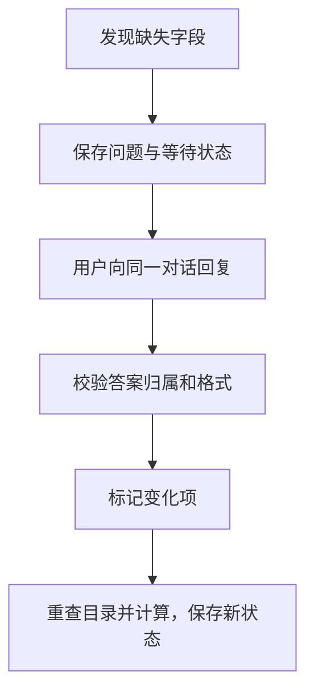

# 07 追问与恢复：保留进度，只重算受影响的项

[返回功能学习总目录](README.md)

缺信息时保存已知内容并追问，收到回复后沿同一对话继续。例如只缺米饭重量，就补克数，不重新识别整顿饭。

## 1. 核心能力

保存食物项、问题和已完成结果；验证答案对应当前问题；只处理变化项，限制重复工作。

## 2. 业务背景

一顿饭有两道菜，其中一道缺克数。每次回复都把整顿饭交给模型重做，既浪费调用，也可能改坏原来正确的结果。

## 3. 整体执行流程



流程图展示主线；失败、追问等分支在下面对应步骤中说明。

## 4. 关键代码与设计理由

### 4.1 等待不只是一句提示

[graph.py](../../backend/app/agent/graph.py) 的 `_resolve` 返回 `WAITING_INPUT`、`ASK_USER` 和结构化问题。只有一句“吃了多少”不够，后端还需要知道答案补哪个食物项。

### 4.2 答案验证后一起应用

同文件 `_apply_resume` 的克数分支：

```python
changed[item_id] = item.model_copy(
    update={"grams": grams, "input_version": _next_version(item.input_version), "is_dirty": True}
)
```

`is_dirty=True` 表示这一项需要重算。未知问题、非法克数或候选版本不一致时保留原状态，不半途应用答案。`_resolve` 跳过未变化且已有结果的项。

### 4.3 服务手动保存和恢复 Checkpoint

[service.py](../../backend/app/agent/service.py) 的 `_load_checkpoint` 和 `_persist_checkpoint` 用同一 `thread_id` 读写状态。服务构造 `Command(resume=...)`，再把回答内容传给自定义图；当前没有调用 `interrupt()`。

Checkpoint 是短期进度，业务运行表负责用户归属和事件。保存进度不等于保证所有外部调用只执行一次；未知调用结果仍需专门处理。

## 5. 难懂语法

`model_copy(update=...)` 创建更新后的副本。`set(answers).issubset(questions)` 检查答案 ID 是否全部来自当前问题，防止改动无关项。

## 6. 怎么验证、怎么继续读

读 [test_runtime_foundation.py](../../backend/tests/unit/test_runtime_foundation.py) 与 [test_agent_multimodal.py](../../backend/tests/unit/test_agent_multimodal.py)，关注等待、非法恢复和调用次数；数据库恢复不能仅靠内存测试证明。

读完试着回答：**恢复为什么需要对话 ID、当前问题和变化项三种信息？**

---

本文解释当前代码行为；代码块为源码节选，省略外围逻辑，不能单独运行。示例用于讲解，不代表真实模型必然输出相同结果。测试执行范围见总目录。
