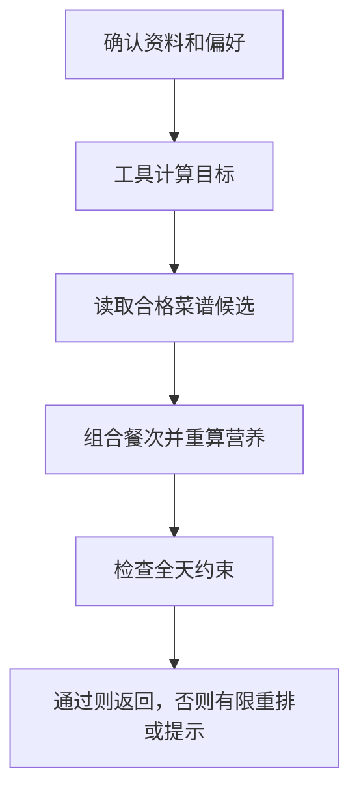

# 12 生成一日餐单：从可用候选中组合，再逐项校验

[返回功能学习总目录](README.md)

根据本次确认的目标和偏好选择早餐、午餐、晚餐，必要时含加餐，并检查整日约束。当前核心组合由后端规则完成，不是模型自由创作一份菜单。

## 1. 先看一个实际例子

小林确认资料和忌口，希望得到一日三餐。假设候选池有足够合格菜品，我们看系统怎样先组合，再决定能否接受，而不是只要凑出三道菜就成功。

这个例子贯穿下面的执行过程。示例数据用于理解代码，不是线上测量或真实模型效果证明。

## 2. 为什么需要这样实现

让模型直接输出三道菜很容易，但菜可能不在目录中，营养也无法复算。系统需要可计算的候选来源，并说明为什么某份计划能被接受。

## 3. 一张图看懂全过程



图展示主线，失败与追问分支在第 5 节对照阅读。

## 4. 跟着这个例子读代码

以下为当前源码的连续节选，省略外围处理，不能单独运行。每一步都说明调用位置和数据去向。

### 4.1 取得目标，明确下一动作

**收到什么**

用户已确认本次偏好；未确认的请求在前面返回 needs_input。

**代码在哪里**

[backend/app/agent/graph.py](../../backend/app/agent/graph.py) 的 `DietPlanningGraph.ainvoke`。

```python
current = state
target_result = self._tools.calculate_daily_target(
    profile=current.profile, preferences=current.preferences
)
current = self._record_tool(current, "calculate_targets", target_result.action.value, target_result)
if target_result.action is not PlanValidationAction.PASS or target_result.target is None:
    return self._safe_terminal(current, target_result.action, target_result.safe_message)
current = current.model_copy(
    update={"target": target_result.target, "next_action": DietPlanningAction.COMPOSE_PLAN}
)
```

**为什么这样写**

目标先通过确定性工具计算，失败不进入组合。把 target 写进状态，让后续重排仍对照同一目标。

**处理后变成什么，交给谁**

状态拿到 DailyTarget，下一步 COMPOSE_PLAN。显式资料保存处理后进入有限组合循环。

> 语法小注：`model_copy(update=...)` 生成更新后的状态，传递下一步需要的数据。

### 4.2 把目标传给选菜服务

**收到什么**

`DailyTarget` 是确定性工具算出的全天目标；`PreferenceReview` 是用户确认的忌口和口味。

**代码在哪里**

[backend/app/agent/tools.py](../../backend/app/agent/tools.py) 的 `SessionNutritionToolAdapter.compose_daily_plan`。以下省略 Session 的创建和关闭：

```python
return service.compose_daily_meals(
    user_id=user_id,
    target=target,
    catalog_version=None,
    preferences=preferences,
    recipe_version=CONTROLLED_RECIPE_VERSION,
)
```

**为什么这样写**

目标必须参与选菜。管理员候选携带自己的目录版本，不固定为某个初始目录。新环境尚未配置过管理员候选时，服务可读取当前启用且审核通过的受控食谱；一旦存在管理员候选记录，即使全部停用或删除，也不会自动回退，避免绕过管理员决定。

**处理后变成什么，交给谁**

每个候选按目录和原有份量重算营养，再交给 `planning/selection.py` 的 `select_meals`。未改变食谱份量和营养公式。

### 4.3 在有界组合中比较目标与偏好

[backend/app/planning/selection.py](../../backend/app/planning/selection.py) 使用 `planning-selection.v2`。输入是已经计算好的候选餐次；输出是一组三餐或空结果。

- 候选总量超过 256 时停止并提示缩小范围，防止大量营养查询。
- 每个餐次最多保留 12 个候选，最多比较 1,728 个三餐组合。
- 排序先看硬校验与目标符合情况，再比较口味匹配、近期重复和目标中点距离；同样输入与历史产生相同结果。
- 近期吃过的菜仍可使用：不能为了换花样丢掉唯一能通过校验的组合。
- 这是有限候选中的启发式搜索，不保证全局最优；最终仍必须通过 `validate_plan`。

忌口检查使用菜名、受控别名、做法和口味标签；受控食谱还检查每个已知食材的名称和别名。全角字符、大小写和多余空白会先归一化。管理员成品菜没有完整配料结构，不能把这种匹配当作过敏原保障，也不推断缺失配料。

> 语法小注：`product(*pools)` 枚举各餐次候选的组合；`min(..., key=score)` 按评分元组从左到右比较。`Decimal` 保留十进制计算，避免浮点误差参与排序。

### 4.4 检查三餐与重复，之后才查数值

**收到什么**

组合产生 PlannedMeal 序列，包括餐次、菜谱 ID 和营养。

**代码在哪里**

[backend/app/planning/service.py](../../backend/app/planning/service.py) 的 `validate_plan`。

```python
if not set(REQUIRED_MEAL_SLOTS).issubset({meal.slot for meal in meals}) or len({meal.slot for meal in meals}) != len(meals):
    return PlanValidationResult(
        action=PlanValidationAction.REPLAN,
        rule_id="incomplete-meal-slots",
        safe_message="餐单必须包含不重复的早餐、午餐和晚餐后才能校验。",
    )
if len({meal.recipe_id for meal in meals}) != len(meals):
    return PlanValidationResult(
        action=PlanValidationAction.REPLAN,
        rule_id="duplicate-controlled-recipe",
        safe_message="同一受控菜谱不能在一天内重复使用。",
    )
```

**为什么这样写**

三餐齐全、不重复是结构条件；后面先检查忌口、最低能量与宏量比例，再检查目标范围。范围放宽不能跳过宏量比例。单个食物算对不代表整日组合符合约束。

**处理后变成什么，交给谁**

违规返回 REPLAN；全部通过才 PASS。图最多有限次数组合；RELAX 是明确标出的目标放宽，不等于严格通过。

> 语法小注：`set` 去重，比较数量能发现同一餐次或菜谱重复。

## 5. 换一种输入，会走哪条路

| 情况 | 判断与处理 | 应观察的结果 |
|---|---|---|
| 偏好未确认 | 等待输入 | 不开始组合 |
| 候选不足 | 重排或结束 | 不编造新菜 |
| 触犯排除项 | 不允许靠放宽接受 | 调整候选 |

## 6. 自己验证一次

在仓库根目录执行现有测试，使用后端已安装的测试环境：

```bash
cd backend
.venv/bin/python -m pytest tests/unit/test_diet_planning_graph.py tests/planning/test_planning_service.py tests/planning/test_personalized_selection.py -q
```

观察 COMPOSE 后还必须 VALIDATE，检查三次上限及 PASS/RELAX 的不同结果。替身验证的是规则路由，不是模型菜单质量。

新增回归覆盖不同目标产生不同组合、口味排序、别名忌口、仅剩可行旧菜、组合上限和宏量比例不能被放宽跳过。替身测试证明指定输入下的代码行为，不能替代真实模型效果、数据库并发或页面验收。

2026-09-15 本地验收：`frontend/tests/e2e/plans.spec.ts` 两项通过；Codex 内置浏览器走过公开注册、资料保存、生成、午餐清淡调整、刷新和历史版本。无可替换早餐时流程有界结束，已保存餐单未被覆盖。使用 Fake Provider，仅验证产品链路；真实模型理解质量与真实设备软键盘仍未验证。

## 7. 读完应该能回答什么

1. 候选来源在哪里决定？
2. 为什么选满三餐仍可能不通过？
3. RELAX 与 PASS 有何区别？

源码阅读顺序：[agent/graph.py](../../backend/app/agent/graph.py) → [planning/service.py](../../backend/app/planning/service.py)。先跟本例函数走一遍，再展开旁支。
