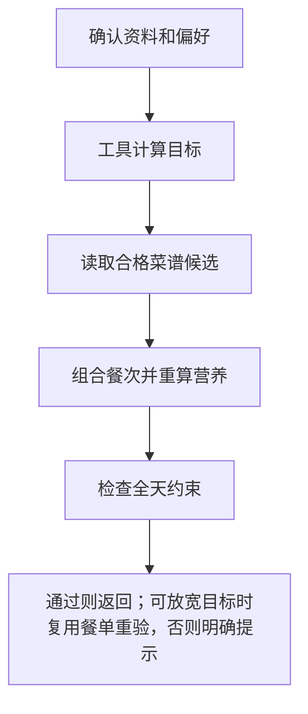

# 12 生成一日餐单：从可用候选中组合，再逐项校验

[返回功能学习总目录](README.md)

根据本次确认的目标和偏好选择早餐、午餐、晚餐，必要时含加餐，并检查整日约束。当前核心组合由后端规则完成，不是模型自由创作一份菜单。

## 1. 先看一个实际例子

小林确认资料和忌口，希望得到一日三餐。假设候选池有足够合格菜品，我们看系统怎样先组合，再决定能否接受，而不是只要凑出三道菜就成功。

这个例子贯穿下面的执行过程。示例数据用于理解代码，不是线上测量或真实模型效果证明。

## 2. 为什么需要这样实现

让模型直接输出三道菜很容易，但菜可能不在目录中，营养也无法复算。系统需要可计算的候选来源，并说明为什么某份计划能被接受。

## 3. 一张图看懂全过程



图展示主线，失败与追问分支在第 5 节对照阅读。

## 4. 跟着这个例子读代码

以下为当前源码的连续节选，省略外围处理，不能单独运行。每一步都说明调用位置和数据去向。

### 4.1 取得目标，明确下一动作

**收到什么**

用户已确认本次偏好；未确认的请求在前面返回 needs_input。

**代码在哪里**

[backend/app/agent/graph.py](../../backend/app/agent/graph.py) 的 `DietPlanningGraph.ainvoke`。

```python
current = state
target_result = self._tools.calculate_daily_target(
    profile=current.profile, preferences=current.preferences
)
current = self._record_tool(current, "calculate_targets", target_result.action.value, target_result)
if target_result.action is not PlanValidationAction.PASS or target_result.target is None:
    return self._safe_terminal(current, target_result.action, target_result.safe_message)
current = current.model_copy(
    update={"target": target_result.target, "next_action": DietPlanningAction.COMPOSE_PLAN}
)
```

**为什么这样写**

目标先通过确定性工具计算，失败不进入组合。把 target 写进状态，让后续校验仍对照同一目标。

**处理后变成什么，交给谁**

状态拿到 DailyTarget，下一步 COMPOSE_PLAN。显式资料保存处理后执行一次有预算的组合搜索。

> 语法小注：`model_copy(update=...)` 生成更新后的状态，传递下一步需要的数据。

### 4.2 把目标传给选菜服务

**收到什么**

`DailyTarget` 是确定性工具算出的全天目标；`PreferenceReview` 是用户确认的忌口和口味。

**代码在哪里**

[backend/app/agent/tools.py](../../backend/app/agent/tools.py) 的 `SessionNutritionToolAdapter.compose_daily_plan`。以下省略 Session 的创建和关闭：

```python
return service.compose_daily_meals(
    user_id=user_id,
    target=target,
    catalog_version=None,
    preferences=preferences,
    recipe_version=CONTROLLED_RECIPE_VERSION,
)
```

**为什么这样写**

目标必须参与选菜。管理员候选携带自己的目录版本，不固定为某个初始目录。新环境尚未配置过管理员候选时，服务可读取当前启用且审核通过的受控食谱；一旦存在管理员候选记录，即使全部停用或删除，也不会自动回退，避免绕过管理员决定。

**处理后变成什么，交给谁**

每个候选先按目录和原有份量重算营养；对单独候选，若启用份量适配且有目标，再计算一个受限的新克数选项，重新调用营养工具。两种份量一起交给 `planning/selection.py` 的 `select_meals`，营养公式不变。

### 4.3 在有界组合中比较目标与偏好

[backend/app/planning/selection.py](../../backend/app/planning/selection.py) 使用 `planning-selection.v9`。输入是已经计算好的候选餐次；输出是一组三餐或空结果。

- Repository 先筛餐次、启用状态和目录资格，再按 UUID 游标翻页：`id > after_id`，没有全库加载和“总数超过 1024 就失败”。管理员候选的两个目录来源先各取一页，再合并取当前页；初始受控菜谱也分页读取。
- Service 的 `_scan_recipes` 给每餐独立的条数和时间预算，默认每页 64 条、每餐最多扫描 2,048 条或 3 秒。先根据菜名和标签排除已知忌口，再调用营养工具并复核目录别名；后面的页面仍有机会进入候选。
- `select_meals` 按默认早餐 25%、午餐 40%、晚餐 35% 的权重筛选营养接近的候选；替换时先扣除固定餐次和加餐，再对剩余餐次归一化权重。每餐维护最多两组各 12 项的流式缓冲，不累积整个菜谱库的计算结果。配置入口见 [后端 README](../../backend/README.md#餐单筛选预算)。
- 忌口匹配先保留中文分句边界，再匹配受控菜名、别名和标签。例如“不吃辣 饮食清淡”中的“不吃辣”会排除“香辣”标签；这仍是有限文字规则，不代表能理解任意自然语言约束。
- 组合阶段默认最多尝试 1,728 个三餐组合或 2 秒，重复菜谱的组合也计入尝试预算；停止后保留已找到的最佳结果，再走最终校验。
- 初筛默认选 8 个营养优先项，再留最多 4 个名额给不同食物引用/已知食材和做法；缺少不同搭配时可用相似候选补足，最终每餐仍最多 12 项。
- 排序先看硬校验与目标符合情况，再比较口味匹配、近期重复和完整组合餐数量，最后综合全天目标中点偏差、餐次分配偏差和搭配相似程度；排序与遍历顺序固定；未触发时间截止且目录未变化时，同样输入、预算与历史产生相同结果。触发时间截止时，机器负载可能影响已扫描范围。
- 近期吃过的菜仍可使用：不能为了换花样丢掉唯一能通过校验的组合。
- 这是有限候选中的启发式搜索，不保证全局最优；最终仍必须通过 `validate_plan`。

`MealSelectionPolicy` 管理餐次权重和多样性强度，`PlanningSearchBudget` 管理工作量，两者分开配置。比如全天 1800 千卡时，默认初筛分别偏向 450/720/630 千卡；这是算法示例，实际选用原份量或重算后的调整份量，并校验全天结果。`SelectionCandidate` 在领域内部把卡片与食物引用包在一起，初始食谱带已知食材集合，管理员成品菜带关联营养条目；返回给 Agent 的仍只有 `PlannedMeal`，不把内部引用扩散到前端合同。

多样性通过已有食物引用集合、做法和口味标签的重合程度比较。`SelectionCandidate.flavours` 对已有口味标签去空白、统一大小写和全半角并去重；`_similarity` 计算标签集合的重合比例。新增口味权重默认 0.25，候选分组、预留名额选择和最终组合都使用同一口味规则。用户偏好里完全匹配的标签会从口味重复比较中排除，预留名额也优先保留这些偏好；例如“喜欢清淡”不能因为三餐清淡而被当成需要纠正的问题。缺少标签不能证明菜品口味不同，按没有新口味证据处理；相同标签仍可重复，营养校验与个人偏好优先。

两个不同菜名若引用同一食物或相同食材集合，仍会被识别为相似；不同目录条目却缺少配料明细时，不能保证识别“其实都是鸡肉”的情况。固定餐次只有已保存的卡片，因此换餐时可比较其做法和口味，但不会反查或猜测已丢失的配料结构。配置说明见[餐次分配与候选多样性](../../backend/README.md#餐次分配与候选多样性)。

忌口检查使用菜名、受控别名、做法和口味标签；受控食谱还检查每个已知食材的名称和别名。全角字符、大小写和多余空白会先归一化。管理员成品菜没有完整配料结构，不能把这种匹配当作过敏原保障，也不推断缺失配料。

时间预算是协作式检查：一次同步查询或计算返回后才会检查时间，不能保证整个请求严格在 11 秒内结束。预算耗尽并不表示库中不存在合适组合，只表示本次有限搜索没有找到；不会用不符合忌口的菜凑满三餐。指定替换按食物、餐次、菜谱 ID 和修订号直接过滤后再分页，旧修订和停用候选不能通过。

> 语法小注：生成器的 `yield` 每次交出一个候选，避免一次构造完整列表；UUID 游标只读取上次 ID 之后的行，更新日期不会让已读记录再次出现。`product(*pools)` 枚举各餐次候选的组合；评分元组从左到右比较。`Decimal` 保留十进制计算，避免浮点误差参与排序。

#### 午餐、晚餐如何包含多个食物

输入是管理员明确标记的主食、蛋白质菜和蔬菜候选。`PlanningService._compose_managed_candidates` 逐项过滤忌口并调用确定性营养计算；`BundlePool.add` 每类只保留有限的不同目录食物，`finish` 枚举各一项的组合。缺少任一类、不合格或同一个目录食物重复占多个角色，都不能形成组合餐。早餐保持原逻辑，不参与拼餐。

```text
分类候选 → 每项资格、忌口、目录计算 → 每类最多 4 项
→ 每餐最多 64 个组合 → 原有每餐初筛 → 全天组合与营养校验
→ 逐项展示 → 保存明细与当时来源版本
```

代码入口为 [bundles.py](../../backend/app/planning/bundles.py) 的 `BundlePool`。角色热量权重默认 45/35/20，仅帮助筛选，不是营养建议。组成菜品保持管理员填写的克数；整餐的重量及四项营养是 `Decimal` 逐项求和，`PlannedMeal` 和 `PlanMealSnapshot` 的运行时校验会拒绝总计不一致的明细。组合无额外模型调用，也不为每种组合重复查询营养。

`PlannedMeal.source_recipe_ids` 返回组成菜谱的真实 ID，跨餐重复检查与近期重复比较使用这些 ID，避免把不同组合的外壳当成完全不同食物。用于整餐替换的组合 ID 则由餐次、各组成菜谱 ID 和修订号确定；它不是新的目录条目。公开卡片不包含这些内部标识。

更换一餐时保留其他餐次快照；“清淡一些”要求每个组成菜品都有清淡标签。本版更换整餐，暂不支持只换其中一道菜。完成后 `agent/service.py` 构建组成来源证据，`PlanArchiveService.record_completion` 写入 `diet-plan-snapshot.v2`；保存当时的菜名、克数、营养和修订，不在读历史时回查当前菜谱重算。旧单菜快照兼容读取。开关关闭只停止生成新组合，保留读取能力。

> 语法小注：`product` 的三组输入代表三个角色，最多产生 K³ 个组合；`uuid5` 为同一组来源生成稳定标识；`items` 默认空元组让旧餐单仍能通过校验。配置及回退见[后端组合预算](../../backend/README.md#午晚餐组合预算)。

### 4.4 先尝试受限份量，再检查目标偏差

`PlanningService._adapted_portion` 先从全天热量目标中点扣除固定餐次和加餐，再按剩余餐次权重分配。以目标餐次热量除以原菜谱热量，得到份量倍率，夹在配置范围内后取整数克。默认范围是原克数的 75%～125%，是产品搜索限制，不是营养处方。

例如目录菜谱 100g 提供 600 kcal，午餐分配目标为 720 kcal，就增加 120g 的选项；原 100g 仍参与选择。成品菜重新调用 `calculate_nutrition`；受控食谱按实际份量倍率调整每种食材的计算克数。原目录、原份量说明和固定餐次快照不被改写，新卡片说明会标明原份量，避免错误沿用“4 只包子”等旧计数。

`SelectionCandidate.identity` 使用菜谱 ID 和克数，让同菜不同份量可以进入候选池；最终仍按菜谱 ID 禁止跨餐重复。每条菜谱最多新增一个选项、每餐最终最多 12 项，组合预算不扩大。这是有预算的近似搜索，不保证找到所有可行份量。

`validate_plan` 使用 `planning-validation.v2`：所有四项指标都检查距原目标最近边界的偏差，默认不超过该边界的 10%。任一项超限就返回不可放宽的 `REPLAN`；图不会重复尝试相同餐单。范围内的偏差仍是 `RELAX`，不能写成全部达标。配置为 0 可关闭放宽；忌口、最低能量和宏量比例检查始终先执行。

前端 `PlanOverview` 只汇总后端卡片数值用于展示，显示原目标、实际总量和四项差距，不替后端决定是否接受。旧历史计划也显示差距，不修改已保存数据。配置和回退见[后端 README](../../backend/README.md#份量适配与目标偏差)。

### 4.5 检查三餐与重复，之后才查数值

**收到什么**

组合产生 PlannedMeal 序列，包括餐次、菜谱 ID 和营养。

**代码在哪里**

[backend/app/planning/service.py](../../backend/app/planning/service.py) 的 `validate_plan`。

```python
if not set(REQUIRED_MEAL_SLOTS).issubset({meal.slot for meal in meals}) or len({meal.slot for meal in meals}) != len(meals):
    return PlanValidationResult(
        action=PlanValidationAction.REPLAN,
        rule_id="incomplete-meal-slots",
        safe_message="餐单必须包含不重复的早餐、午餐和晚餐后才能校验。",
    )
recipe_ids = [identity for meal in meals for identity in meal.source_recipe_ids]
if len(set(recipe_ids)) != len(recipe_ids):
    return PlanValidationResult(
        action=PlanValidationAction.REPLAN,
        rule_id="duplicate-controlled-recipe",
        safe_message="同一受控菜谱不能在一天内重复使用。",
    )
```

**为什么这样写**

三餐齐全、不重复是结构条件；后面先检查忌口、最低能量与宏量比例，再检查目标范围。范围放宽不能跳过宏量比例。单个食物算对不代表整日组合符合约束。

**处理后变成什么，交给谁**

违规返回 REPLAN；全部通过才 PASS。图不再原样组合三次。只有校验器通过 `relaxation_available` 明确允许调整目标范围时，才复用同一份餐单再校验一次；RELAX 会明确展示偏差，不等于严格通过。

> 语法小注：`set` 去重，比较数量能发现同一餐次或菜谱重复。

## 5. 换一种输入，会走哪条路

| 情况 | 判断与处理 | 应观察的结果 |
|---|---|---|
| 偏好未确认 | 等待输入 | 不开始组合 |
| 缺少某餐候选 | 结束当前生成，指出缺少的餐次 | 补充或启用合格菜谱后再生成 |
| 已确认忌口筛掉候选 | 结束并说明缺少的餐次 | 核对偏好或补充合适菜谱，不自动放宽忌口 |
| 候选营养数据不可用 | 与忌口问题区分 | 检查当前营养目录资格 |
| 扫描或组合预算耗尽 | 说明本次搜索额度用完 | 可稍后重试；反复发生时调整预算，不能断言库中没有解 |
| 仅目标范围不匹配 | 在规则允许时复用餐单重验一次 | 明确展示目标偏差，无重复目录计算 |
| 触犯排除项 | 不允许靠放宽接受 | 调整候选 |

### 5.1 失败分类与诊断怎样连接

`PlanningService._search_failure` 把实际扫描结果归为 `missing_slot`、`exclusions`、`nutrition_unavailable`、`search_budget` 或 `no_combination`。命中条数上限时不额外读取下一页，因此保守地标记“可能尚有未读候选”；不会将有限搜索失败误写成全库无解。

`DietPlanningGraph._validate_composed_meals` 同时服务首次生成和单餐替换。严格校验失败后，只有 `PlanValidationResult.relaxation_available=True` 才进入第二次校验；这个标志只允许目标区间偏差，不能用于忌口、最低能量、宏量比例或重复菜谱。第二次使用相同的 `meals`，营养工具会重新检查硬约束，不重新扫描菜谱。每次校验前检查剩余工具预算。新运行标记为 `diet-planning-graph.v2` / `planning-tools.v2`，Checkpoint 结构无需迁移。

每次组合输出一条 `planning_search` 后端诊断日志，由 [diagnostics.py](../../backend/app/planning/diagnostics.py) 的闭合 Schema 生成：按餐次记录页数、读取/扫描数量、忌口淘汰、目录不可用、其他条件过滤、营养计算次数、合格及最终候选数、停止原因与耗时。另记录组合尝试次数、重复组合数及校验通过/可调整/拒绝次数。工具边界的 `planning_validation` 记录最终规则码和是否采用目标调整。

日志不含用户标识、偏好正文、菜名、菜谱 ID、身体资料或营养目标数值。它们进入后端标准日志，不新增业务表，不发送给 Mem0，也不通过页面或 SSE 暴露。生产日志的保留时间由部署环境配置；目前没有新增日志查询后台。

## 6. 自己验证一次

在仓库根目录执行现有测试，使用后端已安装的测试环境：

```bash
cd backend
.venv/bin/python -m pytest tests/unit/test_diet_planning_graph.py tests/planning/test_planning_service.py tests/planning/test_personalized_selection.py -q
```

观察 COMPOSE 后还必须 VALIDATE，检查候选失败只组合一次、目标范围偏差最多校验两次，以及 PASS/RELAX 的不同结果。用户主动换餐仍保留三次调整上限，自动校验不消耗这个计数。替身验证的是规则路由，不是模型菜单质量。

新增回归覆盖不同目标产生不同组合、口味排序、别名忌口、仅剩可行旧菜、组合上限和宏量比例不能被放宽跳过。替身测试证明指定输入下的代码行为，不能替代真实模型效果、数据库并发或页面验收。

2026-09-15 早前本地验收：`frontend/tests/e2e/plans.spec.ts` 两项通过；Codex 内置浏览器走过公开注册、资料保存、生成、午餐清淡调整、刷新和历史版本。无可替换早餐时流程有界结束，已保存餐单未被覆盖。使用 Fake Provider，仅验证产品链路；真实模型理解质量与真实设备软键盘仍未验证。

同日重新生成故障修复追加验证：规划模块与图测试 114 项、独立 PostgreSQL 计划接口与完成投影测试 9 项、前端全部组件测试 179 项通过。内置浏览器在 `http://127.0.0.1:5178/app/plans` 使用经公开接口注册和准备资料的独立账号，验证偏好未确认提示、首次生成、取消重新生成、生成第 2 版和刷新保留；使用当前 612 条可用候选及“不吃辣 饮食清淡”输入。另修复前端将 SSE 序号当作非法负载字段的问题，进度流结束后重读最终快照，避免历史进度覆盖成功或失败结果。本次未重跑 Playwright E2E；上述浏览器验收为真实页面与公开 API 交互。

同日分批筛选改造验证：规划 Service、选择器和图测试 129 项通过，覆盖 1,500/7,000 条候选、排除项位于前几页、各餐独立的扫描条数/时间预算、组合次数/时间预算，以及指定菜谱的修订复核。独立 PostgreSQL 的候选 Repository、规划接口、完成投影测试 27 项通过；其中 1,200 条候选通过每餐两页、每页最多 7 条组成三餐，并检查 SQL 含 LIMIT、游标不重复、最新目录资格有效。内置浏览器使用独立测试账号在 5178 页面重新生成第 3 版计划并刷新，三餐和自动保存状态保留。

本次还通过 Ruff 检查及餐单 Playwright 两项测试（首次生成、单餐调整、刷新和历史版本）；使用原 `plans.spec.ts` 的临时副本，仅移除共享 Mailpit 邮箱的全量清空调用，所有业务断言保持不变，独立服务使用 5198/8098/5199 端口和受保护测试库，结束后临时副本及服务已清理。前后台构建通过，用户前端仍有既有的打包体积警告。

这些验证不是百万级数据压测；尚未验证极端数据库慢查询下的请求总耗时，也不证明有限候选搜索能找到全库最优组合。

同日失败诊断与有效重试验证：142 项规划/图测试、27 项独立 PostgreSQL 集成测试、14 项计划页测试及 2 项餐单 Playwright 测试通过；Ruff、前端类型检查与构建通过。Playwright 继续使用保留业务断言、仅移除共享邮箱全量清空调用的临时副本，结束后已删除。未执行完整后端和全站前端回归；当前证据覆盖本次规划链路，不代表真实模型质量或生产慢查询压测。

内置浏览器在临时 5198/8098 测试环境，通过实际登录页使用 E2E 注册的测试账号：请求替换早餐，在只有一份早餐且该份已被使用时看到明确的“早餐没有满足当前要求的可用候选”提示；刷新后第 1 版三餐保留，重新生成成功保存第 2 版。对应日志只有一次失败筛选，记录 `missing_slot`、早餐扫描 1 条、营养计算 0 次，没有用户原文；临时页面及服务已关闭。

2026-09-15 餐次分配与多样性验证：规划 Service/选择器/图共 162 项测试通过，Ruff 通过。新增场景覆盖 25/40/35 与等权切换、固定餐次与加餐扣除、剩余餐次权重归一化、菜名不同但食物引用相同、做法差异、缺少替代候选、营养校验优先、每餐两组各 K 项缓冲，以及非法配置。管理员成品菜和初始食谱均通过领域服务测试，确认多样性候选仍受忌口约束。另修复空早餐导致其他餐次候选统计遗漏，并补充首餐/末餐缺失回归。

独立 PostgreSQL 的候选 Repository、规划 API 和完成投影共 27 项通过（其中 API 7 项在修复后重跑通过）；旧接口测试的“午餐临时忌口写长期记忆”断言已与临时范围规则同步。Playwright 生成、单餐替换、历史版本和刷新两项路径通过，前端与后台构建成功。使用原有 `plans.spec.ts` 的临时副本，仅去掉清空共享 Mailpit 的步骤；业务断言保留，副本随后删除。测试日志中的本地追踪收集器连接失败未影响上述业务断言，不作为追踪链路通过的证据。

内置浏览器使用隔离测试账号，在 `http://127.0.0.1:5198/app/plans` 登录 → 重新生成 → 复核偏好 → 生成 → 刷新，确认三餐和第 2 版自动保存状态保留。这是餐次权重改动时的历史验收：少量测试种子触发了当时的目标调整提示；本次份量适配已增加放宽上限，旧验收不证明新规则通过。临时服务及页面已关闭，未调用真实模型/Mem0，未对真实大菜谱库做质量评分。

### 2026-09-16 份量适配与目标偏差验证

- 后端规划 Service/选择器/图共 185 项通过，新增测试覆盖成品菜与多食材食谱重算、原目录不变、固定餐次和加餐、整数克上下限、零能量、调整计算不可用时保留原份量、候选预算、四项偏差和非法配置；Ruff 通过。
- 隔离 PostgreSQL 的候选 Repository、规划 API、完成投影共 27 项通过。前端计划相关 37 项测试、TypeScript 和定向 ESLint 通过。前端与后台构建成功。
- Playwright 两条路径通过：原测试资料的较高目标现在因超差拒绝，不保存；另一个可满足的测试资料生成成功；单餐替换保留其他餐、焦点和按钮视口位置，刷新、历史版本及测试计划删除正常。校验阅读位置用按钮在视口的位置，而不是提示消失后已改变的绝对滚动偏移。执行时使用去掉清空共享 Mailpit 步骤的临时副本，保留业务断言。
- 内置浏览器在 `http://127.0.0.1:5198/app/plans` 登录隔离测试账号 → 重新生成 → 复核偏好 → 保存第 2 版 → 刷新。观察到原 260g/430g/435g 调整为 325g/537g/543g，约 1,834 kcal，四项均落在该测试目标内；较高目标明确提示超差，刷新后仍保留第 2 版，没有覆盖成功餐单。
- 验收覆盖桌面中的 H5 容器和相关成功/失败状态，未完成全部手机尺寸与 200% 缩放矩阵；未对真实用户的大菜谱库进行质量评估。测试使用 Fake Provider 和隔离数据库，没有访问真实 Mem0 或模型服务。临时测试服务和页面已关闭。

### 2026-09-16 口味多样性验证

新增 `tests/planning/test_flavour_diversity.py` 的 15 项测试：相同营养和食材下选择不同口味、有限候选池保留口味代表、明确偏好优先及重复豁免、空白/重复标签不产生新口味、固定餐卡参与比较、营养校验优先、缺少替代项仍允许重复，以及真实领域服务先排除辣味候选。关闭 `PLANNING_FLAVOUR_DIVERSITY_WEIGHT` 后回到原有食材/做法评分；非法权重在配置入口拒绝。

规划和图共 200 项测试通过，Ruff 与差异格式检查通过；隔离 PostgreSQL 的候选、规划 API 与完成投影共 27 项通过。原计划 Playwright 两条路径通过，包含较高目标拒绝、生成、换餐、历史版本和刷新；执行时仅从临时副本去掉清空共享 Mailpit 的步骤，副本随后删除。

内置浏览器在 `http://127.0.0.1:5198/app/plans` 使用测试账号，登录 → 重新生成 → 复核偏好 → 保存第 2 版 → 刷新，结果保留且四项营养在该目标范围内。种子菜谱口味较单一，浏览器验收证明流程可用，不能据此宣称真实大库的多样性效果已评估；口味选择差异由定向用例验证。临时服务与页面已关闭，未使用真实模型或 Mem0。

## 7. 读完应该能回答什么

1. 候选来源在哪里决定？
2. 为什么选满三餐仍可能不通过？
3. RELAX 与 PASS 有何区别？

源码阅读顺序：[agent/graph.py](../../backend/app/agent/graph.py) → [planning/service.py](../../backend/app/planning/service.py)。先跟本例函数走一遍，再展开旁支。

### 组合餐验证（2026-09-16）

- `backend/tests/planning/test_meal_bundles.py` 验证完整角色、逐项计算与汇总、缺项/忌口/不可用拒绝、各级预算、整餐替换、固定餐次和来源版本冻结；相关规划与图单测共 217 项通过。
- `backend/tests/integration/test_managed_recipe_candidate_repository.py`、`test_diet_planning_agent_api.py`、`test_planning_completion_projection.py` 的隔离 PostgreSQL 定向测试共 33 项通过（新增组合用例修正测试目录后单独复验通过）。
- H5 计划组件测试 40 项、后台定向组件测试 9 项、两端类型检查与构建通过。补充了恢复旧会话时不得清空未提交换餐文字的回归测试；Ruff 与差异空白检查通过。
- `frontend/tests/e2e/meal-bundles.spec.ts` 完整流程通过：公开接口准备合成目录 → 页面生成 → 刷新 → 换午餐并保留其他餐 → 历史详情 → 停用蔬菜后历史仍可读 → 新生成失败且旧计划不丢失。
- 内置浏览器访问隔离环境 `http://127.0.0.1:5198/app/plans`，实际登录、提交“午餐换一份”，看到第 3 版、鱼肉替换鸡胸肉及“已调整”；早餐和晚餐明细保留。空调整显示校验提示，历史详情仍显示三项组成、克数及各项/整餐热量，窄页面壳排版已检查。

上述验证使用 Fake Provider 与合成目录，不调用真实模型或 Mem0；未自动分类真实菜谱，也未验证真实全库搭配质量。缺少完整分类或可行份量时仍可能无法生成组合；新旧候选共同参与有限搜索，不能保证每次都选组合餐。
