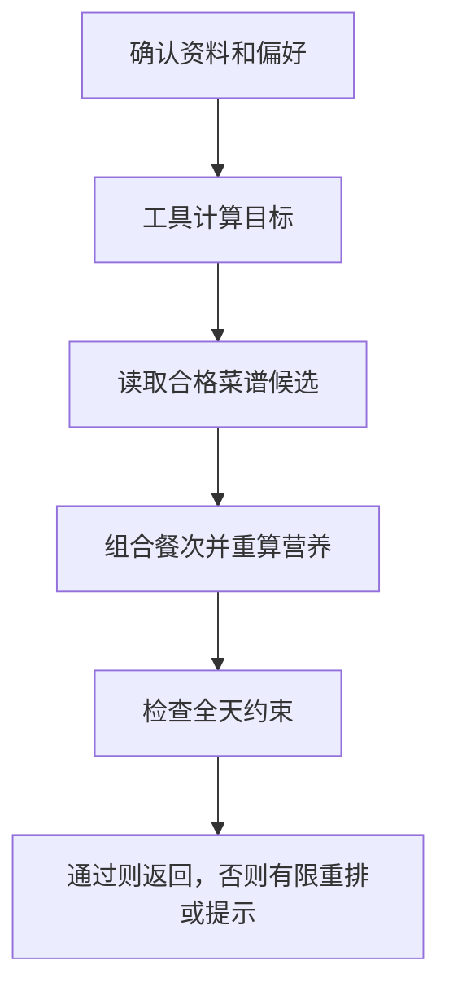

# 12 生成一日餐单：从可用候选中组合，再逐项校验

[返回功能学习总目录](README.md)

根据本次确认的目标和偏好选择早餐、午餐、晚餐，必要时含加餐，并检查整日约束。当前核心组合由后端规则完成，不是模型自由创作一份菜单。

## 1. 先看一个实际例子

小林确认资料和忌口，希望得到一日三餐。假设候选池有足够合格菜品，我们看系统怎样先组合，再决定能否接受，而不是只要凑出三道菜就成功。

这个例子贯穿下面的执行过程。示例数据用于理解代码，不是线上测量或真实模型效果证明。

## 2. 为什么需要这样实现

让模型直接输出三道菜很容易，但菜可能不在目录中，营养也无法复算。系统需要可计算的候选来源，并说明为什么某份计划能被接受。

## 3. 一张图看懂全过程



图展示主线，失败与追问分支在第 5 节对照阅读。

## 4. 跟着这个例子读代码

以下为当前源码的连续节选，省略外围处理，不能单独运行。每一步都说明调用位置和数据去向。

### 4.1 取得目标，明确下一动作

**收到什么**

用户已确认本次偏好；未确认的请求在前面返回 needs_input。

**代码在哪里**

[backend/app/agent/graph.py](../../backend/app/agent/graph.py) 的 `DietPlanningGraph.ainvoke`。

```python
current = state
target_result = self._tools.calculate_daily_target(
    profile=current.profile, preferences=current.preferences
)
current = self._record_tool(current, "calculate_targets", target_result.action.value, target_result)
if target_result.action is not PlanValidationAction.PASS or target_result.target is None:
    return self._safe_terminal(current, target_result.action, target_result.safe_message)
current = current.model_copy(
    update={"target": target_result.target, "next_action": DietPlanningAction.COMPOSE_PLAN}
)
```

**为什么这样写**

目标先通过确定性工具计算，失败不进入组合。把 target 写进状态，让后续重排仍对照同一目标。

**处理后变成什么，交给谁**

状态拿到 DailyTarget，下一步 COMPOSE_PLAN。显式资料保存处理后进入有限组合循环。

> 语法小注：`model_copy(update=...)` 生成更新后的状态，传递下一步需要的数据。

### 4.2 优先从已启用候选池选择

**收到什么**

组合函数收到目标关联信息、偏好以及本次排除的菜谱。此处展示已通过前置身份检查后的候选来源选择。

**代码在哪里**

[backend/app/planning/service.py](../../backend/app/planning/service.py) 的 `compose_daily_meals`。

```python
candidates = getattr(self._repository, "list_managed_recipe_candidates", lambda **_: [])(catalog_version=catalog_version)
if required_recipe_id is not None:
    candidates = [item for item in candidates if item.meal_slot is not required_slot or (item.id == required_recipe_id and item.revision == required_recipe_revision)]
if candidates:
    recent_recipe_ids = () if user_id is None else getattr(
        self._repository, "list_recent_recipe_ids", lambda **_: ()
    )(user_id=user_id, plan_limit=3)
    return self._compose_managed_candidates(
        candidates, preferences, exclude_recipe_ids, recent_recipe_ids, required_food_id, required_catalog_version, required_slot
    )
if catalog_version is None:
    return MealCompositionResult(
        action=PlanValidationAction.REPLAN,
        safe_message="没有可用于餐单的已启用候选菜。请先在菜谱管理中启用合格候选菜。",
    )
```

**为什么这样写**

已有管理员候选时走候选组合，并参考最近三份历史降低重复。没有候选也不能凭空生成：是否能用受控菜谱还取决于目录版本。

**处理后变成什么，交给谁**

候选路径得到按份量重算的餐次组合；缺来源会返回 REPLAN。这里主要是后端规则，不存在模型自由创作整份菜单的调用。

> 语法小注：`getattr(..., 默认函数)` 兼容不同实现的仓储接口，不代表运行时自动获得新能力。

### 4.3 检查三餐与重复，之后才查数值

**收到什么**

组合产生 PlannedMeal 序列，包括餐次、菜谱 ID 和营养。

**代码在哪里**

[backend/app/planning/service.py](../../backend/app/planning/service.py) 的 `validate_plan`。

```python
if not set(REQUIRED_MEAL_SLOTS).issubset({meal.slot for meal in meals}) or len({meal.slot for meal in meals}) != len(meals):
    return PlanValidationResult(
        action=PlanValidationAction.REPLAN,
        rule_id="incomplete-meal-slots",
        safe_message="餐单必须包含不重复的早餐、午餐和晚餐后才能校验。",
    )
if len({meal.recipe_id for meal in meals}) != len(meals):
    return PlanValidationResult(
        action=PlanValidationAction.REPLAN,
        rule_id="duplicate-controlled-recipe",
        safe_message="同一受控菜谱不能在一天内重复使用。",
    )
```

**为什么这样写**

三餐齐全、不重复是结构条件；后面还检查忌口、总量与比例。单个食物算对不代表整日组合符合约束。

**处理后变成什么，交给谁**

违规返回 REPLAN；全部通过才 PASS。图最多有限次数组合；RELAX 是明确标出的目标放宽，不等于严格通过。

> 语法小注：`set` 去重，比较数量能发现同一餐次或菜谱重复。

## 5. 换一种输入，会走哪条路

| 情况 | 判断与处理 | 应观察的结果 |
|---|---|---|
| 偏好未确认 | 等待输入 | 不开始组合 |
| 候选不足 | 重排或结束 | 不编造新菜 |
| 触犯排除项 | 不允许靠放宽接受 | 调整候选 |

## 6. 自己验证一次

在仓库根目录执行现有测试，使用后端已安装的测试环境：

```bash
cd backend
.venv/bin/python -m pytest tests/unit/test_diet_planning_graph.py tests/planning/test_planning_service.py -q
```

观察 COMPOSE 后还必须 VALIDATE，检查三次上限及 PASS/RELAX 的不同结果。替身验证的是规则路由，不是模型菜单质量。

本轮运行范围与结果见[总目录验证记录](README.md)。替身测试证明指定输入下的代码行为，不能替代真实模型效果、数据库并发或页面验收。

## 7. 读完应该能回答什么

1. 候选来源在哪里决定？
2. 为什么选满三餐仍可能不通过？
3. RELAX 与 PASS 有何区别？

源码阅读顺序：[agent/graph.py](../../backend/app/agent/graph.py) → [planning/service.py](../../backend/app/planning/service.py)。先跟本例函数走一遍，再展开旁支。
