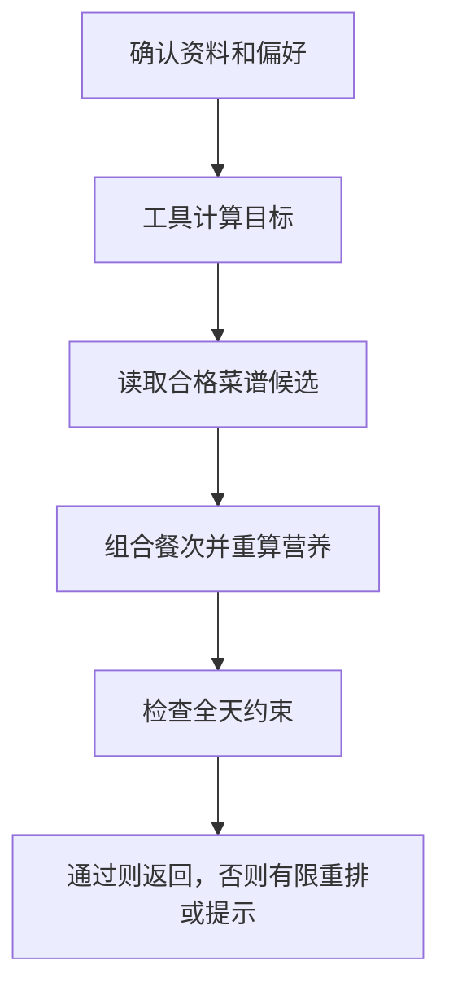

# 12 生成一日餐单：从可用候选中组合，再逐项校验

[返回功能学习总目录](README.md)

根据本次确认的目标和偏好选择早餐、午餐、晚餐，必要时含加餐，并检查整日约束。当前核心组合由后端规则完成，不是模型自由创作一份菜单。

## 1. 核心能力

在受控候选中选菜，按目录和份量重算营养，再检查餐次、重复、忌口和目标；无法满足时有限重排或明确提示。

## 2. 业务背景

让模型直接输出三道菜很容易，但菜可能不在目录中，营养也无法复算。系统需要可计算的候选来源，并说明为什么某份计划能被接受。

## 3. 整体执行流程



流程图展示主线；失败、追问等分支在下面对应步骤中说明。

## 4. 关键代码与设计理由

### 4.1 图组织流程，服务负责规则

[graph.py](../../backend/app/agent/graph.py) 的 `DietPlanningGraph.ainvoke` 先调目标工具，再组合、校验。核心循环：

```python
while current.replan_count < 3:
    composition = self._tools.compose_daily_plan(
        user_id=current.user_id,
        target=target_result.target,
        preferences=current.preferences,
        replan_count=current.replan_count,
    )
```

循环明确有上限。工具实现位于 {L("backend/app/agent/tools.py")}，领域逻辑位于 {L("backend/app/planning/service.py")}。

### 4.2 候选从后台或受控菜谱来

`compose_daily_meals` 优先处理可用的管理员候选；没有候选时是否可走受控菜谱取决于目录版本等条件。代码会排除不匹配餐次、重复或冲突的菜，营养重新调用目录计算。

管理员候选路径会参考最近三份历史计划进行轮换；这是一套确定性选择逻辑，不要写成模型学会了用户口味。

### 4.3 通过、重排与放宽必须区分

`validate_plan` 检查三餐是否齐全、同菜是否重复、是否触碰排除项、总量与比例是否满足政策。返回 `PASS` 才是严格通过；`RELAX` 表示允许范围内的目标放宽，结果中必须明确呈现；不能放宽忌口等硬约束。

当前 `DietPlanningGraph` 没有文本 Reasoning Provider 成员，所以不要为了“突出 AI”虚构一次模型规划调用。这里最值得学习的是模型产品如何依靠后端约束得到可验结果。

## 5. 难懂语法

`while current.replan_count < 3` 是有界循环；`is PlanValidationAction.PASS` 比较枚举成员。枚举把可返回状态限制成一组明确选项。

## 6. 怎么验证、怎么继续读

读 [test_diet_planning_graph.py](../../backend/tests/unit/test_diet_planning_graph.py) 的图路由和终止，再读 [test_planning_service.py](../../backend/tests/planning/test_planning_service.py)、[test_managed_recipe_candidates.py](../../backend/tests/planning/test_managed_recipe_candidates.py) 的领域规则。

读完试着回答：**为什么“成功选出三道菜”不等于“餐单通过校验”？**

---

本文解释当前代码行为；代码块为源码节选，省略外围逻辑，不能单独运行。示例用于讲解，不代表真实模型必然输出相同结果。测试执行范围见总目录。
