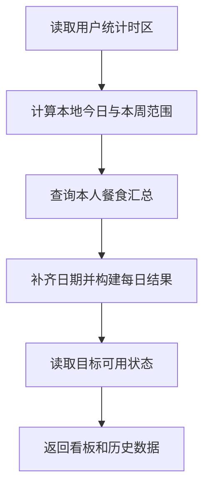

# 15 摄入统计与历史看板：先确定哪一天，再汇总

[返回功能学习总目录](README.md)

按用户确认的统计时区，把正式餐食记录汇总成今日和本周数据，并提供历史列表。这里的数值来自已保存记录，不由 AI 估计。

## 1. 先看一个实际例子

假设小林已确认统计时区，本周有两天保存了餐食。他打开看板，后端要把记录放进正确的本地日期，并为一周构建结果。

这个例子贯穿下面的执行过程。示例数据用于理解代码，不是线上测量或真实模型效果证明。

## 2. 为什么需要这样实现

同一时刻在不同地区可能是两天。如果用服务器日期决定“今天”，用户的晚餐可能被放到明天。统计必须有固定、可解释的时间归属。

## 3. 一张图看懂全过程



图展示主线，失败与追问分支在第 5 节对照阅读。

## 4. 跟着这个例子读代码

以下为当前源码的连续节选，省略外围处理，不能单独运行。每一步都说明调用位置和数据去向。

### 4.1 先确定用户本地今天

**收到什么**

看板收到可信 user_id 和当前时间，统计时区从后端读取。

**代码在哪里**

[backend/app/dashboard/service.py](../../backend/app/dashboard/service.py) 的 `_local_dashboard_today`。

```python
preference = repository.get_dashboard_timezone_for_user(user_id=user_id)
if preference is None:
    raise DashboardTimezonePreconditionError("dashboard timezone confirmation is required")
try:
    zone = ZoneInfo(preference.time_zone)
except (TypeError, ValueError, ZoneInfoNotFoundError) as error:
    raise DashboardTimezonePreconditionError("dashboard timezone confirmation is required") from error
instant = now()
if instant.tzinfo is None:
    raise RuntimeError("dashboard clock must return an aware instant")
return instant.astimezone(zone).date()
```

**为什么这样写**

不能让每次浏览器请求随意决定今天属于哪一天。缺已确认时区要明确处理，不默认用服务器时区假装正确。

**处理后变成什么，交给谁**

得到小林时区中的 date，交给 get_overview 算自然周范围。

> 语法小注：`ZoneInfo` 使用时区规则转换时间，date 只保留日期。

### 4.2 查询本周记录并逐日组织

**收到什么**

已有本地 today；仓储负责按用户与日期查询已记录数据。

**代码在哪里**

[backend/app/dashboard/service.py](../../backend/app/dashboard/service.py) 的 `get_overview`。

```python
today = _local_dashboard_today(repository=self._repository, user_id=user_id, now=self._now)
start = today - timedelta(days=today.weekday())
end = start + timedelta(days=6)
aggregates = {
    aggregate.consumed_local_date: aggregate
    for aggregate in self._repository.get_daily_aggregates(user_id=user_id, start_date=start, end_date=end)
}
week = tuple(self._day_summary(day=current_day, aggregate=aggregates.get(current_day)) for current_day in _days(start, end))
today_summary = self._day_summary(day=today, aggregate=aggregates.get(today))
return DashboardOverview(today=today_summary, week=week, target_eligibility=self._target_port.get_dashboard_target_eligibility(user_id=user_id))
```

**为什么这样写**

从本周周一到周日，按日期映射结果，再补齐每一天。输入来自已确认记录快照，不从模型聊天内容推摄入。

**处理后变成什么，交给谁**

得到 today 和 week 结果，再附目标可用状态。没有记录的一天只是记录不足，不代表真实摄入为零。

> 语法小注：`weekday()` 周一为 0；减去对应天数得到周一。

### 4.3 历史分页只返回当前窗口

**收到什么**

小林翻下一段历史，携带上次返回的游标。

**代码在哪里**

[backend/app/dashboard/service.py](../../backend/app/dashboard/service.py) 的 `get_history`。

```python
decoded = self._cursor_codec.decode(cursor) if cursor is not None else None
rows = self._repository.get_history_page(user_id=user_id, cursor=decoded, limit=limit + 1)
page_rows, has_more = rows[:limit], len(rows) > limit
grouped: dict[date, list[DashboardHistoryRecord]] = defaultdict(list)
for record in page_rows:
    grouped[record.consumed_local_date].append(record)
groups = tuple(self._history_group(day=day, records=records) for day, records in grouped.items())
next_cursor = self._cursor_codec.encode(DashboardHistoryCursor.from_record(page_rows[-1])) if has_more else None
return DashboardHistoryPage(groups=groups, next_cursor=next_cursor)
```

**为什么这样写**

游标先校验，再按用户查询。多取一条判断是否还有下一页，不能把客户端游标当任意数据库查询条件。

**处理后变成什么，交给谁**

返回按日期分组的历史与下一游标。这里的分页位置和每日聚合是两种不同用途的数据。

> 语法小注：游标是“从哪个位置继续”的凭据，不是当前页所有记录。

## 5. 换一种输入，会走哪条路

| 情况 | 判断与处理 | 应观察的结果 |
|---|---|---|
| 未确认时区 | 前置条件失败 | 不随意归入服务器日期 |
| 当天没记录 | 返回记录空态或零汇总 | 不等于证明没吃 |
| 非法游标 | 校验拒绝 | 不任意翻读 |

## 6. 自己验证一次

在仓库根目录执行现有测试，使用后端已安装的测试环境：

```bash
cd backend
.venv/bin/python -m pytest tests/dashboard/test_dashboard_service.py -q
```

对照本地日期、周边界和缺记录日期的预期；再看分页游标错误。数据库归属过滤仍需集成测试。

本轮运行范围与结果见[总目录验证记录](README.md)。替身测试证明指定输入下的代码行为，不能替代真实模型效果、数据库并发或页面验收。

## 7. 读完应该能回答什么

1. 为什么先确定时区？
2. 看板统计的到底是什么？
3. 游标签名能代替用户归属检查吗？

源码阅读顺序：[dashboard/service.py](../../backend/app/dashboard/service.py)。先跟本例函数走一遍，再展开旁支。
