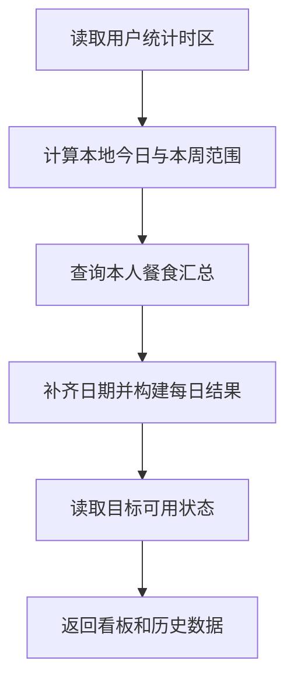

# 15 摄入统计与历史看板：先确定哪一天，再汇总

[返回功能学习总目录](README.md)

按用户确认的统计时区，把正式餐食记录汇总成今日和本周数据，并提供历史列表。这里的数值来自已保存记录，不由 AI 估计。

## 1. 核心能力

确定用户本地今日与自然周，聚合记录快照，附带可用目标状态；历史列表分页读取并检查游标。

## 2. 业务背景

同一时刻在不同地区可能是两天。如果用服务器日期决定“今天”，用户的晚餐可能被放到明天。统计必须有固定、可解释的时间归属。

## 3. 整体执行流程



流程图展示主线；失败、追问等分支在下面对应步骤中说明。

## 4. 关键代码与设计理由

### 4.1 日期由后端计算

[service.py](../../backend/app/dashboard/service.py) 的 `get_overview`：

```python
today = _local_dashboard_today(repository=self._repository, user_id=user_id, now=self._now)
start = today - timedelta(days=today.weekday())
end = start + timedelta(days=6)
```

`weekday()` 以周一为 0，因此减去这个天数得到本周周一。时区由用户已确认的数据读取，不让每次请求任意提交统计窗口。

### 4.2 汇总正式记录，不汇总模型消息

[repository.py](../../backend/app/dashboard/repository.py) 按用户和日期读取已确认、未删除的记录快照。对话里讨论过某食物，不等于已经吃下并记录。

目标通过窄接口读取完成计划资格，不能从个人资料随意重新推一个目标放上看板。没有记录不等于证实用户没吃东西，阅读图表时要区分记录覆盖和实际摄入。

### 4.3 分页游标不是随便传一个页码

`DashboardCursorCodec` 对游标编码并签名；`get_history` 验证后交给查询。游标保存下一段读取的位置，最终数据仍要按用户过滤，签名不能代替归属检查。

## 5. 难懂语法

`timedelta(days=...)` 表示时间差。字典推导式把“日期 → 聚合数据”组织成可快速查找的映射，方便逐天构建一周数据。

## 6. 怎么验证、怎么继续读

读 [test_dashboard_service.py](../../backend/tests/dashboard/test_dashboard_service.py)，真实时间与聚合检查见 [test_dashboard_repository.py](../../backend/tests/integration/test_dashboard_repository.py)、[test_record_local_time_attribution.py](../../backend/tests/integration/test_record_local_time_attribution.py)。下一篇：[AI 周复盘](feature-weekly-review.md)。

读完试着回答：**为什么没有记录的一天，不能直接理解成用户当天没有摄入？**

---

本文解释当前代码行为；代码块为源码节选，省略外围逻辑，不能单独运行。示例用于讲解，不代表真实模型必然输出相同结果。测试执行范围见总目录。
