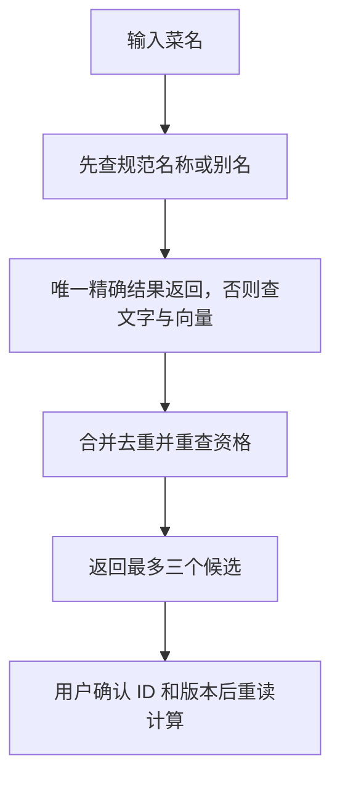

# 05 菜品检索：精确命中直接用，相似候选先确认

[返回功能学习总目录](README.md)

把用户的菜名对应到受控营养目录。唯一精确匹配可直接使用；文字相似或语义相近时返回候选供确认。

## 1. 先看一个实际例子

小林输入一个与目录不完全相同的菜名。系统先尝试唯一精确匹配，没有时才给出相似候选；小林选好后，再确认当前版本仍能计算。

这个例子贯穿下面的执行过程。示例数据用于理解代码，不是线上测量或真实模型效果证明。

## 2. 为什么需要这样实现

用户叫法与目录名称可能不同，但“听起来像”不代表营养相同。检索负责缩小范围，不能把最像的条目强行当成用户吃过的菜。

## 3. 一张图看懂全过程



图展示主线，失败与追问分支在第 5 节对照阅读。

## 4. 跟着这个例子读代码

以下为当前源码的连续节选，省略外围处理，不能单独运行。每一步都说明调用位置和数据去向。

### 4.1 先找唯一精确条目

**收到什么**

查询已规范化，且本次已装配混合检索依赖。若依赖未装配，前面的代码走 legacy_search。

**代码在哪里**

[backend/app/nutrition/service.py](../../backend/app/nutrition/service.py) 的 `NutritionService.search_food_catalog`。

```python
exact_matches = self._search_repository.find_current_qualified_exact(
    normalized_query=normalized_query
)
if len(exact_matches) == 1:
    return self._trace_result(
        self._pass_exact(request, exact_matches[0]),
        channel="exact",
        fallback_code="none",
        started_at=time.monotonic(),
    )
```

**为什么这样写**

精确名称或别名唯一命中时，不必调用 Embedding。否则会把明确的输入变成不必要的模型相似性判断。

**处理后变成什么，交给谁**

唯一命中直接返回 PASS 和条目。本例假设没有唯一结果，继续文字与向量通道。

> 语法小注：`len(...) == 1` 强调唯一，不是只要查到一条以上就使用第一条。

### 4.2 用文字和向量找候选

**收到什么**

菜名没有精确解决，已有规范化查询文字。

**代码在哪里**

[backend/app/nutrition/service.py](../../backend/app/nutrition/service.py) 的 `NutritionService.search_food_catalog`。

```python
embedding = await asyncio.wait_for(
    self._embedding_provider.embed(
        EmbeddingRequest(
            names=(normalized_query,),
            text_type="query",
            model_alias="hybrid-food-query-v1",
        )
    ),
    timeout=EMBEDDING_TIMEOUT_SECONDS,
)
query_vector = tuple(embedding.vectors[0].values)
vector_evidence = self._search_repository.find_vector_candidates(
    query_vector=query_vector, limit=SEMANTIC_RECALL_LIMIT
)
```

**为什么这样写**

先取得文字候选，再让 Embedding 将查询编码为数值特征，去数据库检索相近向量。向量接近只是候选证据，不是证明吃过这道菜。

**处理后变成什么，交给谁**

得到两组候选证据，交给融合排序。超时等已分类问题可保留文字结果，但非临时 Provider 错误并非全部被吞掉。

> 语法小注：`asyncio.wait_for` 限制等待；query_vector 只在本次调用内使用。

### 4.3 合并后重新查资格，返回 ASK

**收到什么**

融合函数收到文本与向量证据；某条目录可能在此期间被管理员撤销。

**代码在哪里**

[backend/app/nutrition/service.py](../../backend/app/nutrition/service.py) 的 `NutritionService.search_food_catalog`。

```python
fused = fuse_food_search_evidence([*text_evidence, *vector_evidence])
rematerialized = tuple(
    self._current_candidate(candidate, food)
    for candidate in fused.candidates
    if (
        food := self._search_repository.get_current_qualified_food(
            food_id=candidate.food_id,
            catalog_version=candidate.catalog_version,
        )
    )
    is not None
)
result = FoodSearchResult(
    action=NutritionAction.ASK,
    query=request.query,
    candidates=rematerialized,
    safe_message="请从候选食物中选择最符合的一项。"
    if rematerialized
    else "目录中没有可直接计算的匹配项，请更换名称或排除该项。",
)
```

**为什么这样写**

融合结果还要重读当前合格条目，避免把旧候选当授权。结果动作固定 ASK，即便只剩一个相似候选也要确认。

**处理后变成什么，交给谁**

小林看到最多三个候选。选定的 ID 与版本交回图后，图核对它确实曾被提供，再权威重读，最后进入计算。

> 语法小注：`food := ...` 在表达式中取得并保存查询结果；后面的 is not None 排除已失格项。

## 5. 换一种输入，会走哪条路

| 情况 | 判断与处理 | 应观察的结果 |
|---|---|---|
| 唯一精确结果 | 精确通道直接返回 | 不调用向量模型 |
| Embedding 超时 | 按既定降级处理 | 仍可能返回文字候选 |
| 候选已撤销 | 重读资格排除 | 不能继续计算旧条目 |

## 6. 自己验证一次

在仓库根目录执行现有测试，使用后端已安装的测试环境：

```bash
cd backend
.venv/bin/python -m pytest tests/unit/test_hybrid_food_search.py -q
```

检查精确分支是否绕过模型、非精确是否始终 ASK，以及故障后候选集合；数据库相似度查询需另跑 integration/test_hybrid_food_search.py。

本轮运行范围与结果见[总目录验证记录](README.md)。替身测试证明指定输入下的代码行为，不能替代真实模型效果、数据库并发或页面验收。

## 7. 读完应该能回答什么

1. 为什么精确优先？
2. 向量相近能证明什么、不能证明什么？
3. 确认后为什么还要查版本？

源码阅读顺序：[nutrition/service.py](../../backend/app/nutrition/service.py)。先跟本例函数走一遍，再展开旁支。
