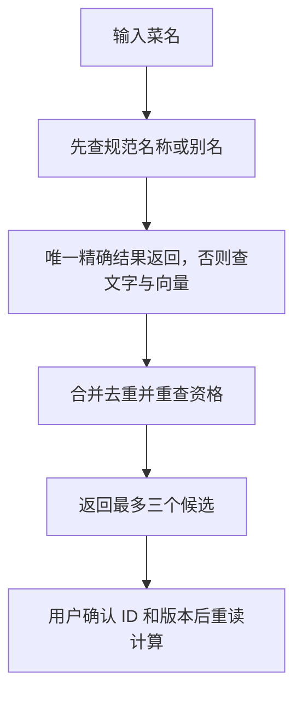

# 05 菜品检索：精确命中直接用，相似候选先确认

[返回功能学习总目录](README.md)

把用户的菜名对应到受控营养目录。唯一精确匹配可直接使用；文字相似或语义相近时返回候选供确认。

## 1. 核心能力

结合精确名称、别名、模糊文字和向量检索，并重查候选是否仍属于当前合格版本。餐食分析和餐单调整共用这个能力。

## 2. 业务背景

用户叫法与目录名称可能不同，但“听起来像”不代表营养相同。检索负责缩小范围，不能把最像的条目强行当成用户吃过的菜。

## 3. 整体执行流程



流程图展示主线；失败、追问等分支在下面对应步骤中说明。

## 4. 关键代码与设计理由

### 4.1 精确结果优先

位置：[service.py](../../backend/app/nutrition/service.py) 的 `search_food_catalog`。唯一精确结果在 Embedding 调用之前返回，避免多余调用。没有完整混合检索依赖时走 `_legacy_search`，不能假设每次搜索都使用向量。

### 4.2 向量只是候选证据

Embedding 把查询转成一串数字，数据库据此找目录里相近的表达，再与文字候选合并。合并函数在 [search.py](../../backend/app/nutrition/search.py) 的 `fuse_food_search_evidence`。返回结果明确写成：

```python
result = FoodSearchResult(
    action=NutritionAction.ASK,
    query=request.query,
    candidates=rematerialized,
```

`ASK` 表示需要确认，即使相似候选只有一个也不是自动精确命中。

### 4.3 确认后仍要检查当前数据

[graph.py](../../backend/app/agent/graph.py) 的 `_resolve` 先核对选择与已展示候选，再重查当前资格。管理员撤销或更新条目后，旧候选不能继续授权计算。

已分类的向量超时等故障可以保留文字候选；当前代码仍抛出部分非临时 Provider 错误，不能概括成“所有模型错误都能自动降级”。

## 5. 难懂语法

`await asyncio.wait_for(..., timeout=...)` 限制等待时长。`[*text_evidence, *vector_evidence]` 合并两组列表。Embedding 先理解为文字特征的数字表示即可。

## 6. 怎么验证、怎么继续读

读 [test_hybrid_food_search.py](../../backend/tests/unit/test_hybrid_food_search.py) 的精确优先、候选确认和降级；真实数据库证据见 [test_hybrid_food_search.py](../../backend/tests/integration/test_hybrid_food_search.py)。下一篇：[营养计算](feature-nutrition.md)。

读完试着回答：**为什么不能直接选择相似度最高的结果？**

---

本文解释当前代码行为；代码块为源码节选，省略外围逻辑，不能单独运行。示例用于讲解，不代表真实模型必然输出相同结果。测试执行范围见总目录。
