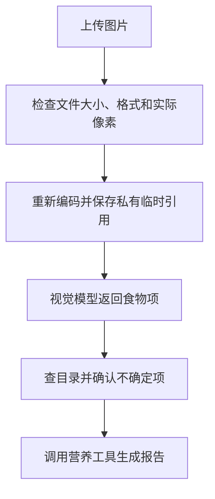

# 04 图片上传与识别：先安全读图，再计算营养

[返回功能学习总目录](README.md)

系统检查用户上传的照片，调用视觉模型获得食物候选和份量线索，再交给餐食分析流程。图片识别成功不代表热量已经算好。

## 1. 核心能力

检查图片的真实格式、大小和像素；重新编码并临时保存；把视觉结果变成可校验字段，再决定是否追问。

## 2. 业务背景

照片可能有多个菜，也可能损坏或伪装格式。先安全解码，再识别；识别出“像鸡肉”后仍要对应到具体目录条目，确认重量才能计算。

## 3. 整体执行流程



流程图展示主线；失败、追问等分支在下面对应步骤中说明。

## 4. 关键代码与设计理由

### 4.1 不能只看扩展名

位置：[service.py](../../backend/app/images/service.py) 的 `validate_and_store`。先比较声明 MIME 与实际格式，再检查像素上限，之后加载并重新编码：

```python
source.load()
normalized = self._normalize(source, mime)
```

`_normalize` 重编码像素以剥离原始元数据。返回上层的是带尺寸、摘要和过期时间的引用；实际像素文件暂存在私有目录，不能把“状态里只保存引用”理解成从不临时保存图片。

### 4.2 视觉调用与文本调用分开

位置：[graph.py](../../backend/app/agent/graph.py) 的 `_observe_image`；Qwen 实现在 [qwen.py](../../backend/app/providers/vision/qwen.py)。

```python
observed = await self._vision_provider.analyze_meal_image(request)
```

明确临时故障可有限重试；如果供应商是否处理成功未知，记录 `outcome_unknown` 并停下，避免盲目重复请求。

### 4.3 置信度只是线索

`_vision_result_state` 将结果转成食物项；`_resolve` 对低置信度项可能要求确认，即使目录精确匹配也不直接接受。计算仍交给营养工具。

基础删除方法在图片 Service，运行清理在 [retention.py](../../backend/app/agent/retention.py)。数据库不需要保存原图或 base64 才能跟踪本次分析。

## 5. 难懂语法

`with Image.open(...) as source` 在受控范围内使用图片对象并释放资源。MIME 是请求声明的类型，例如 `image/png`，必须与解码内容比对。

## 6. 怎么验证、怎么继续读

读 [test_image_safety.py](../../backend/tests/unit/test_image_safety.py) 的损坏、格式不一致场景，以及 [test_agent_multimodal.py](../../backend/tests/unit/test_agent_multimodal.py) 的识别和追问路径。替身测试不代表真实照片识别准确率。

读完试着回答：**为什么识别出菜名之后还可能追问？**

---

本文解释当前代码行为；代码块为源码节选，省略外围逻辑，不能单独运行。示例用于讲解，不代表真实模型必然输出相同结果。测试执行范围见总目录。
