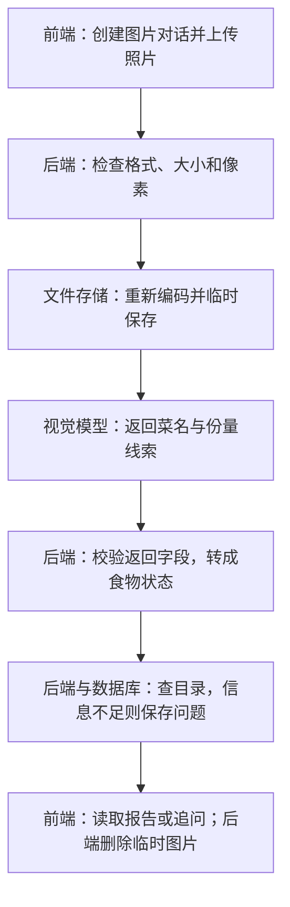

# 04 图片上传与识别：一张餐食照片怎样变成可计算的食物项

[返回功能学习总目录](README.md)

这个功能接收餐食照片，让视觉模型识别食物，再由后端判断信息是否足够。足够时进入营养计算；不够时向用户追问。**模型负责看图，后端负责决定能不能算、怎么继续。**

## 1. 先看一个实际例子

假设小林上传一张米饭照片。我们用下面这条路径贯穿全文：

1. 照片通过后端检查。
2. 模型识别为“米饭”，但没有给出重量。
3. 后端保存识别结果，询问需要补充的克数。
4. 小林填写重量后，系统继续确认菜品、查询目录并计算营养。

本篇重点讲清楚前三步。第四步接到[追问与恢复](feature-clarification.md)和[营养计算](feature-nutrition.md)。

这里是假设模型返回“菜名为米饭、重量为空”的教学例子，不代表真实照片一定被这样识别。后面的现有测试使用相同类型的结果，可以复现后端为什么追问。

## 2. 为什么要分成这些步骤

直接把照片发给模型、再显示它的回答，看起来最省事，但会留下三个具体问题：

- **上传的真的是正常图片吗？** 扩展名和请求声明都可能不准确，图片也可能损坏或像素过大，需要先检查。
- **模型说有多少热量，依据是什么？** 所以模型只返回菜名、份量线索等观察结果；最终数值由目录和工具计算。
- **缺重量时怎么办？** 后端必须保留已经识别的菜名和当前问题，等用户回答后继续，不能每次都重新看图。

这套流程最终得到的是“可以继续处理的食物项”，而不是一段无法核验的看图描述。

## 3. 一张图看懂全过程



模型调用在第 4 步。其余步骤由后端代码、文件存储和数据库协作完成。图中“保存问题”是保存处理状态，不是保存模型的完整思考过程。

## 4. 跟着这张照片读代码

下面代码都是当前源码节选，只省略外围分支或字段，不是可单独运行的完整程序。每一步都看同一件事：收到什么、如何处理、变成什么、交给谁。

### 4.1 收到照片：先确认对话属于谁，再有上限地读取文件

**收到什么**

前端先调用 `POST /api/v1/agent/threads/image` 创建属于当前用户的空对话，再向 `POST /api/v1/agent/threads/{thread_id}/images` 上传文件。请求包括照片、登录身份及标记这次操作的 `Idempotency-Key`。

代码位置：[agent/api.py](../../backend/app/agent/api.py) 的 `create_agent_image_thread`、`upload_agent_meal_image`。上传函数先通过 `service.get_thread` 检查对话归属，然后读取：


```python
content = await image.read(settings.image_max_bytes + 1)
safety = cast(ImageSafetyService, runtime.image_safety)
reference = safety.validate_and_store(content=content, declared_mime=image.content_type)
```

**为什么这样写**

`image_max_bytes + 1` 是刻意多读一个字节。如果文件超过上限，拿到的字节数就能证明它超限，同时避免把无上限的文件全部读进内存。

`declared_mime` 是请求声明的类型，例如 `image/jpeg`。它只是声明，下一步还要与真实图片格式比对。

**处理后变成什么**

照片从上传对象变成 `content`，即一段文件字节。它被交给图片检查服务，尚未发给模型。

> 语法小注：`await image.read(...)` 等待读取文件；`cast(...)` 为类型检查器说明对象类型，不会在运行时替你验证这个对象。

### 4.2 检查图片：实际解码，重新编码，然后生成临时引用

**收到什么**

图片检查服务收到文件字节和声明类型。它先拒绝空文件、字节超限或不支持的类型；随后检查实际内容。

代码位置：[images/service.py](../../backend/app/images/service.py) 的 `ImageSafetyService.validate_and_store`。


```python
with Image.open(io.BytesIO(content)) as source:
    actual_format = source.format
    mime = _FORMAT_TO_MIME.get(actual_format or "")
    if mime is None or mime != declared_mime:
        raise ImageValidationError("IMAGE_TYPE_MISMATCH", "图片格式与文件声明不一致。")
    width, height = source.size
    if width <= 0 or height <= 0 or width * height > self._max_pixels:
        raise ImageValidationError("IMAGE_PIXELS_EXCEEDED", "图片尺寸超过允许范围，请缩小后重试。")
    source.load()
    normalized = self._normalize(source, mime)
```

**为什么这样写**

`source.format` 是图片库读出的格式。即使文件声称自己是 PNG，实际解码是 JPEG，也会拒绝。像素上限在 `source.load()` 前检查，因为很小的压缩文件也可能展开成巨量像素。

`_normalize` 重新编码像素，剥离原始元数据。随后服务写入私有临时文件，返回 `ValidatedImageReference`。

**处理后变成什么**

引用只包含定位和检查信息，例如下面的概念示意（不是完整对象）：

```text
mime_type: image/jpeg
width / height: 实际图片宽高
locator: 随机生成的临时文件名
digest_sha256: 重新编码后内容的摘要
expires_at: 临时文件过期时间
```

像素此时仍在私有临时文件里。引用相当于“取图凭据”，不是图片内容。API 把图片记录、运行记录写入业务存储，再将引用交给 Agent；Graph State 不需要装入整张图的 base64。

> 语法小注：`io.BytesIO(content)` 让内存字节像文件一样被读取。`with ... as source` 管理图片对象的使用范围，退出时释放相关资源。

### 4.3 调用视觉模型：真正发出去的是图片和输出要求

**收到什么**

Agent 图中的 `_observe_image` 收到图片引用，构建 `VisionMealRequest`，调用视觉 Provider。Provider 是本项目统一的模型接口；启用真实 Qwen 配置时，进入下面这个实现。

代码位置：[vision/qwen.py](../../backend/app/providers/vision/qwen.py) 的 `QwenVisionModelProvider._body`。它在 `analyze_meal_image` 发 HTTP 请求前被调用。


```python
image_bytes = self._image_loader(request.image)
if not image_bytes:
    raise ProviderCallError(kind=ProviderFailureKind.PERMANENT, code="VALIDATED_IMAGE_UNAVAILABLE")
data_url = f"data:{request.image.mime_type};base64,{base64.b64encode(image_bytes).decode('ascii')}"
return {
    "model": self._model,
    "messages": [{"role": "user", "content": [
        {"type": "image_url", "image_url": {"url": data_url, "min_pixels": MIN_PIXELS, "max_pixels": request.pixel_budget}},
        {"type": "text", "text": VISION_JSON_CONTRACT},
    ]}],
    "response_format": {"type": "json_object"},
    "enable_thinking": False,
    "stream": False,
    "max_tokens": MAX_COMPLETION_TOKENS,
}
```

**为什么这样写**

供应商读不到本机的临时文件名，所以这里先读取像素文件，再临时编码为 base64，装进 `image_url` 消息。`VISION_JSON_CONTRACT` 是随图片发送的文字要求：只返回食物项，不返回营养数值、解释或其他字段。

这才是“把图片交给模型”的实际位置。图层只调用统一接口，供应商地址、HTTP 请求和图片编码封装在 Provider 中。

**处理后变成什么**

请求包含两部分：图片，以及“按指定字段返回 JSON”的指令。模型可能返回如下食物观察：

```json
{
  "items": [{
    "item_id": "rice-1",
    "food_name": "米饭",
    "preparation": null,
    "portion_clue": null,
    "estimated_grams": null,
    "confidence": 0.6
  }]
}
```

这是本篇例子的假设响应。`null` 表示未知重量，不是 0 克；`0.6` 是模型返回的置信度字段，不是经过评测证明的正确率。

“不持久化 base64”和“请求里不使用 base64”是两回事：当前真实请求会短暂使用它，但不会将其作为图状态保存。

> 语法小注：`base64.b64encode` 把二进制转换成可放进文本的编码，**不是加密**。`response_format` 要求模型输出 JSON，但仍不能保证字段一定符合业务规则。

### 4.4 收到回答：先校验字段，再转成后端自己的食物状态

**收到什么**

Provider 收到供应商 HTTP 响应，先取出模型文字并解析 JSON，再附加本次调用的用量等元数据。

代码位置：[vision/qwen.py](../../backend/app/providers/vision/qwen.py) 的 `analyze_meal_image`：


```python
document = response.json()
content = _content(document)
payload = json.loads(content)
if not isinstance(payload, dict) or set(payload) != {"items"}:
    raise ValueError("Vision response JSON is not an object")
metadata = _metadata(document, response.headers, self._model, latency_ms, self._price_tiers)
result = VisionMealResult.model_validate({**payload, "metadata": metadata})
```

**为什么这样写**

“可以解析为 JSON”还不够。字段规则在 [vision/dto.py](../../backend/app/providers/vision/dto.py)：食物项数量必须在范围内，置信度限制为 0～1，估计重量必须为正且不超过上限，额外字段不允许悄悄进入。

例如模型自行添加 `energy_kcal`，会因不符合结构而被拒绝，不会直接成为计算结果。

Provider 的返回对象检查通过后，图把它转成自己的状态。位置：[agent/graph.py](../../backend/app/agent/graph.py) 的 `_vision_result_state`：


```python
items = tuple(
    StateMealItem(
        item_id=item.item_id,
        normalized_name=item.food_name,
        grams=item.estimated_grams,
        portion_description=item.portion_clue,
        input_version="vision.v1",
        is_dirty=True,
        search_query=item.food_name,
        is_estimated=item.estimated_grams is not None,
        estimate_confidence=item.confidence,
    )
    for item in observed.items
)
```

**处理后变成什么**

本例中的米饭变成：

```text
normalized_name = 米饭
grams = None
is_dirty = True
is_estimated = False
estimate_confidence = 0.6
```

`is_dirty` 表示这项尚需后端处理。`is_estimated=False` 是因为这次没有估重值，**不是说菜名已经被人工确认**。

图随后把视觉调用标记为 `completed`，下一步设为 `RESOLVE_CATALOG`，交给 `_resolve`。视觉工作已完成，不代表整顿饭的分析已完成。

> 语法小注：`for item in observed.items` 逐项转换，因此一张图能处理多道食物。Provider DTO 和 Graph State 分开，避免供应商字段直接绑死后端工作流。

### 4.5 缺重量：保存问题，不让模型猜一个热量

**收到什么**

`_resolve` 收到上述食物状态：知道菜名，没有克数，也没有常见份量描述。

代码位置：[agent/graph.py](../../backend/app/agent/graph.py) 的 `MealAnalysisGraph._resolve`：


```python
if item.grams is None and item.portion_description is None:
    questions.append(_grams_question(item))
    updated.append(item.model_copy(update={"is_dirty": False}))
    continue
```

**为什么这样写**

当前顺序先检查是否有重量或份量描述。两者都缺，就生成重量问题，暂不查询和计算这一项。`continue` 让循环继续处理其他食物，不必因为一道菜缺信息就抹掉其他项的结果。

因此本例会先问克数。即使置信度也偏低，也不是立刻把所有确认问题一次问完。

**处理后变成什么**

图返回 `WAITING_INPUT`，保存重量问题；应用服务将状态保存到 Checkpoint，并写入供前端读取的安全结果。前端读取对话快照或事件后显示追问，上传接口本身主要返回对话 ID、图片 ID 和状态。

小林填写重量后，同一对话继续处理。此时还可能因为菜名置信度低或目录匹配不唯一而要求确认，**补了重量不保证下一步直接出报告**。

估重不为空的路径则不同：它可以进入目录匹配和确定性计算，但结果要带估计标识，不能把模型估重当成真实称重。

### 4.6 结束上传处理：删掉图片，留下可继续处理的状态

**收到什么**

API 等待本次 `_execute` 返回。它可能完成报告，也可能停在追问。此时已识别的食物项和问题足够支持后续交互，不必继续保留原图。

代码位置：[agent/api.py](../../backend/app/agent/api.py) 的 `upload_agent_meal_image` 末尾：


```python
try:
    safety.delete(reference)
    service.mark_image_deleted(image_id=image_record.id, user_id=principal)
except Exception:
    service.mark_image_deletion_failed(image_id=image_record.id, user_id=principal)
```

**为什么这样写**

实际删除临时文件后，更新数据库中的删除状态；删除失败则记录失败，留给后续清理机制处理。它不是只等文件过期才删除，也不能说删除失败时文件已经消失。

**处理后变成什么**

保留下来的是运行信息、食物状态与结果，而不是原图。用户补充重量时继续消费这些结构化信息；其他过期与失败清理由 [agent/retention.py](../../backend/app/agent/retention.py) 管理。

> 语法小注：`except Exception` 在这里处理删除失败。记录失败和删除成功是两个不同结果，不能因为错误被捕获就认为工作完成。

## 5. 换一种情况，会走哪条路

| 情况 | 判断位置 | 当前处理 |
|---|---|---|
| 声明 PNG，实际是 JPEG | 图片 Service 的格式比较 | 拒绝上传，不发送模型请求 |
| 模型返回热量等额外字段 | Vision DTO 校验 | 拒绝该响应，不把它写成营养真相 |
| 模型没给重量与份量描述 | 图的 `_resolve` | 生成重量问题，保存等待状态 |
| 网络中断，无法知道供应商是否已完成 | Qwen Provider 的网络异常分支 | 标记 `OUTCOME_UNKNOWN`，图不盲目重发 |
| 重复提交已接受的同一图片操作 | 上传 API 查询该运行已有图片 | 删除本次多余临时文件，返回已有图片信息 |

**重试有两层。** Qwen Provider 内部对部分 HTTP 状态可以重试，图的 `_observe_image` 也对分类为临时故障的返回作有限重试。因此不能把“图最多两次 Provider 调用”说成“总共最多两次 HTTP 请求”。这一点在排查调用次数与费用时很重要。

## 6. 自己验证一次：为什么没有重量就会追问

先读 [test_agent_multimodal.py](../../backend/tests/unit/test_agent_multimodal.py) 的 `test_vision_items_become_safe_estimated_state_and_one_combined_clarification`。它已经设置好了本篇的关键输入：

- Fake Vision 返回米饭、未知重量、置信度 0.6。
- 执行真实的 `MealAnalysisGraph.ainvoke`。
- 断言结果是等待输入、问题字段是 `grams`、视觉 Provider 只调用一次。
- 检查序列化状态中不包含图片字节或 base64。

在仓库根目录执行：

```bash
cd backend
.venv/bin/python -m pytest tests/unit/test_agent_multimodal.py::test_vision_items_become_safe_estimated_state_and_one_combined_clarification -q
```

再看同文件 `test_estimated_weight_reaches_only_deterministic_nutrition_and_is_reported`：这次给出估重，检查重量进入营养工具且报告保留估计标识。比较这两个现成测试，就能看到同一流程为何分支。

图片格式检查见 [test_image_safety.py](../../backend/tests/unit/test_image_safety.py)，真实 Provider 的请求封装测试见 [test_qwen_vision_provider.py](../../backend/tests/test_qwen_vision_provider.py)。

这些测试用可控数据或网络替身验证代码行为，**没有证明真实照片识别质量**。本篇改写的实际测试结果见下方验证记录。

### 本篇改写验证记录

图片安全、视觉状态流转和 Qwen Provider 封装共 **17 项测试通过**。本次没有调用真实模型，也没有执行浏览器页面验收；只修改了本篇教学内容和目录说明。

## 7. 读完应该能回答什么

1. 临时图片引用和真正发给模型的图片内容有什么区别？
2. 为什么模型返回合法 JSON，后端还要再次校验？
3. 模型已经识别出米饭，系统为什么先追问重量，而且之后可能还要确认菜名？

回到源码时按这个顺序读：

[上传 API](../../backend/app/agent/api.py) → [图片检查](../../backend/app/images/service.py) → [Qwen 请求与响应](../../backend/app/providers/vision/qwen.py) → [图中的状态转换与追问](../../backend/app/agent/graph.py)。

不要一开始通读整个文件，先按本篇标出的函数跟完这张照片的路径。
