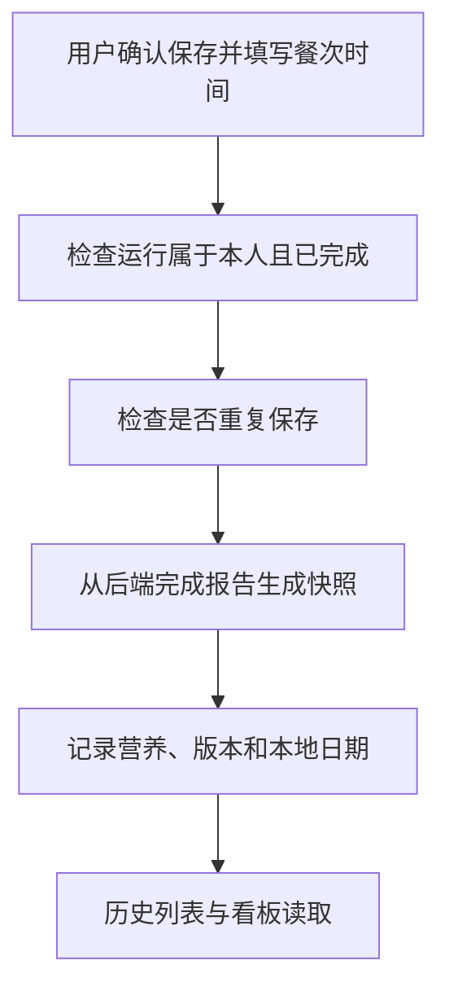

# 09 餐食确认与历史记录：把分析结果变成正式记录

[返回功能学习总目录](README.md)

用户确认保存后，后端从已完成的分析中取得报告，连同餐次、食用时间和营养快照写入正式餐食记录，供历史列表和统计使用。

## 1. 先看一个实际例子

小林完成分析后点“保存”，选择午餐和食用时间。他又点了一次保存。我们看一份分析怎样成为一条正式记录，并避免多记一餐。

这个例子贯穿下面的执行过程。示例数据用于理解代码，不是线上测量或真实模型效果证明。

## 2. 为什么需要这样实现

“分析一下这张照片”不一定意味着用户真的吃了这顿饭。未经确认就记入摄入会污染统计。保存时也不能相信浏览器随意提交的一组热量数字。

## 3. 一张图看懂全过程



图展示主线，失败与追问分支在第 5 节对照阅读。

## 4. 跟着这个例子读代码

以下为当前源码的连续节选，省略外围处理，不能单独运行。每一步都说明调用位置和数据去向。

### 4.1 先找到本人完成的运行并去重

**收到什么**

API 传入可信用户 ID、thread_id、保存命令键及餐次时间；基础时间校验在这段之前。

**代码在哪里**

[backend/app/records/service.py](../../backend/app/records/service.py) 的 `confirm_from_completed_run`。

```python
by_command = self._repository.get_record_for_command_for_user(
    command_key=command_key, user_id=user_id, include_deleted=True
)
run = self._repository.get_completed_run_for_thread_for_user(
    thread_id=thread_id, user_id=user_id, for_update=True
)
if run is None:
    raise MealRecordConfirmationUnavailable("completed report is unavailable")
if by_command is not None:
    if by_command.source_run_id != run.id:
        raise MealRecordCommandConflict("save idempotency key payload mismatch")
    return by_command
existing = self._repository.get_record_for_source_run_for_user(
    source_run_id=run.id, user_id=user_id, include_deleted=True
)
if existing is not None:
    return existing
```

**为什么这样写**

按命令键检查重放，再按来源运行去重。同键对应不同运行会冲突，不能随便复用保存键。

**处理后变成什么，交给谁**

已有记录就直接返回；没有则继续读取该运行的完成报告。小林第二次点击不会因此增加一餐。

> 语法小注：`for_update=True` 请求锁定相关记录，帮助事务内协调。

### 4.2 从后端报告生成正式快照

**收到什么**

拿到完成事件，报告来自后端，不是浏览器任意上传的一组热量。

**代码在哪里**

[backend/app/records/service.py](../../backend/app/records/service.py) 的 `confirm_from_completed_run`。

```python
event = self._repository.get_completed_report_for_run_for_user(
    run_id=run.id, user_id=user_id
)
report = event.payload.get("report") if event is not None else None
snapshot = self._validated_snapshot(report)
```

**为什么这样写**

_validated_snapshot 检查能否保存。记录同时绑定来源运行、餐次、食用时间、时区和版本，以后能解释这份数值怎么算出来的。

**处理后变成什么，交给谁**

构建待保存 MealRecord；随后填入营养总量与各食物项。即便目录后来更新，也保留本次确认快照。

> 语法小注：`consumed_local_date` 是按用户提交时区换算后的日期，不是直接取服务器日期。

### 4.3 提交后才能作为历史记录

**收到什么**

记录对象和各子项已构建完，尚需数据库事务保存。

**代码在哪里**

[backend/app/records/service.py](../../backend/app/records/service.py) 的 `confirm_from_completed_run`。

```python
try:
    saved = self._repository.add_record(record)
    self._commit()
    return saved
except Exception:
    self._rollback()
    raise
```

**为什么这样写**

add_record 和 commit 成功才返回正式结果；失败回滚。否则界面可能显示保存成功却无法在历史找到。

**处理后变成什么，交给谁**

返回 saved，历史与看板按用户读取它。查看、修改和删除继续使用 get_record、update_record、delete_record 的归属检查。

> 语法小注：`except Exception` 不是忽略错误，回滚后还会 raise 交给上层。

## 5. 换一种输入，会走哪条路

| 情况 | 判断与处理 | 应观察的结果 |
|---|---|---|
| 运行未完成 | 拒绝确认 | 不创建记录 |
| 同运行重复保存 | 复用记录 | 不重复统计 |
| 目录后续改变 | 旧记录仍用快照 | 历史数值不悄悄重算 |

## 6. 自己验证一次

在仓库根目录执行现有测试，使用后端已安装的测试环境：

```bash
cd backend
.venv/bin/python -m pytest tests/records/test_record_service.py -q
```

检查保存后的来源 ID、餐次与时间；重复调用后记录数量应不增加。真实数据库事务需另外集成测试。

本轮运行范围与结果见[总目录验证记录](README.md)。替身测试证明指定输入下的代码行为，不能替代真实模型效果、数据库并发或页面验收。

## 7. 读完应该能回答什么

1. 为什么分析不自动等于吃过？
2. 去重用了哪两个身份？
3. 为什么保存目录版本和快照？

源码阅读顺序：[records/service.py](../../backend/app/records/service.py)。先跟本例函数走一遍，再展开旁支。
