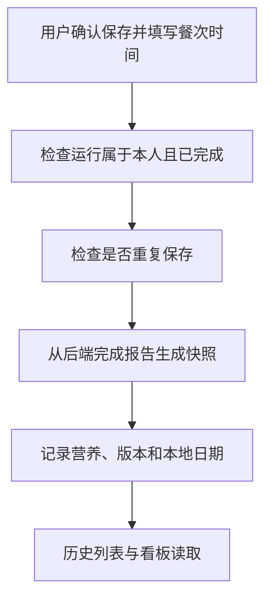

# 09 餐食确认与历史记录：把分析结果变成正式记录

[返回功能学习总目录](README.md)

用户确认保存后，后端从已完成的分析中取得报告，连同餐次、食用时间和营养快照写入正式餐食记录，供历史列表和统计使用。

## 1. 核心能力

只保存本人可确认的完成报告；防止重复保存；保存当时的数值和版本，支持查看、修改部分信息及删除。

## 2. 业务背景

“分析一下这张照片”不一定意味着用户真的吃了这顿饭。未经确认就记入摄入会污染统计。保存时也不能相信浏览器随意提交的一组热量数字。

## 3. 整体执行流程



流程图展示主线；失败、追问等分支在下面对应步骤中说明。

## 4. 关键代码与设计理由

### 4.1 从后端报告取数，不接收任意营养真相

位置：[service.py](../../backend/app/records/service.py) 的 `confirm_from_completed_run`。它先按用户读取完成运行，再取得对应事件中的报告：

```python
report = event.payload.get("report") if event is not None else None
snapshot = self._validated_snapshot(report)
```

`_validated_snapshot` 检查报告能否成为正式记录。后续建立 `MealRecord` 和各个 `MealRecordItem`，保存菜名、克数、数值以及目录版本。

### 4.2 重复点击不会制造两顿饭

同函数先查 `command_key`，再查 `source_run_id`。同一保存请求或同一运行已有记录时返回原记录；同键对应不同运行会报冲突。这是“幂等”：重复相同操作，结果不重复增加。

### 4.3 餐次、时间和统计日期各有意义

`meal_slot` 表示早餐、午餐等餐次；`consumed_at` 是食用时间；`consumed_local_date` 是按确认时区换算的本地日期。实际校验在同文件 `_validate_meal_slot`、`_validate_consumed_at`。

`get_record`、`update_record`、`delete_record` 都带用户身份。旧快照不会因为目录更新自动改成另一套数值，否则昨天的历史会悄悄变化。

## 5. 难懂语法

`enumerate(snapshot["items"])` 同时取得食物项的位置和内容。快照就是“把保存时认可的结果固定下来”，不等于复制整个临时对话。

## 6. 怎么验证、怎么继续读

读 [test_record_service.py](../../backend/tests/records/test_record_service.py) 的保存、重复请求和归属测试；实际数据库见 [test_meal_records.py](../../backend/tests/integration/test_meal_records.py)。下一篇：[长期记忆](feature-memory.md)。

读完试着回答：**为什么保存正式餐食时不能直接拿前端提交的热量入库？**

---

本文解释当前代码行为；代码块为源码节选，省略外围逻辑，不能单独运行。示例用于讲解，不代表真实模型必然输出相同结果。测试执行范围见总目录。
