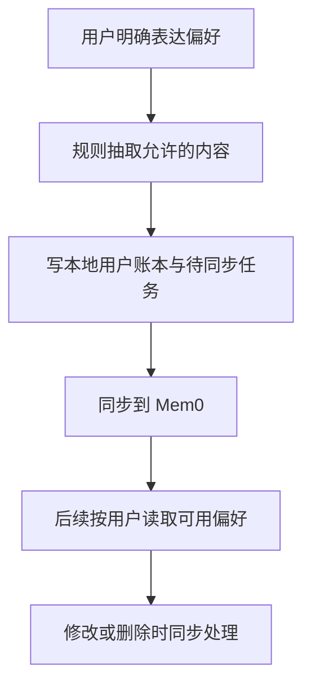

# 10 长期饮食偏好：明确表达才保存，删除也要真正生效

[返回功能学习总目录](README.md)

把用户明确表达的忌口、目标和偏好保存下来，供后续对话使用，并支持修改删除。当前不是让模型自动记住整段聊天。

## 1. 核心能力

筛选允许保存的偏好类别，记录用户归属与来源，向 Mem0 同步受控内容；删除时立即停止本地可见性，再处理外部删除。

## 2. 业务背景

小林说“我不吃香菜”，之后的对话应该能参考。相反，照片里出现香菜不能自动推断用户喜欢香菜；旧餐食也不能覆盖用户刚表达的新忌口。

## 3. 整体执行流程



流程图展示主线；失败、追问等分支在下面对应步骤中说明。

## 4. 关键代码与设计理由

### 4.1 抽取目前依靠有限规则

[service.py](../../backend/app/memory/service.py) 的 `capture_explicit_preferences` 调用 `_extract_explicit_preferences`。后者按句子匹配“不吃”“目标是”“我喜欢”等表达，不是用大模型自动总结一切。

这里要认识实现边界：当前匹配规则也接受“今天不吃”等表达，所以代码本身不能充分区分临时选择和真正长期偏好。不要把它写成已经具备完整的长期性判断。

### 4.2 本地账本与外部记忆分工

`create_direct` 先校验类别、形成请求标识，再通过 Repository 写本地记录和同步意图。`process_due_provisioning` 处理外部写入。[providers.py](../../backend/app/memory/providers.py) 封装 Fake 与 Mem0；直接写入使用 `infer=False`，即不让 Mem0 重新推断一遍。

PostgreSQL 中的账本决定这条偏好属于谁、是否可见。Mem0 是受控外部副本，不是餐食数值的权威来源。模型推测类记录由 `create_inference_proposal` 创建为未启用，需要确认。

### 4.3 删除先关闭本地可见性

位置：`delete_memory` 的核心节选：

```python
ledger.is_active = False
ledger.deleted_at = now
ledger.updated_at = now
```

随后取消尚未执行的写入，或建立外部删除任务。外部服务暂时不可用时，本地不应继续把已删偏好呈现给用户。

### 4.4 有记忆，不等于每次都喂给模型

[service.py](../../backend/app/retrieval/service.py) 的 `PersonalContextService.retrieve` 按来源组合偏好、历史和目录知识，偏好排在前面。当前餐食图保存 `context_hints`，但文本解析调用 `ParseMealRequest` 只传餐食描述；不能宣称这些提示已经全部进入文本模型提示词。规划使用本次确认的偏好。

## 5. 难懂语法

`lambda` 是一个简短函数表达式，常用于把“稍后执行这件事”传给事务包装。Outbox 可理解为数据库里的待办表，记录外部同步还没做完的工作。

## 6. 怎么验证、怎么继续读

读 [test_memory_service.py](../../backend/tests/memory/test_memory_service.py) 和 [test_agent_memory_context.py](../../backend/tests/unit/test_agent_memory_context.py)；外部删除与本地一致性看 [test_memory_deletion_chain.py](../../backend/tests/integration/test_memory_deletion_chain.py)。

读完试着回答：**为什么不能把“图片里有某种食物”直接变成用户的长期偏好？**

---

本文解释当前代码行为；代码块为源码节选，省略外围逻辑，不能单独运行。示例用于讲解，不代表真实模型必然输出相同结果。测试执行范围见总目录。
