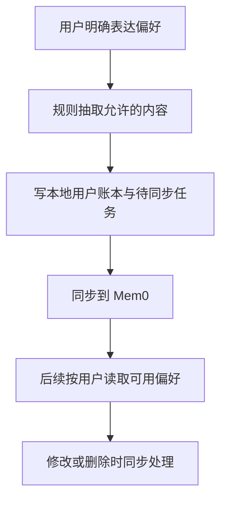

# 10 长期饮食偏好：明确表达才保存，删除也要真正生效

[返回功能学习总目录](README.md)

把用户明确表达的忌口、目标和偏好保存下来，供后续对话使用，并支持修改删除。当前不是让模型自动记住整段聊天。

## 1. 先看一个实际例子

小林说“我不吃香菜”，系统保存偏好；稍后他删除它。我们看一句话怎样成为受控记忆，以及外部服务失败时怎样避免它重新出现。

这个例子贯穿下面的执行过程。示例数据用于理解代码，不是线上测量或真实模型效果证明。

## 2. 为什么需要这样实现

小林说“我不吃香菜”，之后的对话应该能参考。相反，照片里出现香菜不能自动推断用户喜欢香菜；旧餐食也不能覆盖用户刚表达的新忌口。

## 3. 一张图看懂全过程



图展示主线，失败与追问分支在第 5 节对照阅读。

## 4. 跟着这个例子读代码

以下为当前源码的连续节选，省略外围处理，不能单独运行。每一步都说明调用位置和数据去向。

### 4.1 从明确表达中抽取允许类别

**收到什么**

capture_explicit_preferences 收到当前用户这次表达，本例是我不吃香菜。

**代码在哪里**

[backend/app/memory/service.py](../../backend/app/memory/service.py) 的 `_extract_explicit_preferences`。

```python
clauses = (" ".join(part.split()).strip() for part in re.split(r"[，,。！!?；;]", statement))
for normalized in clauses:
    avoidance = re.fullmatch(r"(?:我|今天)?(?:不想|不)吃(?P<item>.+)", normalized)
    if avoidance is not None:
        item = avoidance.group("item").strip()
        return [("avoidance", f"不吃{item}")] if item else []
    goal = re.fullmatch(r"(?:我的)?目标(?:是|为)(?P<value>.+)", normalized)
    if goal is not None and goal.group("value").strip():
        return [("goal", goal.group("value").strip())]
    preference = re.fullmatch(r"我(?:喜欢|偏好)(?P<value>.+)", normalized)
    if preference is not None and preference.group("value").strip():
        return [("stable_preference", preference.group("value").strip())]
return []
```

**为什么这样写**

目前靠正则规则提取，不是让模型总结整个聊天。照片出现香菜不能推出用户偏好。规则也接受“今天不吃”，所以还不能声称已能正确判断长期性。

**处理后变成什么，交给谁**

本例得到 avoidance 类别和“不吃香菜”，交给 create_direct；不符合规则返回空列表。当前命中后就返回，并非完整多偏好语义解析器。

> 语法小注：`re.fullmatch` 匹配整句，`group("item")` 取得括号命名部分。

### 4.2 同步前先查询本次写入是否存在

**收到什么**

create_direct 已写本地用户账本与同步待办，Worker 领取并再次检查后进入这段。

**代码在哪里**

[backend/app/memory/service.py](../../backend/app/memory/service.py) 的 `process_due_provisioning`。

```python
external_id = self._provider.resolve_direct_by_request_key(
    user_id=user_id, request_key=intent.request_key
)
# An outcome-unknown retry may only resolve its opaque request key.  Retrying a
# blind create here would turn a timeout into an unbounded duplicate-write bug.
if external_id is None and previous_status != "outcome_unknown":
    external_id = self._provider.create_direct(
        user_id=user_id,
        category=ledger.category,
        canonical_text=ledger.canonical_text,
        request_key=intent.request_key,
    )
if external_id is None:
    raise TimeoutError("direct provider outcome remains unknown")
```

**为什么这样写**

按同用户的 request_key 找现有外部记忆。如果上次结果未知，不能盲目再创建，否则一次超时会产生重复偏好。真实 Mem0 的直接写入禁用再次推断。

**处理后变成什么，交给谁**

拿到 external_id 后绑定本地账本；结果仍未知则记录待恢复状态。本地决定归属和可见性，外部副本不替代业务数据库。

> 语法小注：`previous_status != "outcome_unknown"` 是允许新建的条件，不是所有异常都可以重试写入。

### 4.3 删除先使本地不可见

**收到什么**

小林删除自己的 memory_id；查询仍需用户 ID，不能只认外部记忆编号。

**代码在哪里**

[backend/app/memory/service.py](../../backend/app/memory/service.py) 的 `delete_memory`。

```python
ledger = self._repository.get_active_for_user(ledger_id=memory_id, user_id=user_id, for_update=True)
if ledger is None:
    raise MemoryUnavailable("memory is unavailable")
now = self._now()
ledger.is_active = False
ledger.deleted_at = now
ledger.updated_at = now
if self._repository.cancel_pending_provision(
    ledger_id=ledger.id, user_id=user_id, now=now
):
    ledger.provisioning_status = "cancelled"
else:
    provision = self._repository.get_provision_for_ledger(
        ledger_id=ledger.id, user_id=user_id
    )
    if ledger.external_memory_id is not None or provision is not None:
        self._repository.ensure_deletion_intent(
            ledger_id=ledger.id,
            user_id=user_id,
            request_key=provision.request_key if provision is not None else None,
            now=now,
        )
self._persist(lambda: None)
```

**为什么这样写**

先停用并标记删除，再取消待同步任务或建立外部删除待办。否则“删除”可能与正在同步的创建竞争，外部副本稍后又回来。

**处理后变成什么，交给谁**

提交后不再作为本地可用偏好呈现，外部删除可能稍后完成。后续检索使用本地有效账本，不以外部搜索结果自行恢复删除项。

> 语法小注：Outbox 是数据库里的待办记录，用来追踪外部工作尚未完成。

## 5. 换一种输入，会走哪条路

| 情况 | 判断与处理 | 应观察的结果 |
|---|---|---|
| 只是照片识别出的食物 | 不按明确表达写记忆 | 不推断偏好 |
| 外部写入结果未知 | 先按请求键查找 | 不盲目新建 |
| 删除时尚未同步 | 取消待办 | 不能重新激活 |

## 6. 自己验证一次

在仓库根目录执行现有测试，使用后端已安装的测试环境：

```bash
cd backend
.venv/bin/python -m pytest tests/memory/test_memory_service.py tests/unit/test_agent_memory_context.py -q
```

看显式表达、未确认推测和删除场景，关注本地可见性与外部调用次数。外部删除竞争另需集成测试。

本轮运行范围与结果见[总目录验证记录](README.md)。替身测试证明指定输入下的代码行为，不能替代真实模型效果、数据库并发或页面验收。

## 7. 读完应该能回答什么

1. 为什么不保存整段聊天？
2. 外部超时后为什么先查而非再写？
3. 本地账本与 Mem0 谁决定归属？

源码阅读顺序：[memory/service.py](../../backend/app/memory/service.py)。先跟本例函数走一遍，再展开旁支。

当前餐食图保存 context_hints，但文本解析 ParseMealRequest 只传餐食描述；不要把保存了提示描述成已经全部注入模型上下文。规划使用本次确认的偏好。
