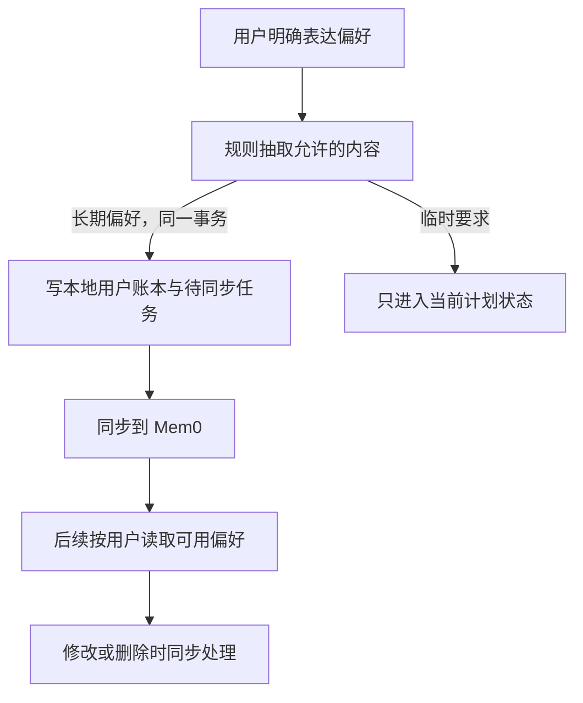

# 10 长期饮食偏好：明确表达才保存，删除也要真正生效

[返回功能学习总目录](README.md)

把用户明确表达的忌口、目标和偏好保存下来，供后续对话使用，并支持修改删除。当前不是让模型自动记住整段聊天。

## 1. 先看一个实际例子

小林说“我不吃香菜”，系统保存偏好；稍后他删除它。我们看一句话怎样成为受控记忆，以及外部服务失败时怎样避免它重新出现。

这个例子贯穿下面的执行过程。示例数据用于理解代码，不是线上测量或真实模型效果证明。

## 2. 为什么需要这样实现

小林说“我不吃香菜”，之后的对话应该能参考。相反，照片里出现香菜不能自动推断用户喜欢香菜；旧餐食也不能覆盖用户刚表达的新忌口。

## 3. 一张图看懂全过程



图展示主线，失败与追问分支在第 5 节对照阅读。

## 4. 跟着这个例子读代码

以下为当前源码的连续节选，省略外围处理，不能单独运行。每一步都说明调用位置和数据去向。

### 4.1 拆分复合偏好，先判断本次还是长期

规则入口是 [memory/preferences.py](../../backend/app/memory/preferences.py) 的 `extract_explicit_preferences`，版本为 `explicit-preferences.v2`。它按标点以及明确的新语句边界拆分，用完整匹配提取类别，不调用模型推断。

| 输入 | 得到的偏好 | 保存范围 |
|---|---|---|
| 不吃辣 饮食清淡 | 忌口“不吃辣”、口味“清淡” | 两条长期偏好 |
| 今天不想吃辣，饮食清淡 | 同上 | 当前计划，不建立 Mem0 同步任务 |
| 今天不吃辣，我长期偏好少油 | 临时忌口“不吃辣”、长期口味“少油” | 只保存“少油” |
| 朋友不吃辣、引用、疑问或假设句 | 不据此推断用户长期偏好 | 不自动保存 |

临时时间范围会延续到后面的子句，直到明确表达“一直、长期、平时”等习惯。无法确定的说法不猜；这是有限规则，不能声称理解所有自然语言、自动处理偏好撤销或冲突。输入最多 8000 字符，单次最多提取 12 项，重复项去重。

[MemoryService.capture_explicit_preferences](../../backend/app/memory/service.py) 返回经过校验的偏好及范围，只把长期项按固定顺序放进同一个数据库事务。以下为删减后的主逻辑：

```python
captured = extract_explicit_preferences(statement)
persistent = sorted(
    (item for item in captured if item.scope == "long_term"),
    key=lambda item: (item.category, item.canonical_text),
)
# 省略：事务内为所有 persistent 项建立本地记录与同步待办，失败则整体回滚。
return captured
```

`scope` 是使用范围，`current_plan` 表示仅本次；`frozen=True` 让规则结果不能被调用方随意修改。固定顺序用于让并发事务按一致顺序处理记录。

Agent 通过 [agent/tools.py](../../backend/app/agent/tools.py) 接收安全摘要，不接触账本或外部编号。[规划图](../../backend/app/agent/graph.py) 的 `_capture_adjustment_preferences` 将长期和临时要求都合入当前计划约束，临时项仅保留在本次图状态中。餐食分析入口也会过滤临时项的长期写入；它不因此改变确定性营养计算。

### 4.1.1 旧记录怎样参与计划复核

公开只读接口 `GET /api/v1/memories/preference-summary` 只查询当前用户的有效本地记录。`MemoryService.preference_summary` 将旧的“不吃辣 饮食清淡”投影成两类摘要，保留无法识别的已有忌口供用户复核，排除有明确临时范围的子句。原记录和 Mem0 正文保持原样，不做迁移或自动删除。

[ProfileGoalForm](../../frontend/src/features/plans/components/ProfileGoalForm.tsx) 显示分类摘要，用户勾选后才用于新计划。摘要变化会清除勾选，读取失败则阻止生成，避免把加载失败当成“没有忌口”。管理与编辑入口仍在“我的 → 饮食偏好”，计划页没有第二个编辑器。

手动记忆 CRUD 仍按用户选择的类别和原文保存；上述范围过滤针对自动提取及计划复核，不会事后改写用户手动保存的记录。

### 4.2 同步前先查询本次写入是否存在

**收到什么**

create_direct 已写本地用户账本与同步待办，Worker 领取并再次检查后进入这段。

**代码在哪里**

[backend/app/memory/service.py](../../backend/app/memory/service.py) 的 `process_due_provisioning`。

```python
external_id = self._provider.resolve_direct_by_request_key(
    user_id=user_id, request_key=intent.request_key
)
# An outcome-unknown retry may only resolve its opaque request key.  Retrying a
# blind create here would turn a timeout into an unbounded duplicate-write bug.
if external_id is None and previous_status != "outcome_unknown":
    external_id = self._provider.create_direct(
        user_id=user_id,
        category=ledger.category,
        canonical_text=ledger.canonical_text,
        request_key=intent.request_key,
    )
if external_id is None:
    raise TimeoutError("direct provider outcome remains unknown")
```

**为什么这样写**

按同用户的 request_key 找现有外部记忆。如果上次结果未知，不能盲目再创建，否则一次超时会产生重复偏好。真实 Mem0 的直接写入禁用再次推断。

**处理后变成什么，交给谁**

拿到 external_id 后绑定本地账本；结果仍未知则记录待恢复状态。本地决定归属和可见性，外部副本不替代业务数据库。

> 语法小注：`previous_status != "outcome_unknown"` 是允许新建的条件，不是所有异常都可以重试写入。

### 4.3 删除先使本地不可见

**收到什么**

小林删除自己的 memory_id；查询仍需用户 ID，不能只认外部记忆编号。

**代码在哪里**

[backend/app/memory/service.py](../../backend/app/memory/service.py) 的 `delete_memory`。

```python
ledger = self._repository.get_active_for_user(ledger_id=memory_id, user_id=user_id, for_update=True)
if ledger is None:
    raise MemoryUnavailable("memory is unavailable")
now = self._now()
ledger.is_active = False
ledger.deleted_at = now
ledger.updated_at = now
if self._repository.cancel_pending_provision(
    ledger_id=ledger.id, user_id=user_id, now=now
):
    ledger.provisioning_status = "cancelled"
else:
    provision = self._repository.get_provision_for_ledger(
        ledger_id=ledger.id, user_id=user_id
    )
    if ledger.external_memory_id is not None or provision is not None:
        self._repository.ensure_deletion_intent(
            ledger_id=ledger.id,
            user_id=user_id,
            request_key=provision.request_key if provision is not None else None,
            now=now,
        )
self._persist(lambda: None)
```

**为什么这样写**

先停用并标记删除，再取消待同步任务或建立外部删除待办。否则“删除”可能与正在同步的创建竞争，外部副本稍后又回来。

**处理后变成什么，交给谁**

提交后不再作为本地可用偏好呈现，外部删除可能稍后完成。后续检索使用本地有效账本，不以外部搜索结果自行恢复删除项。

> 语法小注：Outbox 是数据库里的待办记录，用来追踪外部工作尚未完成。

### 4.4 编辑时恢复丢失的 Fake 副本

本地 Fake Provider 的内容只在实例内存里，而偏好正文、用户归属和外部编号保存在 PostgreSQL。记忆编辑接口会创建新的 Provider 实例；后端重启也会清空 Fake 内容。因此列表可能正常显示，但旧外部编号在当前 Fake 实例里已经不存在。

`MemoryService.update_memory` 先按用户 ID 查询并锁定有效账本，再更新副本。只有 Provider 明确抛出 `MemoryReplicaMissing`（确认副本不存在）时，才重建副本、更新外部编号，并保存新正文和“用户手动维护”来源。其他用户的记录在调用 Provider 前就会被拒绝；超时、未知错误和副本归属冲突不会触发重建。

关键入口：[service.py](../../backend/app/memory/service.py) 的 `update_memory`、[providers.py](../../backend/app/memory/providers.py) 的 `FakeMemoryProvider.update/create`。Fake 新编号使用 UUID，避免不同请求、进程或删除后复用相同编号。真实 Mem0 适配器不将错误自动归类为副本缺失，本次恢复针对 Fake 的生命周期问题。

### 4.5 配置真实 Mem0 与迁移旧副本

配置和启动命令见 [backend/README.md](../../backend/README.md)。云服务通过 `MemoryClient` 调用：编辑用 `text`，搜索用户标识放在 `filters` 中，精确重试查询用 `metadata.request_key`。本地确认后的正文使用 `infer=False`，避免云端再次拆分或改写；编辑仅修改正文，保留用于追踪原写入的 metadata。

切换配置不会自动迁移旧 Fake 编号。获得用户对云端同步的授权后，[migrate_fake_memories.py](../../backend/scripts/migrate_fake_memories.py) 按用户预览或入队：本地锁定有效账本 → 为 Fake 副本建立稳定的迁移请求键 → 后台按请求键查询/写入 → 绑定真实编号。原本地记录编号与正文保持不变，未知写入结果仍只能查询恢复。它不是创建一个新用户偏好，也不会复活已经删除的记忆。

新增记忆提交后会主动唤醒后台同步。同步未开始时编辑只改本地正文，后台读取最新正文；同步已经开始或结果未确认时，接口返回 409，避免另一笔同步创建与原任务竞争。关键入口是 `MemoryService.update_memory`、`queue_fake_replica_migration` 和 `SqlAlchemyMemoryLedgerRepository.queue_fake_replica_migration`。

## 5. 换一种输入，会走哪条路

| 情况 | 判断与处理 | 应观察的结果 |
|---|---|---|
| 今天不吃辣 | 当前计划生效，不进入长期队列 | 后续新计划不自动继承 |
| 复合偏好第二条保存失败 | 回滚整笔事务 | 不留半条成功的记录 |
| 只是照片识别出的食物 | 不按明确表达写记忆 | 不推断偏好 |
| 外部写入结果未知 | 先按请求键查找 | 不盲目新建 |
| 删除时尚未同步 | 取消待办 | 不能重新激活 |

## 6. 自己验证一次

在仓库根目录执行现有测试，使用后端已安装的测试环境：

```bash
cd backend
.venv/bin/python -m pytest tests/memory/test_memory_service.py tests/unit/test_agent_memory_context.py -q
```

看显式表达、未确认推测和删除场景，关注本地可见性与外部调用次数。外部删除竞争另需集成测试。

本轮运行范围与结果见[总目录验证记录](README.md)。替身测试证明指定输入下的代码行为，不能替代真实模型效果、数据库并发或页面验收。

2026-09-15 修复验证：`tests/memory` 与 `tests/unit/test_memory_api.py` 共 17 项通过；真实 PostgreSQL 的公开记忆 API、删除重试、幂等写入三组测试共 5 项通过。覆盖连续请求和应用重建后保存、外部编号不复用、他人请求 404、超时不盲目创建。内置浏览器在隔离环境 `http://127.0.0.1:5186` 使用独立账号验证“不吃辣 饮食清淡”保存后返回列表，并在真实重启测试后端后再次编辑成功；测试不代表真实 Mem0 服务可用性。

2026-09-15 真实 Mem0 接入追加验证：`tests/memory` 与 `tests/unit/test_memory_api.py` 共 23 项通过；`test_memory_direct_write_idempotency.py` 与 `test_memory_deletion_chain.py` 共 5 项 PostgreSQL 测试通过，Ruff 通过。SDK 合约测试使用已安装客户端及 HTTPX MockTransport，不调用云端。另执行了获授权的真实云端联调：认证、禁用推断写入、请求键查找、编辑、搜索、另一用户查不到该记忆和删除均成功。

内置浏览器在 `http://127.0.0.1:5178/app/me/memories` 使用独立测试账号，走公开接口新增后，从页面保存编辑并确认来源变为“用户手动维护”，再确认删除。云端正文更新和 request key 保留均核实；删除待办完成，云端精确查询为空。本次测试记忆已清理。用户单独授权的 1 条旧 Fake 记忆已迁移，原本地编号保留，云端编号经同用户请求键核对。未重跑完整后端或 Playwright E2E，也未验证真实云端故障注入；超时恢复与删除竞争由隔离测试覆盖。

2026-09-15 复合偏好与临时范围验证：后端 `tests/memory`、`test_memory_api.py`、`test_agent_memory_context.py`、`test_diet_planning_graph.py` 及 `tests/planning` 共 199 项通过，Ruff 通过。独立 PostgreSQL 的 `test_memory_direct_write_idempotency.py`、`test_direct_memory_public_api.py`、`test_memory_deletion_chain.py` 共 7 项通过，覆盖整批回滚、同用户幂等、不同用户隔离及临时要求不进入同步队列。前端 PlanPage/ProfileGoalForm 共 21 项通过，类型检查、定向 ESLint、构建及 `memory-preferences.spec.ts` 的 1 项端到端测试通过。

内置浏览器在隔离环境 `http://127.0.0.1:5198` 使用独立测试账号走登录 → 计划复核 → 记忆编辑 → 返回计划：旧复合文本正确分成忌口与口味，旧临时忌口不进入新计划摘要；手动将“饮食清淡”改为“饮食少油”后显示更新后的口味且勾选清除。空态由端到端测试覆盖，读取失败与后台摘要变化由组件测试覆盖；本轮未重新联调真实 Mem0，也未验证所有自然语言表达或完整的生成餐单浏览器路径。规则、保存链路使用 Fake Provider 验证，不代表云服务可用性。

## 7. 读完应该能回答什么

1. 为什么不保存整段聊天？
2. 外部超时后为什么先查而非再写？
3. 本地账本与 Mem0 谁决定归属？

源码阅读顺序：[memory/service.py](../../backend/app/memory/service.py)。先跟本例函数走一遍，再展开旁支。

当前餐食图保存 context_hints，但文本解析 ParseMealRequest 只传餐食描述；不要把保存了提示描述成已经全部注入模型上下文。规划使用本次确认的偏好。
