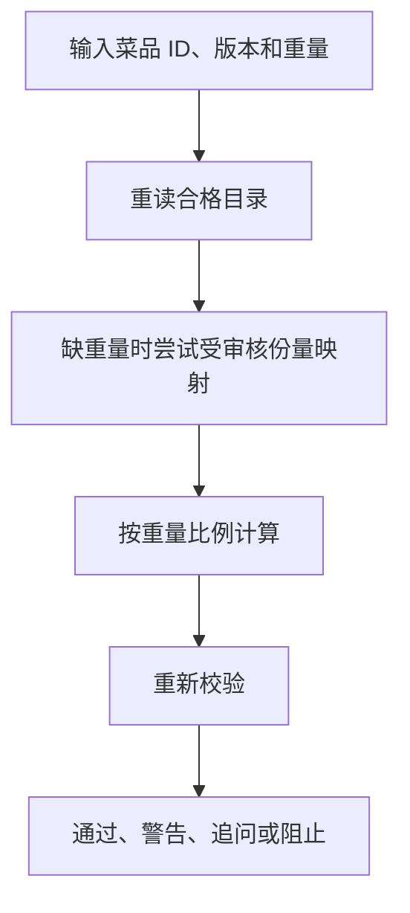

# 06 营养计算与校验：数值来自目录和公式

[返回功能学习总目录](README.md)

根据已确定的菜品、版本和重量计算营养，再检查结果。它是普通后端计算，不调用模型做算术。

## 1. 先看一个实际例子

假设测试目录中某食物每 100g 为 120 kcal，小林确认吃了 150g。我们追踪 1.5 倍换算怎样产生 180 kcal，以及代码如何发现结果被改错。这个数值仅作算术示例。

这个例子贯穿下面的执行过程。示例数据用于理解代码，不是线上测量或真实模型效果证明。

## 2. 为什么需要这样实现

同样的输入应该得到可解释、可追溯的结果。若模型自由写最终热量，很难知道它用了哪个数据源，也难保证重复计算一致。

## 3. 一张图看懂全过程



图展示主线，失败与追问分支在第 5 节对照阅读。

## 4. 跟着这个例子读代码

以下为当前源码的连续节选，省略外围处理，不能单独运行。每一步都说明调用位置和数据去向。

### 4.1 重读条目，再确定克数

**收到什么**

请求包含 food_id、catalog_version 和 grams=150。名称检索已在前一步完成。

**代码在哪里**

[backend/app/nutrition/service.py](../../backend/app/nutrition/service.py) 的 `calculate_nutrition`。

```python
food = self._repository.get_qualified_food(
    food_id=request.food_id, catalog_version=request.catalog_version
)
if food is None:
    return NutritionCalculationResult(
        action=NutritionAction.BLOCK,
        safe_message="所选食物不属于当前可计算的营养目录版本。",
    )
grams = request.grams
if grams is None and request.portion_description is not None:
    portions = [
        portion
        for portion in food.portions
        if portion.audited
        and normalize_food_name(portion.description)
        == normalize_food_name(request.portion_description)
    ]
    if len(portions) == 1:
        grams = portions[0].grams
```

**为什么这样写**

ID 与版本锁定本次依据。没有克数时，只能用该条目里唯一且经过审核的份量映射，不能自行把“一碗”猜成 150g。

**处理后变成什么，交给谁**

得到合格食物和克数，随后还检查正数与上限；找不到条目返回 BLOCK，份量不明返回 ASK。

> 语法小注：列表推导式筛选 audited 份量；只有唯一结果才采用。

### 4.2 按每 100g 比例计算四项数值

**收到什么**

本例 grams=150，目录中保存每 100g 营养。

**代码在哪里**

[backend/app/nutrition/service.py](../../backend/app/nutrition/service.py) 的 `calculate_nutrition`。

```python
factor = grams / HUNDRED_GRAMS
source = food.nutrients_per_100g
return NutritionCalculationResult(
    action=NutritionAction.PASS,
    food=food,
    grams=grams,
    nutrients=NutritionValues(
        energy_kcal=source.energy_kcal * factor,
        protein_g=source.protein_g * factor,
        fat_g=source.fat_g * factor,
        carbohydrate_g=source.carbohydrate_g * factor,
    ),
    safe_message="营养值已按目录每 100 克基准确定性计算。",
)
```

**为什么这样写**

所有营养素沿同一个倍数换算，避免模型把热量和蛋白质分别编成不一致的数值。Decimal 保持十进制计算。

**处理后变成什么，交给谁**

factor=1.5，示例热量为 180 kcal；结果还携带目录与计算规则信息。交给 validate_nutrition_result，而不是立刻当作已验证报告。

> 语法小注：字段赋值里的乘法是实际业务计算，不是对模型输出做格式包装。

### 4.3 从目录重算，检查是否一致

**收到什么**

校验器收到计算结果；前面已检查动作、非负数和密度范围。

**代码在哪里**

[backend/app/nutrition/service.py](../../backend/app/nutrition/service.py) 的 `validate_nutrition_result`。

```python
expected = self._recalculate(calculation.food, calculation.grams)
if not self._same_values(expected, calculation.nutrients):
    return self._validation(
        NutritionAction.RECALCULATE,
        "item-total-recalculation",
        "项目营养值与目录重算结果不一致，需要重新核算。",
        calculation.food,
    )
if request.reported_total is not None and not self._same_values(
    calculation.nutrients, request.reported_total
):
    return self._validation(
        NutritionAction.RECALCULATE,
        "reported-total-recalculation",
        "汇总值与已计入项目不一致，需要重新核算。",
        calculation.food,
    )
```

**为什么这样写**

重新按同一目录和重量算 expected，再比对逐项和报告汇总。若有人把示例 180 改成 200，不能因为它是正数就接受。

**处理后变成什么，交给谁**

一致则继续后续校验；不一致返回 RECALCULATE。宏量推导与来源能量存在允许差异时可能 WARN，仍保留来源值，不能让模型盖掉警告。

> 语法小注：`is not None` 区分未提交汇总与汇总为零。

## 5. 换一种输入，会走哪条路

| 情况 | 判断与处理 | 应观察的结果 |
|---|---|---|
| 缺重量且无审核份量 | ASK | 补充后再算 |
| 目录版本不可用 | BLOCK | 不出数值 |
| 计算结果被修改 | RECALCULATE | 不能直接通过 |

## 6. 自己验证一次

在仓库根目录执行现有测试，使用后端已安装的测试环境：

```bash
cd backend
.venv/bin/python -m pytest tests/unit/test_nutrition.py -q
```

观察输入重量、目录营养、动作和输出数值；改变重量应按比例改变，改坏计算结果应触发校验。无须调用模型。

本轮运行范围与结果见[总目录验证记录](README.md)。替身测试证明指定输入下的代码行为，不能替代真实模型效果、数据库并发或页面验收。

## 7. 读完应该能回答什么

1. 为什么必须带目录版本？
2. 180 kcal 是在哪一行逻辑得到的？
3. 公式正确还依赖哪些输入正确？

源码阅读顺序：[nutrition/service.py](../../backend/app/nutrition/service.py)。先跟本例函数走一遍，再展开旁支。
