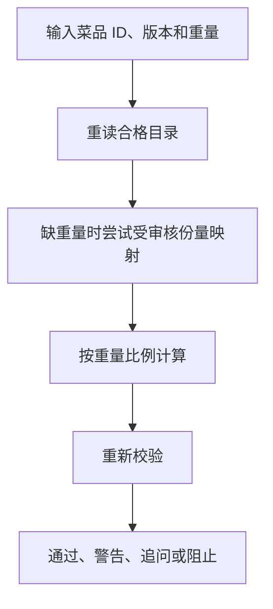

# 06 营养计算与校验：数值来自目录和公式

[返回功能学习总目录](README.md)

根据已确定的菜品、版本和重量计算营养，再检查结果。它是普通后端计算，不调用模型做算术。

## 1. 核心能力

读取每 100g 数值按克数换算，检查份量、资格与结果一致性；缺信息时追问，数据不合格时阻止。

## 2. 业务背景

同样的输入应该得到可解释、可追溯的结果。若模型自由写最终热量，很难知道它用了哪个数据源，也难保证重复计算一致。

## 3. 整体执行流程



流程图展示主线；失败、追问等分支在下面对应步骤中说明。

## 4. 关键代码与设计理由

### 4.1 先确认算的是哪一条数据

[service.py](../../backend/app/nutrition/service.py) 的 `calculate_nutrition` 先调用 `get_qualified_food`，找不到就返回 `BLOCK`。菜名用于搜索，ID 和版本才确定本次计算对象。

### 4.2 核心只有一个比例


```python
factor = grams / HUNDRED_GRAMS
source = food.nutrients_per_100g
```

每项营养都用 `source` 中每 100g 数值乘 `factor`。假设一个测试条目每 100g 为 120 kcal，150g 就是 180 kcal；这是算术示例，不是某种食物的真实营养声明。

### 4.3 一碗不能随便猜成一个重量

没有克数时，只接受该条目内经过审核且唯一匹配的常见份量；否则 `ASK`。克数还要检查正数与上限。

同文件 `validate_nutrition_result` 检查异常并通过 `_recalculate` 比对目录重算结果。Graph 只有在存在营养结果、食物且校验为 `PASS/WARN` 时才写报告，模型不能覆盖决定。

## 5. 难懂语法

`Decimal` 按十进制处理数值，减少二进制浮点误差。`None` 表示缺失，不是零；不能把没填重量按零克计算。

## 6. 怎么验证、怎么继续读

读 [test_nutrition.py](../../backend/tests/unit/test_nutrition.py) 的份量、资格和结果不一致用例。纯计算无需付费模型。

读完试着回答：**为什么公式正确，仍不能保证整顿饭一定算准？**

---

本文解释当前代码行为；代码块为源码节选，省略外围逻辑，不能单独运行。示例用于讲解，不代表真实模型必然输出相同结果。测试执行范围见总目录。
