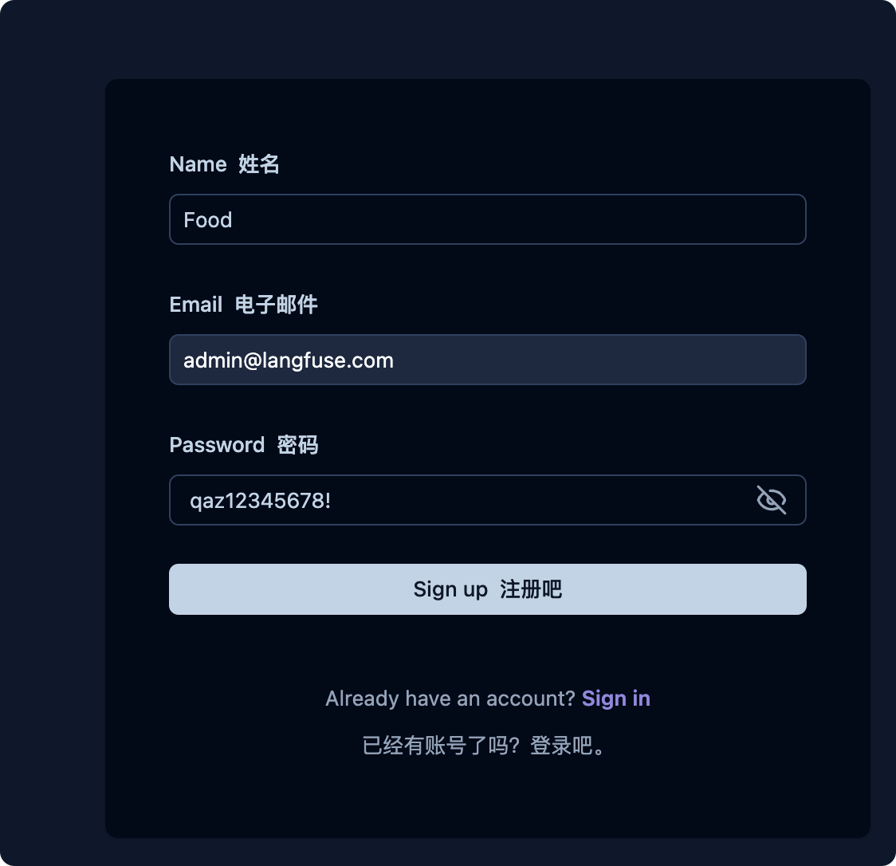

# Agent 可观测性与本地 Langfuse

本功能让开发者在本机查看 Agent 的安全调用轨迹。它记录节点、工具、模型别名、耗时、Token、费用、版本和错误码，不记录饮食原文、用户身份、图片、完整提示词、模型原文或思维链。

## 核心能力

- `TRACING_ENABLED=false` 时完全关闭，不创建客户端。
- 开发环境可选择 `TRACING_BACKEND=langfuse`，把安全 span 发送到本地 Langfuse。
- 生产环境继续使用 Phoenix/OpenTelemetry，配置会拒绝生产 Langfuse。
- Langfuse 或 Phoenix 关闭时会在应用生命周期结束前 flush；可观测平台不参与营养数值计算和发布判定。

## 业务背景

一次“我吃了米饭”的请求会经过模型理解、目录检索、营养计算和状态保存。只看最终 HTTP 响应无法判断慢在何处。Trace 把同一次请求里的多个 span 组织起来，但健康数据具有敏感性，所以项目只允许固定字段进入可观测平台。

## 整体执行流程

```text
backend/.env
  → Settings 校验开关、后端和密钥
  → FastAPI lifespan 创建一个 TracingRuntime
  → DeepSeek、营养工具、Supervisor 共享该实例
  → span() 删除白名单外字段
  → Langfuse SDK 异步发送到本地 Langfuse
  → 应用关闭时 flush + shutdown
```

## 第一次启动本地 Langfuse

在仓库根目录复制模板：

```bash
cp .env.langfuse.example .env.langfuse
```

用 `openssl rand -base64 32` 分别生成 PostgreSQL、ClickHouse、Redis、MinIO、NextAuth 和 Salt 密钥；用 `openssl rand -hex 32` 生成恰好 64 位十六进制 `LANGFUSE_ENCRYPTION_KEY`。不要提交 `.env.langfuse`。

启动并等待依赖健康：

```bash
docker compose --env-file .env.langfuse -f docker-compose.langfuse.yml up -d --wait
```

打开 `http://127.0.0.1:3001`，注册本地账号，创建 `food-agent-dev` 项目，在 Project Settings → API Keys 创建密钥。把得到的两项写回 `.env.langfuse`：

```dotenv
LANGFUSE_PUBLIC_KEY=pk-lf-实际值
LANGFUSE_SECRET_KEY=sk-lf-实际值
LANGFUSE_BASE_URL=http://127.0.0.1:3001
LANGFUSE_ENVIRONMENT=development
```

## 配置后端开发环境

把相同的三个 SDK 配置写入未提交的 `backend/.env`，再开启追踪：

```dotenv
TRACING_ENABLED=true
TRACING_BACKEND=langfuse
TRACING_HMAC_KEY=使用-openssl-rand-base64-32-生成
TRACING_SERVICE_NAME=food-agent-backend
TRACING_SERVICE_VERSION=local-dev
LANGFUSE_PUBLIC_KEY=pk-lf-实际值
LANGFUSE_SECRET_KEY=sk-lf-实际值
LANGFUSE_BASE_URL=http://127.0.0.1:3001
LANGFUSE_ENVIRONMENT=development
```

后端在宿主机运行时使用 `127.0.0.1:3001`。如果以后把后端也放进 Docker，同一地址会指向后端容器自身，届时必须改为共享网络中的 Langfuse 服务地址。

## 关键代码

- `backend/app/core/config.py::Settings.validate_runtime_boundaries`：缺少密钥时拒绝启动，也拒绝在生产环境选择 Langfuse。
- `backend/app/core/tracing.py::LangfuseTracingRuntime`：创建客户端、过滤属性并管理生命周期。
- `TRACING_SERVICE_NAME` 与 `TRACING_SERVICE_VERSION` 写入 OpenTelemetry Resource；`LANGFUSE_ENVIRONMENT` 写入 Langfuse 的环境字段，支持按服务、版本和环境筛选。
- 开发环境的 Langfuse 会记录经过边界清洗的结构化 Input/Output：`agent.run` 记录命令类型与运行结果，`agent.provider` 记录用户消息、模型结构化输出、Token 和成本，`nutrition.hybrid_search` 记录查询与匹配结果。
- `agent.provider` 使用 Langfuse Generation 类型并设置模型名，因此 Langfuse 可以单独统计模型调用、Token、成本和延迟；其余步骤保持 Span 类型。
- 清洗器限制字符串长度、字段数量和嵌套深度，并自动移除密码、密钥、Authorization、思维链、邮箱、手机号和图片 Base64。生产 Phoenix 仍只导出 allowlist 指标属性，不导出业务 Input/Output。
- `backend/app/main.py::PersistedAgentRuntimeFactory.create`：只创建一个追踪实例并注入 Provider、工具和 Supervisor。
- `backend/app/providers/reasoning/factory.py::create_reasoning_provider`：把共享实例交给 DeepSeek Provider。

`Protocol` 描述客户端必须提供的方法，使单元测试可以传入 Fake 客户端，不访问网络。`contextmanager` 保证 span 在异常时也能正确结束。

## 验证方法

先验证已有冻结评测发布器：

```bash
cd backend
uv run --env-file ../.env.langfuse --extra dev \
  python evals/phase_06_3/langfuse_publish.py --publish-langfuse
```

然后启动后端并完成一次真实餐食分析，在 Langfuse Tracing 页面应看到 `agent.run`、`agent.provider` 和营养检索 span。开发环境允许显示经过边界清洗的餐食文字与模型结构化输出；页面中不应出现邮箱、手机号、图片 Base64、密钥、Authorization 或思维链。

离线合同测试：

```bash
cd backend
uv run pytest tests/unit/test_langfuse_export.py \
  tests/unit/test_runtime_foundation.py \
  tests/test_reasoning_provider.py -q
```

当前自动测试使用 Fake Langfuse，不证明本机容器、账号和项目密钥已经配置。真实页面验收必须在操作者创建项目密钥后进行。

常见错误：未设置 `LANGFUSE_BASE_URL` 会连接 SDK 默认云地址；只把变量传给 Docker Compose 不会让 FastAPI 读取到它们；宿主机与容器中的 `127.0.0.1` 指向不同运行环境。

## 理解检查

1. 为什么 `LANGFUSE_SECRET_KEY` 和数据库密码不能写进 `.env.example`？
2. 为什么业务代码只能传明确的结构化调试字段，不能直接上传完整请求对象？
3. 为什么 FastAPI 生命周期内只创建一个 Langfuse 客户端？

最短阅读顺序：`backend/.env.example` → `backend/app/core/config.py` → `backend/app/core/tracing.py` → `backend/app/main.py`。


