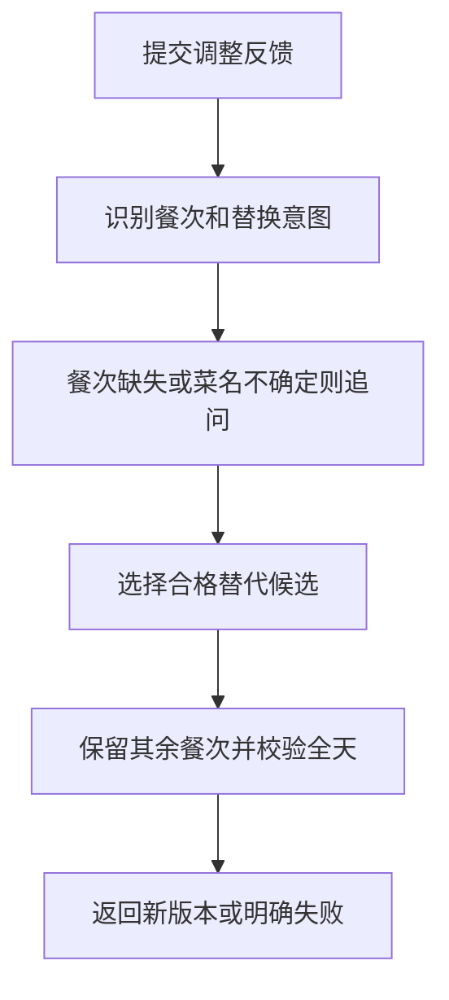

# 13 餐单局部调整：换一餐，还要重新检查全天

[返回功能学习总目录](README.md)

用户说“晚餐换清淡一点”，系统识别要改的餐次，在原计划基础上换候选，再校验全天。没有指明餐次或菜名不确定时先追问。

## 1. 核心能力

保留已有目标和其他餐次，处理指定餐次的替换、候选确认及有限次数调整。

## 2. 业务背景

用户只是想换晚餐，如果把整天重做，满意的早餐午餐也会变化。但只换晚餐不检查整日总量，又可能破坏原有目标。

## 3. 整体执行流程



流程图展示主线；失败、追问等分支在下面对应步骤中说明。

## 4. 关键代码与设计理由

### 4.1 当前反馈识别是一组规则

[graph.py](../../backend/app/agent/graph.py) 的 `_apply_adjustment`：

```python
intent = "lighter" if "清淡" in feedback else "replace"
slot = _slot_from_feedback(feedback)
food_query = _food_query_from_feedback(feedback)
```

当前通过关键词和辅助解析函数判断意图，不是调用模型理解任意复杂指令。没有找到餐次时列出可调整餐次供选择，不能假定所有自然语言说法都支持。

### 4.2 指定菜品也要经过候选确认

同函数保存 `pending_food_query` 和候选，恢复时核对 ID、版本并重新检索。它与餐食分析共用[菜品检索](feature-food-search.md)边界，不能因为用户确认过一次就永远信任旧候选。

### 4.3 局部修改，整日校验

[tools.py](../../backend/app/agent/tools.py) 的 `replace_planning_slot` 执行替换；图再调用校验工具。计数达到上限返回需要修改输入或新建计划的状态。

`RELAX` 仍是有标识的放宽结果，不是静默通过；原计划的排除项和健康范围检查不能被“换清淡”绕开。

## 5. 难懂语法

`resume.get("feedback")` 从回答字典读取字段，没有就得到空值。`pending_*` 保存尚未完成的调整意图，避免追问后丢失“到底想改什么”。

## 6. 怎么验证、怎么继续读

读 [test_diet_planning_graph.py](../../backend/tests/unit/test_diet_planning_graph.py) 的调整、餐次追问和次数上限；领域候选测试见 [test_managed_recipe_candidates.py](../../backend/tests/planning/test_managed_recipe_candidates.py)。

读完试着回答：**为什么换一道菜之后还要检查全天，而不只看这道菜？**

---

本文解释当前代码行为；代码块为源码节选，省略外围逻辑，不能单独运行。示例用于讲解，不代表真实模型必然输出相同结果。测试执行范围见总目录。
