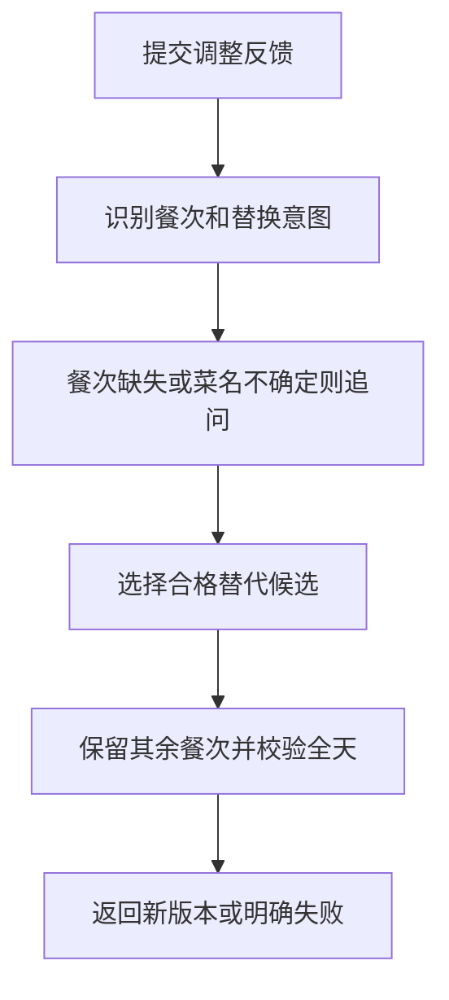

# 13 餐单局部调整：换一餐，还要重新检查全天

[返回功能学习总目录](README.md)

用户说“晚餐换清淡一点”，系统识别要改的餐次，在原计划基础上换候选，再校验全天。没有指明餐次或菜名不确定时先追问。

## 1. 先看一个实际例子

小林要把晚餐换成另一道菜。目录已确认菜名，但这个菜有两份不同重量或做法的菜谱。现在必须再选具体菜谱，才能只换晚餐而保留早餐午餐。

这个例子贯穿下面的执行过程。示例数据用于理解代码，不是线上测量或真实模型效果证明。

## 2. 为什么需要这样实现

菜名只确定营养目录来源，份量和做法属于具体菜谱选择。用户想换一餐，既不能默默采用任意份量，也不能把其他餐次一起改掉。

## 3. 一张图看懂全过程



图展示主线，失败与追问分支在第 5 节对照阅读。

## 4. 跟着这个例子读代码

以下为当前源码的连续节选，省略外围处理，不能单独运行。每一步都说明调用位置和数据去向。

### 提交之前：区分再次换餐和网络重试

用户连续两次说“午餐换一份”，表示两次操作；同一次请求因网络问题重发，则应只执行一次。这种“重发不重复执行”的机制叫幂等。

`frontend/src/features/plans/components/PlanPage.tsx` 的 `submitAdjustment` 为每次新提交生成随机请求标识，通过已有 API 客户端的 `Idempotency-Key` 请求头发送。网络响应丢失或读取结果失败时，同一页面中再次提交相同内容会沿用原标识；确认请求结束并读取结果后，才释放该标识。下一次同文提交获得新标识。同步的 `useRef` 标记还会阻止连续点击在渲染前发送两次请求。

后端 `agent/api.py` 接收可选请求头，对标识做摘要并加上规划提交前缀；`AgentService.find_reusable_run` 在解释当前图状态之前按用户、会话和标识查已接收命令。相同标识、相同正文只返回已有状态，不再次推进图；正文不一致返回 409。标识不同则创建新运行，仍受原有营养校验、租约和最多三次自动调整限制。旧请求不能拿后来的待确认状态继续执行。

```text
新提交 → 新请求标识 → 新运行 → 换餐、校验、存档
响应不确定 → 保留标识重试 → 读取已有运行 → 不多建版本
完成后再次输入相同文字 → 新标识 → 下一次换餐
```

服务只存正文摘要和标识摘要，不将反馈原文写入幂等账本。未传请求头的旧客户端保留按文字摘要去重的兼容行为；修复需同时更新用户 H5 与后端。无需迁移，回退这两处实现即可撤销，但会恢复旧的同文去重问题。

> 语法小注：`useRef` 保存不会因组件渲染而重置的临时值；`crypto.randomUUID()` 生成提交标识。标识仅保存在当前页面内存中，关闭或刷新页面后的未确认请求不提供自动重试恢复，宜先查看已保存计划。

### 4.1 先找到需要修改的餐次

**收到什么**

恢复请求带反馈文字；状态已有目标、原餐单和累计调整次数。

**代码在哪里**

[backend/app/agent/graph.py](../../backend/app/agent/graph.py) 的 `DietPlanningGraph._apply_adjustment`。

```python
if isinstance(feedback, str) and 1 <= len(feedback) <= 500:
    intent = "lighter" if "清淡" in feedback else "replace"
    slot = _slot_from_feedback(feedback)
    food_query = _food_query_from_feedback(feedback)
    current = self._capture_adjustment_preferences(current, feedback)
    current = current.model_copy(
        update={
            "pending_adjustment_intent": intent,
            "pending_adjustment_slot": slot,
            "pending_food_query": food_query,
            "pending_food_candidates": (),
            "pending_recipe_candidates": (),
        }
    )
    if slot is None:
        return current.model_copy(
            update={
                "status": AgentRuntimeStatus.WAITING_INPUT,
                "next_action": DietPlanningAction.NEEDS_INPUT,
                "report": {
                    "stage": "needs_input",
                    "message": "请选择要调整的餐次。",
                    "input_choices": [meal.slot.value for meal in current.meals],
                },
            }
        )
```

**为什么这样写**

用现有规则解析餐次、清淡或替换意图及菜名，保存 pending 字段。未指出餐次先追问，不随便改整日。

**处理后变成什么，交给谁**

本例定位晚餐，并记住待查询菜名。后续目录检索遵守非精确候选确认；当前规则并非任意复杂自然语言理解器。

> 语法小注：`pending_*` 表示还没完成的选择，追问后仍要保留。

### 4.2 菜名确定后，筛选具体菜谱

**收到什么**

已确认 food_id 和版本、目标餐次是晚餐、原菜谱需排除。

**代码在哪里**

[backend/app/planning/service.py](../../backend/app/planning/service.py) 的 `list_replacement_recipes`。

```python
if not preferences.confirmed:
    return ()
candidates = (
    item for item in self._repository.list_managed_recipe_candidates(catalog_version=None)
    if item.nutrition_item_id == food_id and item.catalog_version == catalog_version
    and item.meal_slot is affected_slot and item.id not in exclude_recipe_ids
    and self._build_managed_meal(item, preferences) is not None
)
return tuple(sorted(candidates, key=lambda item: str(item.id)))[:20]
```

**为什么这样写**

同一道菜可能有不同份量与做法。代码按目录身份、餐次、排除项及可重算资格筛选，排序后限量返回，不能把菜名选择当最终份量选择。

**处理后变成什么，交给谁**

返回候选菜谱；图在多候选时进入 recipe_clarification。选择后还会核对 recipe_id 与 revision，过期选择需重选。

> 语法小注：生成器先过滤，`sorted` 固定顺序，切片限制候选数量。

### 4.3 只替换目标餐次，然后校验整日

**收到什么**

领域服务已给出合法 replacement_plan，待替换晚餐确定。

**代码在哪里**

[backend/app/agent/tools.py](../../backend/app/agent/tools.py) 的 `SessionNutritionToolAdapter.replace_planning_slot`。

```python
replacement = next(meal for meal in replacement_plan.meals if meal.slot is affected_slot)
return MealCompositionResult(
    action=PlanValidationAction.PASS,
    meals=tuple(replacement if meal.slot is affected_slot else meal for meal in existing_meals),
    safe_message="已替换指定餐次并保留其余餐次。",
)
```

**为什么这样写**

选菜前，工具就把其他餐次作为 `fixed_meals` 传入服务，按它们已经占用的营养量比较替换候选。原快照不要求目录仍在售，也不重新生成其他餐次。

`feedback_intent="lighter"` 只接受受控口味标签含“清淡”的替换菜；找不到时返回无法满足，不能把随便换一道菜说成清淡。这里的“清淡”是已维护的口味标签，不代表系统测出了盐含量。随后图仍调用 `validate_daily_plan` 校验整日。

**处理后变成什么，交给谁**

得到保留其他餐次的新餐单。通过或有明确标识的放宽才能呈现结果；不能仅因替换成功就跳过整日约束。

> 语法小注：`replacement if ... else meal` 按餐次选择新旧值。

## 5. 换一种输入，会走哪条路

| 情况 | 判断与处理 | 应观察的结果 |
|---|---|---|
| 没说改哪餐 | 列出餐次选择 | 先不替换 |
| 同菜多个菜谱 | 再次确认份量与做法 | 不是直接选第一份 |
| 菜谱版本变化 | 重读拒绝旧选择 | 重新确认 |
| 相同文字再次提交 | 新提交使用新标识 | 可以再换一次，仍受次数上限约束 |
| 同一请求网络重试 | 相同标识和正文返回已有状态 | 不重复推进、不多保存版本 |
| 相同标识改了正文 | 返回 409 | 原计划不被修改 |

## 6. 自己验证一次

在仓库根目录执行现有测试，使用后端已安装的测试环境：

```bash
cd backend
.venv/bin/python -m pytest tests/unit/test_diet_planning_graph.py tests/planning/test_managed_recipe_candidates.py tests/planning/test_personalized_selection.py -q
```

重点观察同一菜品多个菜谱、过期 revision 和非目标餐次保持不变的用例。测试以当前候选规则为准，不推导真实模型理解能力。

新增回归覆盖清淡要求不可满足、其他餐次已下架仍保持快照、替换后全天目标符合情况。替身测试证明指定输入下的代码行为，不能替代真实模型效果、数据库并发或页面验收。

2026-09-15 本地验收：`frontend/tests/e2e/plans.spec.ts` 两项通过；Codex 内置浏览器走过公开注册、资料保存、生成、午餐清淡调整、刷新和历史版本。无可替换早餐时流程有界结束，已保存餐单未被覆盖。使用 Fake Provider，仅验证产品链路；真实模型理解质量与真实设备软键盘仍未验证。

### 连续换餐与重试验证（2026-09-16）

后端定向单测 23 项、规划 API 的真实 PostgreSQL 集成测试 8 项、H5 计划组件测试 42 项通过；类型检查、构建、Ruff 与差异空白检查通过。新增用例验证：相同标识不多建运行或版本、不同标识的同文请求确实换餐、标识与正文冲突返回 409、外部用户不可重放、旧请求不能覆盖新结果，以及待确认运行不能重复推进图。

`frontend/tests/e2e/meal-bundles.spec.ts` 通过，页面连续两次提交“午餐换清淡一些”分别保存第 2、3 版，早餐与晚餐不变。内置浏览器在隔离 `http://127.0.0.1:5198/app/plans` 实际登录、重新生成后，连续提交“午餐换一份”，观察第 5、6、7 版及午餐食物变化；第四次提示达到三次调整上限，保留第 7 版。测试全程使用合成目录与 Fake Provider；没有验证真实模型费用或并发压力，网络丢包与读取失败由组件测试模拟。

## 7. 读完应该能回答什么

1. 为什么确认菜名后还要确认菜谱？
2. 怎样保证早餐午餐不变？
3. 为什么换完晚餐还要校验全天？

源码阅读顺序：[agent/graph.py](../../backend/app/agent/graph.py) → [planning/service.py](../../backend/app/planning/service.py) → [agent/tools.py](../../backend/app/agent/tools.py)。先跟本例函数走一遍，再展开旁支。
