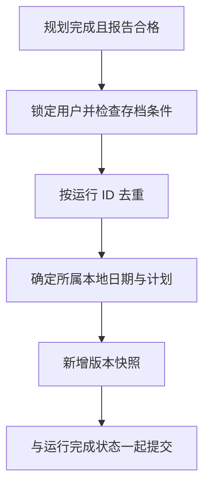

# 14 餐单存档：对话会清理，正式计划要留下

[返回功能学习总目录](README.md)

把完成的餐单保存为按日期组织的正式计划，并记录后续调整产生的版本，供今日计划、历史和详情读取。

## 1. 核心能力

把长期计划与短期 Agent 状态分开；同一运行不重复存档；调整生成新版本，删除后阻止旧运行把它意外恢复。

## 2. 业务背景

用户一周后想看当时计划，不能依赖随时可能清理的对话状态。同时，一次生成任务被重试，也不应该在历史中多出一份相同计划。

## 3. 整体执行流程



流程图展示主线；失败、追问等分支在下面对应步骤中说明。

## 4. 关键代码与设计理由

### 4.1 正式保存和完成状态共用事务

[archive_service.py](../../backend/app/planning/archive_service.py) 的 `record_completion` 开头：

```python
self.repo.lock_owner(command.user_id)
self.check_admission(user_id=command.user_id, thread_id=command.thread_id)
if self.repo.by_run(command.user_id, command.run_id) is not None:
    return
```

先串行化该用户的写入，再检查是否已保存此运行。方法末尾只 `flush`，最终由 AgentService 提交，避免出现“运行说完成，但计划未保存”的半套结果。

### 4.2 同一计划的新结果追加版本

`record_completion` 按线程和日期定位计划，新计划版本从 1 开始，已有计划递增 `current_version`。版本记录保存完整报告、重算总量以及公式、图、工具和菜谱来源信息。

日期根据开始时间与用户时区归属，不是简单取服务器当前日期；已有线程计划保持自己的归属。

### 4.3 删除也参与并发判断

同方法检查删除时间。如果旧生成任务开始在删除之前，不能在删除后重新把计划写回来。`today`、`history`、`detail` 和 `delete` 构成读取与管理入口，API 在 [archive_api.py](../../backend/app/planning/archive_api.py)。

## 5. 难懂语法

`astimezone(ZoneInfo(time_zone)).date()` 把时间转换为指定时区，再取日期。`flush` 送出数据库修改但未最终提交；`commit` 才结束事务。

## 6. 怎么验证、怎么继续读

读 [test_plan_archive.py](../../backend/tests/planning/test_plan_archive.py) 的重复运行、版本、日期与删除用例。纯服务测试不能代替数据库锁与并发验收。

读完试着回答：**为什么正式计划不能只放在 Checkpoint 里？**

---

本文解释当前代码行为；代码块为源码节选，省略外围逻辑，不能单独运行。示例用于讲解，不代表真实模型必然输出相同结果。测试执行范围见总目录。
