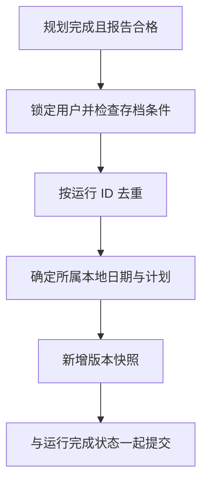

# 14 餐单存档：对话会清理，正式计划要留下

[返回功能学习总目录](README.md)

把完成的餐单保存为按日期组织的正式计划，并记录后续调整产生的版本，供今日计划、历史和详情读取。

## 1. 先看一个实际例子

小林生成今天的餐单，随后调整晚餐，历史里应有两个版本。如果完成回调重复执行，不能凭空再多一个版本。

这个例子贯穿下面的执行过程。示例数据用于理解代码，不是线上测量或真实模型效果证明。

## 2. 为什么需要这样实现

用户一周后想看当时计划，不能依赖随时可能清理的对话状态。同时，一次生成任务被重试，也不应该在历史中多出一份相同计划。

## 3. 一张图看懂全过程



图展示主线，失败与追问分支在第 5 节对照阅读。

## 4. 跟着这个例子读代码

以下为当前源码的连续节选，省略外围处理，不能单独运行。每一步都说明调用位置和数据去向。

### 4.1 先按运行去重并确定归属

**收到什么**

Agent 完成流程带用户、线程、运行与报告交给存档服务。

**代码在哪里**

[backend/app/planning/archive_service.py](../../backend/app/planning/archive_service.py) 的 `record_completion`。

```python
self.repo.lock_owner(command.user_id)
self.check_admission(user_id=command.user_id, thread_id=command.thread_id)
if self.repo.by_run(command.user_id, command.run_id) is not None:
    return
time_zone = self.repo.time_zone(command.user_id)
assert time_zone is not None
plan = self.repo.by_thread(command.user_id, command.thread_id)
if plan is None:
    day = command.started_at.astimezone(ZoneInfo(time_zone)).date()
    deleted_at = self.repo.latest_deletion(command.user_id, day)
    if deleted_at is not None and command.started_at <= deleted_at:
        raise PlanArchiveConflict("生成期间这天的计划已被删除，请重新生成。")
    plan = self.repo.by_date(command.user_id, day)
```

**为什么这样写**

先锁用户协调写入，同一 run 已存在就返回。按线程优先找到计划，必要时按开始时间和统计时区找日期，并检查删除墓碑。

**处理后变成什么，交给谁**

第一次生成找到当天计划或准备新建；同一完成重放不新增。旧任务不能把用户已删除的计划重新带回来。

> 语法小注：`astimezone(...).date()` 先转换时区再取日期。

### 4.2 已有计划追加版本

**收到什么**

上一阶段确定 plan 是否已经存在。

**代码在哪里**

[backend/app/planning/archive_service.py](../../backend/app/planning/archive_service.py) 的 `record_completion`。

```python
now = self.now()
if plan is None:
    plan = DietPlan(
        id=uuid.uuid4(),
        user_id=command.user_id,
        plan_date=command.started_at.astimezone(ZoneInfo(time_zone)).date(),
        time_zone=time_zone,
        current_version=1,
        created_at=now,
        updated_at=now,
    )
    self.repo.add_plan(plan)
else:
    plan.current_version += 1
    plan.updated_at = now
```

**为什么这样写**

新计划从版本 1 开始，已有计划提高版本号。调整后的报告保存为新版本，而不是把旧报告覆盖到无法追溯。

**处理后变成什么，交给谁**

第一次生成 v1，晚餐调整完成变成 v2。后面按新报告重算总量并保存来源信息。

### 4.3 保存完整报告，提交交给调用方

**收到什么**

新版本号、报告、总量和来源信息已准备好。

**代码在哪里**

[backend/app/planning/archive_service.py](../../backend/app/planning/archive_service.py) 的 `record_completion`。

```python
self.repo.add_version(
    DietPlanVersion(
        id=uuid.uuid4(),
        user_id=command.user_id,
        plan_id=plan.id,
        version=plan.current_version,
        source_run_id=command.run_id,
        source_thread_id=command.thread_id,
        report=command.report.model_dump(mode="json", exclude_none=True),
        totals=totals.model_dump(mode="json"),
        provenance=provenance,
        created_at=now,
    )
)
self.repo.flush()
```

**为什么这样写**

版本记录绑定来源 run 和 thread；这里只 flush，让 Agent 的运行完成状态与正式存档一起 commit。否则可能运行成功但计划没保存。

**处理后变成什么，交给谁**

版本持久化到同一事务，成功提交后 today/history/detail 可读取。正式计划不依赖临时 Checkpoint 长期保留。

> 语法小注：`model_dump(mode="json")` 把结构转成可序列化数据，不能与任意原始用户输入混用。

## 5. 换一种输入，会走哪条路

| 情况 | 判断与处理 | 应观察的结果 |
|---|---|---|
| 同 run 重放 | 直接返回 | 版本不增加 |
| 新调整完成 | 版本递增 | 旧版仍可追溯 |
| 旧任务晚于删除写回 | 检查墓碑 | 拒绝复活旧计划 |

## 6. 自己验证一次

在仓库根目录执行现有测试，使用后端已安装的测试环境：

```bash
cd backend
.venv/bin/python -m pytest tests/planning/test_plan_archive.py -q
```

观察相同 run 与不同 run 对版本号的影响，再检查日期与删除冲突。真实数据库锁需要另行集成验证。

本轮运行范围与结果见[总目录验证记录](README.md)。替身测试证明指定输入下的代码行为，不能替代真实模型效果、数据库并发或页面验收。

## 7. 读完应该能回答什么

1. 为什么不能只保存 Checkpoint？
2. 什么时候版本应该增加？
3. 为什么由调用方 commit？

源码阅读顺序：[planning/archive_service.py](../../backend/app/planning/archive_service.py)。先跟本例函数走一遍，再展开旁支。
