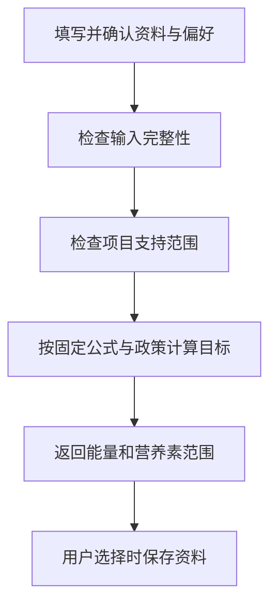

# 11 个人资料与饮食目标：先确认输入，再计算范围

[返回功能学习总目录](README.md)

用户提供身体资料、活动水平和目标后，后端按版本化规则计算一日目标范围。用户可选择保存资料，下次使用时仍需确认本次输入。

## 1. 核心能力

检查资料是否完整、是否属于项目支持范围，然后计算目标；资料保存是显式选择，偏好由独立记忆模块负责。

## 2. 业务背景

如果用户只是试算一次目标，后端不应自动把输入当成长期个人资料。数值目标也需要固定计算政策，不能每次由模型随意编一个。

## 3. 整体执行流程



流程图展示主线；失败、追问等分支在下面对应步骤中说明。

## 4. 关键代码与设计理由

### 4.1 输入不完整就停下补充

[service.py](../../backend/app/planning/service.py) 的 `calculate_daily_target` 先调用 `_has_complete_inputs`，不完整返回 `NEEDS_INPUT`；`_is_health_scope_blocked` 决定是否拒绝。这里解释的是项目现有策略，不是在给读者提供个人营养建议。

### 4.2 目标由代码计算

同函数核心节选：

```python
energy = (
    self._mifflin_st_jeor(profile)
    * ACTIVITY_FACTORS[profile.activity_level]
    + SPEED_DELTAS[profile.goal_speed]
)
```

公式计算、活动系数和目标调整量都由代码选择，再形成范围。模型没有直接写目标值的入口。政策与公式位置在同文件，改变政策应有版本与测试。

### 4.3 保存发生在支持范围检查之后

[graph.py](../../backend/app/agent/graph.py) 的 `DietPlanningGraph.ainvoke` 先获得合法目标，再在 `save_profile` 为真时调用资料保存工具。这样被拒绝的试算输入不会因此被写为个人资料。

读取、替换和删除在 [service.py](../../backend/app/planning/service.py) 的 `PlanningProfileService`。资料变化还会撤销相关完成目标投影，防止看板继续使用旧目标。

## 5. 难懂语法

`assert profile.height_cm is not None` 在前置检查后表达“这里应已有值”，不是给外部请求做校验的主要手段。`TargetRange` 表示上下界，不是一个精确到个位的承诺。

## 6. 怎么验证、怎么继续读

读 [test_planning_service.py](../../backend/tests/planning/test_planning_service.py) 和 [test_planning_profile_service.py](../../backend/tests/planning/test_planning_profile_service.py)，检查资料缺失、显式保存和删除。下一篇：[生成餐单](feature-daily-planning.md)。

读完试着回答：**为什么“用资料计算一次”和“长期保存资料”要分开？**

---

本文解释当前代码行为；代码块为源码节选，省略外围逻辑，不能单独运行。示例用于讲解，不代表真实模型必然输出相同结果。测试执行范围见总目录。
