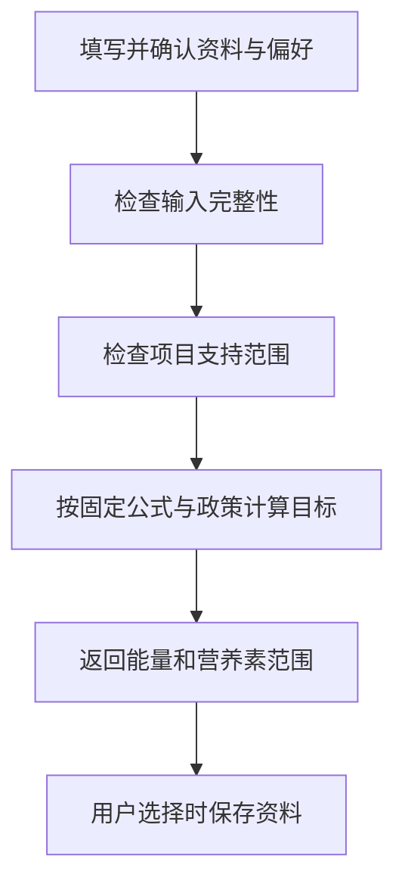

# 11 个人资料与饮食目标：先确认输入，再计算范围

[返回功能学习总目录](README.md)

用户提供身体资料、活动水平和目标后，后端按版本化规则计算一日目标范围。用户可选择保存资料，下次使用时仍需确认本次输入。

## 1. 先看一个实际例子

小林填写身体资料和活动水平，确认这次要使用的偏好，只想先试算目标；他没有勾选保存资料。我们看系统如何计算，却不把试算自动变成长期资料。

这个例子贯穿下面的执行过程。示例数据用于理解代码，不是线上测量或真实模型效果证明。

## 2. 为什么需要这样实现

如果用户只是试算一次目标，后端不应自动把输入当成长期个人资料。数值目标也需要固定计算政策，不能每次由模型随意编一个。

## 3. 一张图看懂全过程



图展示主线，失败与追问分支在第 5 节对照阅读。

## 4. 跟着这个例子读代码

以下为当前源码的连续节选，省略外围处理，不能单独运行。每一步都说明调用位置和数据去向。

### 4.1 先检查是否能计算

**收到什么**

图调用目标工具，收到本次资料与已确认偏好。

**代码在哪里**

[backend/app/planning/service.py](../../backend/app/planning/service.py) 的 `calculate_daily_target`。

```python
if not self._has_complete_inputs(profile, preferences):
    return TargetCalculationResult(
        action=PlanValidationAction.NEEDS_INPUT,
        safe_message="请补全并确认身体资料、目标和饮食偏好后继续。",
    )
if self._is_health_scope_blocked(profile):
    return TargetCalculationResult(
        action=PlanValidationAction.BLOCK_HEALTH_SCOPE,
        safe_message=HEALTH_REFUSAL_MESSAGE,
    )
```

**为什么这样写**

完整输入和项目支持范围是前置条件；不应该让模型先编目标再补检查。这里只解释现有代码政策，不是给读者的个人健康建议。

**处理后变成什么，交给谁**

缺失返回 NEEDS_INPUT，超出范围返回 BLOCK_HEALTH_SCOPE；本例通过后进入公式。

> 语法小注：枚举 action 是下一步的明确指令，不是一段需要模型猜测含义的文字。

### 4.2 固定公式生成目标范围

**收到什么**

资料已通过检查，公式所需字段不再为空。

**代码在哪里**

[backend/app/planning/service.py](../../backend/app/planning/service.py) 的 `calculate_daily_target`。

```python
energy = (
    self._mifflin_st_jeor(profile)
    * ACTIVITY_FACTORS[profile.activity_level]
    + SPEED_DELTAS[profile.goal_speed]
)
energy_range = TargetRange(
    lower=energy - TARGET_RANGE_MARGIN_KCAL,
    upper=energy + TARGET_RANGE_MARGIN_KCAL,
)
if energy < MIN_SAFE_ENERGY_KCAL or energy_range.lower < MIN_SAFE_ENERGY_KCAL:
    return TargetCalculationResult(
        action=PlanValidationAction.BLOCK_HEALTH_SCOPE,
        safe_message=HEALTH_REFUSAL_MESSAGE,
    )
```

**为什么这样写**

基础公式、活动系数和目标调整量都在代码中。先得到能量再给范围，并检查最低边界，不让模型决定数值真相。

**处理后变成什么，交给谁**

生成 energy_range，后续用它派生宏量营养范围，返回 DailyTarget 给规划流程。相同输入和政策得到可重算结果。

> 语法小注：`Decimal` 处理十进制值；范围是上下界，不是精确的个人需求承诺。

### 4.3 通过检查后才考虑保存资料

**收到什么**

当前已有可用目标，还带用户是否选择保存的 save_profile。

**代码在哪里**

[backend/app/agent/graph.py](../../backend/app/agent/graph.py) 的 `DietPlanningGraph.ainvoke`。

```python
# A health-scope refusal must not persist the transient command as a profile.  Saving is
# intentionally deferred until the deterministic health guard has accepted the request.
if current.save_profile and not current.profile_save_completed:
    current = self._call_profile_upsert(current)
```

**为什么这样写**

使用资料算一次与长期存储是两个决定。保存放在范围检查后，避免被拒绝的输入被顺便记录。

**处理后变成什么，交给谁**

本例 save_profile=False，直接进入餐单组合，不写资料。为真则调用 _call_profile_upsert，且用完成标记防止重复保存。

### 4.4 已保存资料与记录页目标同步

H5 在“我的”保存身体资料，再在计划页发送 `save_profile=False` 生成餐单。这个开关只决定是否写入资料，不决定记录页能否使用目标。

流程：计划通过校验并完成 → `AgentService.execute_run` 将本次资料和确定性目标交给 `PlanningCompletionProjectionService.record_validated_completion` → 服务锁定当前用户的有效资料，比较身体参数、目标及计算版本 → 匹配时保存目标投影 → 记录页读取目标资格。前端完成生成后也会使记录页缓存失效。

资料未保存、已删除或与本次计划不匹配时，餐单仍可完成，但不会产生新的记录页目标。资料后续变更会撤销旧资格；重复完成请求不能恢复已撤销目标。不会为了同步目标而隐式覆盖用户资料。旧版本曾漏写的目标不会自动补写，需要在修复后的服务上重新生成计划。

本次验证：规划与图单测 241 项通过；隔离 PostgreSQL 规划接口和投影测试原有 10 项通过，新增目标同步回归 1 项通过（按数据库六位小数精度比较）；前端定向 22 项、类型检查、构建及后端定向 Ruff 通过。内置浏览器在 5182 完成测试账号注册、资料保存和计划页读取，但生成返回 503，临时环境未配置启用的推理服务，因此完整浏览器目标显示路径尚未验收。

验证入口：`tests/planning/test_completion_projection_service.py` 覆盖资料匹配、删除、跨用户、版本不匹配与幂等；`tests/integration/test_diet_planning_agent_api.py::test_saved_profile_plan_without_resaving_authorizes_dashboard_target` 通过公开 API 验证先保存资料、生成而不重复保存、看板获得目标、修改资料后资格失效。

记录页还必须接受后端 `DailyTarget` 返回的 `policy_version` 和 `formula_version`。此前前端严格校验未声明这两个字段，会把有效资格降级为 `undefined`，错误显示“尚未获得可用的营养目标”。现在显式校验这两个可选版本字段，同时保留对未知字段的拒绝。回归用例先复现有效目标被丢弃，再验证修复后完整保留；记录模块 31 项测试、类型检查和构建通过。用户当前 Chrome 的 `http://127.0.0.1:5178/app/records` 已实际验证：刷新后显示三个目标状态，无需再次生成计划。本次没有重新执行真实模型生成。

## 5. 换一种输入，会走哪条路

| 情况 | 判断与处理 | 应观察的结果 |
|---|---|---|
| 缺身高等字段 | NEEDS_INPUT | 等待补充 |
| 超出支持范围 | 拒绝 | 不借此持久化资料 |
| 不勾选保存 | 跳过 upsert | 仍可继续本次流程 |

## 6. 自己验证一次

在仓库根目录执行现有测试，使用后端已安装的测试环境：

```bash
cd backend
.venv/bin/python -m pytest tests/planning/test_planning_service.py tests/planning/test_planning_profile_service.py -q
```

观察目标计算与资料写入是独立测试；比较完整输入、缺字段和删除资料后目标资格的变化。

本轮运行范围与结果见[总目录验证记录](README.md)。替身测试证明指定输入下的代码行为，不能替代真实模型效果、数据库并发或页面验收。

## 7. 读完应该能回答什么

1. 为什么试算不等于保存？
2. 目标数值在哪里产生？
3. 资料改变后旧目标为什么需要失效？

源码阅读顺序：[planning/service.py](../../backend/app/planning/service.py) → [agent/graph.py](../../backend/app/agent/graph.py)。先跟本例函数走一遍，再展开旁支。
