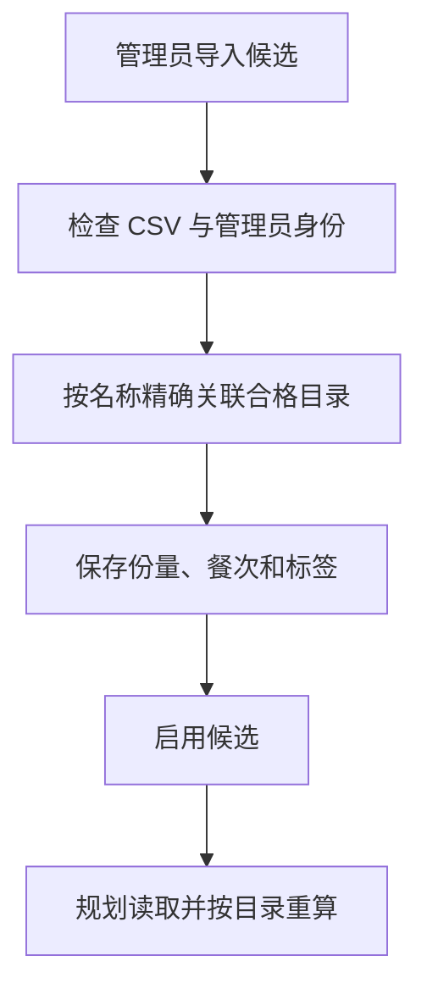

# 18 菜谱候选池：决定餐单有哪些菜可以选

[返回功能学习总目录](README.md)

管理员维护可用于餐单的成品菜候选，指定关联营养目录、单份重量、餐次、餐内角色和口味标签。规划服务从这些候选里组合餐单。

## 1. 先看一个实际例子

管理员导入一份午餐候选：关联某道目录菜，单份 200g。规划时应该从该目录重算营养，而不是把 CSV 里的另一份热量当真相。

这个例子贯穿下面的执行过程。示例数据用于理解代码，不是线上测量或真实模型效果证明。

## 2. 为什么需要这样实现

目录回答“这道菜每 100g 有什么营养”，候选池回答“这道菜是否作为一份午餐候选、每份多少克”。两者混成一张随意输入营养的表，会出现两套不一致的数值。

## 3. 一张图看懂全过程



图展示主线，失败与追问分支在第 5 节对照阅读。

## 4. 跟着这个例子读代码

以下为当前源码的连续节选，省略外围处理，不能单独运行。每一步都说明调用位置和数据去向。

### 4.1 先检查整份 CSV 和重复批次

**收到什么**

API 已校验管理员命令结构，Service 解析待导入 CSV。

**代码在哪里**

[backend/app/admin/service.py](../../backend/app/admin/service.py) 的 `import_recipe_candidates`。

```python
preview = parse_recipe_candidate_csv(command.csv_text)
if preview.errors:
    raise RecipeCandidateCsvInvalid("文件存在错误，请修正全部错误后再导入。")
self._repository.acquire_recipe_candidate_lock(command_key)
batch_key = f"recipe-import-batch:{command_key}"
request_hash = self._request_hash("recipe-import", command.model_dump())
replay = self._repository.get_audit_event_by_command_key(batch_key)
if replay is not None:
    if replay.after_diff.get("request_hash") != request_hash:
        raise RecipeCandidateConflict(
            "Idempotency-Key was reused for a different command"
        )
    return RecipeCandidateImportResponse(
        imported_count=len(replay.after_diff["candidate_ids"]),
        candidate_ids=[
            uuid.UUID(value) for value in replay.after_diff["candidate_ids"]
        ],
    )
```

**为什么这样写**

有错误先拒绝，再通过批次键与内容摘要处理重复提交。同键不同内容不能复用原成功结果。

**处理后变成什么，交给谁**

得到校验过的行；重复同批返回原 candidate_ids，新批继续逐行解析目录。

> 语法小注：`command.model_dump()` 提取命令字段以计算请求摘要。

### 4.2 候选必须指向唯一合格目录

**收到什么**

本例行中有目录名称、午餐、200g 和做法口味标签。

**代码在哪里**

[backend/app/admin/service.py](../../backend/app/admin/service.py) 的 `import_recipe_candidates`。

```python
foods = self._repository.resolve_qualified_food_by_name(
    row.catalog_food_name
)
if len(foods) != 1:
    raise RecipeCandidateCsvInvalid(
        f"第 {row_number} 行“{row.catalog_food_name}”在当前合格目录中"
        "不存在或营养值不一致，无法自动创建或猜测关联。"
    )
food = foods[0]
candidate = ManagedRecipeCandidate(
    id=uuid.uuid4(),
    food_catalog_item_id=(
        food.id if food.source_kind == "food_catalog_item" else None
    ),
    catalog_publication_id=(
        food.id if food.source_kind == "catalog_publication" else None
    ),
    catalog_food_name=food.canonical_name,
    nutrition_catalog_version=food.nutrition_catalog_version,
    meal_slot=row.meal_slot,
    meal_role=row.meal_role,
    portion_grams=row.portion_grams,
    portion_description=row.portion_description,
    method_tags="|".join(row.method_tags),
    flavour_tags="|".join(row.flavour_tags),
    status=row.status,
    revision=1,
    created_at=now,
    updated_at=now,
)
```

**为什么这样写**

必须唯一匹配合格目录，找不到不能自动造营养条目。候选保存引用和份量，避免多维护一套会漂移的营养数值。

**处理后变成什么，交给谁**

构建 ManagedRecipeCandidate，保存后写审计。启用的候选才可能被规划读取；CSV 导入成功不代表任意候选都满足本次忌口。

> 语法小注：两种来源引用按 source_kind 选择，不是同时绑定两个营养来源。

### 4.3 使用候选时仍需构造与计算

**收到什么**

规划读取候选，本例是 200g 午餐，另有用户已确认偏好。

**代码在哪里**

[backend/app/planning/service.py](../../backend/app/planning/service.py) 的 `_build_managed_meal`。

以下为删减主逻辑，省略计数、别名忌口校验、份量调整和卡片组装：

```python
if candidate.meal_role != "standalone":
    stats.filtered += 1
    return None
calculation = self._nutrition_port.calculate_nutrition(
    NutritionCalculationInput(
        food_id=candidate.nutrition_item_id,
        catalog_version=candidate.catalog_version,
        grams=grams,
    )
)
```

**为什么这样写**

单独候选可作为一餐；午餐、晚餐还可通过 `planning/bundles.py` 的 `BundlePool` 将主食、蛋白质菜、蔬菜各一项拼成一餐。数据库默认只返回单独候选，组合路径才显式允许这三类组成菜品，领域服务再次检查；任意一个组成菜品都不能单独成为整餐。之后仍按目录每 100g 基准重算营养，并核对菜名、别名和已知标签中的忌口；不会从菜名猜完整配料。

**处理后变成什么，交给谁**

得到可用 `PlannedMeal` 或 `None`。可用项进入整日组合；失败项排除。最近历史轮换只能尽量减少重复，不保证候选有限时永不重复。

> 语法小注：`PlannedMeal | None` 表示既可能返回餐次，也可能返回“此项不可用”。

### 4.4 明确标记餐内角色

分类决定午餐、晚餐如何组合；它由管理员维护，模型和菜名都不能替代这份证据。

| CSV / 后台标签 | 保存值 | 当前用途 |
|---|---|---|
| 单独候选 | `standalone` | 沿用原有每餐一个候选的行为，不代表营养搭配完整 |
| 主食 | `staple` | 午餐、晚餐组合的主食项 |
| 蛋白质菜 | `protein` | 午餐、晚餐组合的蛋白质菜项 |
| 蔬菜 | `vegetable` | 午餐、晚餐组合的蔬菜项 |
| 其他配菜 | `side` | 暂不参与规划 |
| 饮品 | `drink` | 暂不参与规划 |

新模板在原七列末尾增加“餐内角色”，支持表中中文或保存值。新列存在时必须填写有效值，不能留空或写“自动”。完整的旧七列模板仍可导入，默认 `standalone`，系统不会因名称含“蔬菜”或“牛奶”而自动改分类。迁移也将现有行保留为 `standalone`。

后台“菜谱管理”可勾选已有记录，点击“设置餐内角色”，填写角色与原因。这比导出后重新导入更适合修正旧数据：重新导入会新增候选，不会覆盖原记录。

入口是 [RecipeRoleDialog.tsx](../../admin-frontend/src/features/recipes/RecipeRoleDialog.tsx)，公开接口为 `POST /api/v1/admin/recipe-candidates/meal-role`，业务函数是 `AdminService.change_recipe_candidate_role`。每批最多 1000 条：验证当前管理员 → 对选中记录按 ID 排序加锁 → 全批检查 → 修改角色和版本 → 同事务写审计。缺失或已删除成员使整批失败；同一请求键重复提交返回原计数，不重复修改版本。角色未变化的行不增加版本，返回计数只统计真正修改的行。

角色变更会影响新的候选扫描和换餐确认，已归档餐单不被回写。若所有候选都标成配菜，系统会报告缺少可用餐次，不会偷偷回退到初始种子菜谱。分类由管理员明确提供，不是模型推断，也不是营养资质认证。

## 5. 换一种输入，会走哪条路

| 情况 | 判断与处理 | 应观察的结果 |
|---|---|---|
| 目录不存在或不唯一 | 导入拒绝 | 不猜关联 |
| 同批重发 | 返回原 ID | 不新增重复候选 |
| 已标成配菜或饮品 | 生成和换餐排除 | 不单独成为一餐 |
| 触犯忌口 | 构造失败或排除 | 不进入餐单 |

## 6. 自己验证一次

核心测试入口：

- [CSV 兼容与校验](../../backend/tests/admin/test_recipe_candidate_csv.py)：新分类往返、旧模板默认、空值与非法角色。
- [管理服务](../../backend/tests/admin/test_recipe_role_service.py)：当前角色授权、审计、重试、整批失败与无效命令。
- [规划过滤](../../backend/tests/planning/test_recipe_meal_roles.py)：即使替身仓储错误返回配菜，生成和换餐仍会拒绝，且不调用营养计算。
- [真实 PostgreSQL](../../backend/tests/integration/test_managed_recipe_candidate_repository.py)：两种目录来源均在分页前过滤，数据库拒绝非法角色。
- [后台交互](../../admin-frontend/tests/e2e/recipe-management.spec.ts)：旧模板、新分类导入、批量修改、刷新和审计。

2026-09-16 已执行相关规划、后台与图单测 259 项，真实 PostgreSQL 集成测试 31 项，另有迁移升级/降级与旧数据回填测试 1 项；后台定向组件测试 9 项、类型检查和构建通过。真实后台端到端流程 1 条通过，覆盖旧模板与新分类导入、启停删除、批量修改、刷新和审计。内置浏览器已在隔离环境通过实际登录 → 菜谱管理 → 设置角色 → 保存，看到成功提示与列表更新。测试使用隔离数据，尚未对真实菜谱库做分类；不能证明现有菜品已经有完整营养搭配。

## 7. 读完应该能回答什么

1. 目录和候选池分别保存什么？
2. 为什么份量属于候选？
3. 启用的菜为何还可能被本次规划排除？

源码阅读顺序：[admin/service.py](../../backend/app/admin/service.py) → [planning/service.py](../../backend/app/planning/service.py)。先跟本例函数走一遍，再展开旁支。


组合餐的本轮测试、真实页面验收和未验证范围见[生成一日餐单的组合餐验证](feature-daily-planning.md#组合餐验证2026-09-16)。分类完成只是必要条件，候选还必须启用、目录合格、符合已知忌口，并通过全天营养校验。
