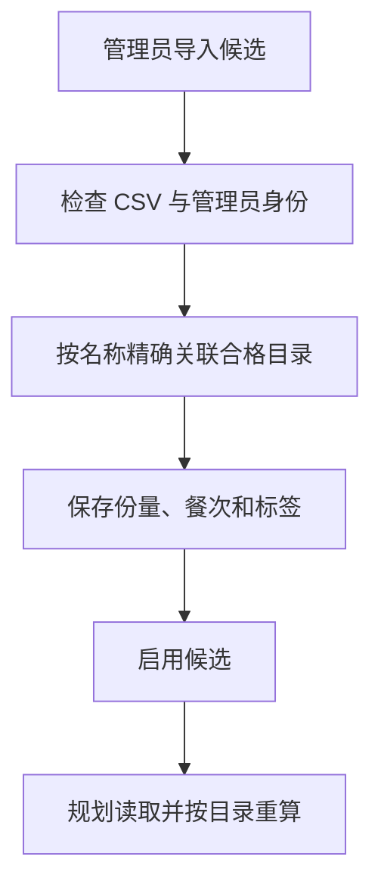

# 18 菜谱候选池：决定餐单有哪些菜可以选

[返回功能学习总目录](README.md)

管理员维护可用于餐单的成品菜候选，指定关联营养目录、单份重量、餐次、三维分类和口味标签。规划服务从这些候选里组合餐单。

## 1. 先看一个实际例子

管理员导入一份午餐候选：关联某道目录菜，单份 200g。规划时应该从该目录重算营养，而不是把 CSV 里的另一份热量当真相。

这个例子贯穿下面的执行过程。示例数据用于理解代码，不是线上测量或真实模型效果证明。

## 2. 为什么需要这样实现

目录回答“这道菜每 100g 有什么营养”，候选池回答“这道菜是否作为一份午餐候选、每份多少克”。两者混成一张随意输入营养的表，会出现两套不一致的数值。

## 3. 一张图看懂全过程



图展示主线，失败与追问分支在第 5 节对照阅读。

## 4. 跟着这个例子读代码

以下为当前源码的连续节选，省略外围处理，不能单独运行。每一步都说明调用位置和数据去向。

### 4.1 先检查整份 CSV 和重复批次

**收到什么**

API 已校验管理员命令结构，Service 解析待导入 CSV。

**代码在哪里**

[backend/app/admin/service.py](../../backend/app/admin/service.py) 的 `import_recipe_candidates`。

```python
preview = parse_recipe_candidate_csv(command.csv_text)
if preview.errors:
    raise RecipeCandidateCsvInvalid("文件存在错误，请修正全部错误后再导入。")
self._repository.acquire_recipe_candidate_lock(command_key)
batch_key = f"recipe-import-batch:{command_key}"
request_hash = self._request_hash("recipe-import", command.model_dump())
replay = self._repository.get_audit_event_by_command_key(batch_key)
if replay is not None:
    if replay.after_diff.get("request_hash") != request_hash:
        raise RecipeCandidateConflict(
            "Idempotency-Key was reused for a different command"
        )
    return RecipeCandidateImportResponse(
        imported_count=len(replay.after_diff["candidate_ids"]),
        candidate_ids=[
            uuid.UUID(value) for value in replay.after_diff["candidate_ids"]
        ],
    )
```

**为什么这样写**

有错误先拒绝，再通过批次键与内容摘要处理重复提交。同键不同内容不能复用原成功结果。

**处理后变成什么，交给谁**

得到校验过的行；重复同批返回原 candidate_ids，新批继续逐行解析目录。

> 语法小注：`command.model_dump()` 提取命令字段以计算请求摘要。

### 4.2 候选必须指向唯一合格目录

**收到什么**

本例行中有目录名称、午餐、200g 和做法口味标签。

**代码在哪里**

[backend/app/admin/service.py](../../backend/app/admin/service.py) 的 `import_recipe_candidates`。

```python
foods = self._repository.resolve_qualified_food_by_name(
    row.catalog_food_name
)
if len(foods) != 1:
    raise RecipeCandidateCsvInvalid(
        f"第 {row_number} 行“{row.catalog_food_name}”在当前合格目录中"
        "不存在或营养值不一致，无法自动创建或猜测关联。"
    )
food = foods[0]
candidate = ManagedRecipeCandidate(
    id=uuid.uuid4(),
    food_catalog_item_id=(
        food.id if food.source_kind == "food_catalog_item" else None
    ),
    catalog_publication_id=(
        food.id if food.source_kind == "catalog_publication" else None
    ),
    catalog_food_name=food.canonical_name,
    nutrition_catalog_version=food.nutrition_catalog_version,
    meal_slot=row.meal_slot,
    classification=row.classification.model_dump(mode="json") if row.classification else None,
    portion_grams=row.portion_grams,
    portion_description=row.portion_description,
    method_tags="|".join(row.method_tags),
    flavour_tags="|".join(row.flavour_tags),
    status=row.status,
    revision=1,
    created_at=now,
    updated_at=now,
)
```

**为什么这样写**

必须唯一匹配合格目录，找不到不能自动造营养条目。候选保存引用和份量，避免多维护一套会漂移的营养数值。

**处理后变成什么，交给谁**

构建 ManagedRecipeCandidate，保存后写审计。启用的候选才可能被规划读取；CSV 导入成功不代表任意候选都满足本次忌口。

> 语法小注：两种来源引用按 source_kind 选择，不是同时绑定两个营养来源。

### 4.3 使用候选时仍需构造与计算

**收到什么**

规划读取候选，本例是 200g 午餐，另有用户已确认偏好。

**代码在哪里**

[backend/app/planning/service.py](../../backend/app/planning/service.py) 的 `_build_managed_meal`。

以下为删减主逻辑，省略计数、别名忌口校验、份量调整和卡片组装：

```python
classification = candidate.classification
if classification is None or classification.role == "unknown" or not (
    classification.purpose in ("whole_meal", "both") if not allow_component else
    classification.purpose in ("component", "both") and classification.role in BUNDLE_ROLES
):
    stats.filtered += 1
    return None
calculation = self._nutrition_port.calculate_nutrition(
    NutritionCalculationInput(
        food_id=candidate.nutrition_item_id,
        catalog_version=candidate.catalog_version,
        grams=grams,
    )
)
```

**为什么这样写**

用途为整餐候选或两者皆可的菜可作为一餐；午餐、晚餐还可通过 `planning/bundles.py` 的 `BundlePool` 将主食、蛋白质菜、蔬菜各一项拼成一餐。数据库默认只返回整餐用途候选，组合路径才显式允许这三类组成菜品，领域服务再次检查；任意一个组成菜品都不能单独成为整餐。之后仍按目录每 100g 基准重算营养，并核对菜名、别名和已知标签中的忌口；不会从菜名猜完整配料。

**处理后变成什么，交给谁**

得到可用 `PlannedMeal` 或 `None`。可用项进入整日组合；失败项排除。最近历史轮换只能尽量减少重复，不保证候选有限时永不重复。

> 语法小注：`PlannedMeal | None` 表示既可能返回餐次，也可能返回“此项不可用”。

### 4.4 三个维度只维护一套分类

配餐用途有整餐候选、组合组成项、两者皆可、待确认；餐内角色包括主食、蛋白质菜、蔬菜菜肴、混合主餐、水果、奶及替代品、坚果种子、汤羹、饮品、其他配菜、待确认；食材标签支持固定类别多选。枚举与运行时校验见 [classification.py](../../backend/app/planning/classification.py)。

新模板共十一列：原七列后增加“配餐用途、餐内角色、食材标签、分类依据”。用途、角色、依据需一起填写，食材标签用 `|` 分隔；全部分类列为空时保留未分类。不带分类的七列文件仍可导入，旧八列角色模板明确拒绝。导出携带三个维度及依据，导入仍只新增候选，不覆盖已有记录，也不直接启用。

后台每行“编辑分类”入口为 [RecipeClassificationEditDialog.tsx](../../admin-frontend/src/features/recipes/RecipeClassificationEditDialog.tsx)，调用 `classification-review`。先检查管理员权限、版本及整批记录，再保存并写审计。历史快照不随分类修改。已废弃的旧角色按钮、接口、DTO 和数据库列均已删除，0031 迁移保护已有分类。

## 5. 换一种输入，会走哪条路

| 情况 | 判断与处理 | 应观察的结果 |
|---|---|---|
| 目录不存在或不唯一 | 导入拒绝 | 不猜关联 |
| 同批重发 | 返回原 ID | 不新增重复候选 |
| 已标成配菜或饮品 | 生成和换餐排除 | 不单独成为一餐 |
| 触犯忌口 | 构造失败或排除 | 不进入餐单 |

## 6. 自己验证一次

核心测试入口：

- [CSV 兼容与校验](../../backend/tests/admin/test_recipe_candidate_csv.py)：新分类往返、旧模板默认、空值与非法角色。
- [管理服务](../../backend/tests/admin/test_recipe_classification.py)：当前角色授权、审计、重试、整批失败与无效命令。
- [规划过滤](../../backend/tests/planning/test_component_eligibility.py)：即使替身仓储错误返回配菜，生成和换餐仍会拒绝，且不调用营养计算。
- [真实 PostgreSQL](../../backend/tests/integration/test_managed_recipe_candidate_repository.py)：两种目录来源均在分页前过滤，删列迁移保护已有分类。
- [后台交互](../../admin-frontend/tests/e2e/recipe-management.spec.ts)：旧模板、新分类导入、批量修改、刷新和审计。

2026-09-16 已执行相关规划、后台与图单测 259 项，真实 PostgreSQL 集成测试 31 项，另有迁移升级/降级与旧数据回填测试 1 项；后台定向组件测试 9 项、类型检查和构建通过。真实后台端到端流程 1 条通过，覆盖旧模板与新分类导入、启停删除、批量修改、刷新和审计。内置浏览器已在隔离环境通过实际登录 → 菜谱管理 → 设置角色 → 保存，看到成功提示与列表更新。测试使用隔离数据，尚未对真实菜谱库做分类；不能证明现有菜品已经有完整营养搭配。

## 7. 读完应该能回答什么

1. 目录和候选池分别保存什么？
2. 为什么份量属于候选？
3. 启用的菜为何还可能被本次规划排除？

源码阅读顺序：[admin/service.py](../../backend/app/admin/service.py) → [planning/service.py](../../backend/app/planning/service.py)。先跟本例函数走一遍，再展开旁支。


组合餐的本轮测试、真实页面验收和未验证范围见[生成一日餐单的组合餐验证](feature-daily-planning.md#组合餐验证2026-09-16)。分类完成只是必要条件，候选还必须启用、目录合格、符合已知忌口，并通过全天营养校验。

## 三维分类回填（2026-09-17）

新增能力是给旧候选补齐“配餐用途、餐内角色、已知食材标签”，并在后台展示。当前 `classification` 已直接驱动规划，废弃的候选 `meal_role` 已由0031删除。不能把名称回填当作人工核实完整配料，更不能用于过敏原排除的保证。

业务场景：旧“单独候选”只说明过去如何选择，不能证明一盘肉或一碗汤能独立成餐。新增维度保存在同一条候选上，不重新导入、不改份量营养、不重写历史。用途支持整餐候选、组合组成项、两者皆可、待确认；角色支持主食、蛋白质菜、蔬菜菜肴、混合主餐、水果、奶及替代品、坚果种子、汤羹、饮品、其他配菜、待确认。食材标签采用固定多选词表，无证据时为空，页面显示待确认。

执行流程：勾选候选 → “补齐三维分类” → 后端读取当前名称与参考资料生成预览 → 检查分类及待确认条目 → 填写原因保存 → 后端逐条锁定并校验版本 → 整批写入及审计 → 刷新列表。已分类条目会跳过，版本冲突整批拒绝；同一提交重试复用幂等键。

关键入口：

- `backend/app/admin/recipe_classification.py`：确定性名称线索与例外；例如鱼香肉丝不据此添加鱼标签，红烧鸡枞不添加禽肉标签。隐含配料不推断。
- `backend/app/admin/schemas.py`：三维词表和请求运行时校验；`Literal` 约束允许值，元组保存多选标签，拒绝重复标签和重复 ID。
- `AdminService.preview_recipe_classification` / `backfill_recipe_classification`：预览、当前 RBAC、版本检查、幂等、原子写入和审计。以排序后的 ID 加行锁，降低重叠批次死锁风险。
- `backend/migrations/versions/0030_recipe_classification.py`：只新增可空 JSONB 字段与对象约束；旧行默认未分类。
- `admin-frontend/src/features/recipes/RecipeClassificationDialog.tsx`：分类预览和原因表单。审计存储保留完整对象，公开审计只显示三个平铺摘要，兼容既有审计合同。

CSV 现为十一列，支持三个维度和依据；七列无分类格式仍接受，八列旧角色格式已停用。回填前后的完整证据保存在 `outputs/recipe-classification-review/`。现在支持逐项编辑分类并直接使用新配餐规则。

验证入口：`tests/admin/test_recipe_classification.py`、`tests/unit/test_recipe_classification_api.py`、`tests/integration/test_managed_recipe_candidate_repository.py`、后台 `RecipeListPage.test.tsx` 和 `tests/e2e/recipe-management.spec.ts`。覆盖名称例外、未知保留、字段校验、整批冲突不部分写入、审计、重试、持久化、刷新和再次跳过。


## 三维分类编辑及直接配餐（2026-09-17）

这次把已保存的分类接入真实选择链路，避免“页面有分类、算法仍用旧角色”。后台每行可编辑配餐用途、餐内角色和已知食材标签，并填写依据与修改原因；待确认不会被强制填成确定类别。

流程：编辑表单 → `classification-review` → 当前管理员权限校验 → 幂等及候选修订检查 → 原子保存分类和审计 → 新配餐查询按用途、角色筛选 → Service 再校验并检查已知食材类别忌口 → 原有营养工具计算、有限组合和全天校验 → 归档快照。旧历史不读取当前分类重算。

关键入口：

- `backend/app/planning/classification.py`：共享分类合同和已知食材类别词；`Literal` 限定枚举，`tuple` 保持已验证分类不可变。
- `backend/app/planning/repository.py:list_managed_recipe_candidates`：在数据库分页前筛掉未知分类和不适用用途，避免无效条目占满搜索预算。
- `backend/app/planning/service.py:_compose_managed_candidates`：`both` 同时提供整餐与组成项选择；`_build_managed_meal` 再次校验，防止宽松 Repository 绕过规则。
- `backend/app/planning/bundles.py:BundlePool`：组合位置读取新角色，仍仅午晚餐主食＋蛋白质菜＋蔬菜。
- `admin-frontend/src/features/recipes/RecipeClassificationEditDialog.tsx`：依据、原因、多个食材标签及稳定重试标识；冲突需刷新后重新编辑。

`classification` 的 JSONB 使用 `none_as_null=True`，让 Python 的 `None` 表示数据库空值，而非 JSON null，满足对象约束。分类结构版本继续为 `recipe-classification.v1`，选择规则提升为 `planning-selection.v11`。

验证入口新增 `tests/planning/test_classification_selection.py`，覆盖用途/角色矩阵、旧角色不再控制选择、未分类不回退以及已知食材标签忌口。后台组件覆盖编辑必填和失败重试复用标识；真实 PostgreSQL 覆盖分页前筛选。具体执行结果和开发库复核清单见 `outputs/recipe-classification-review/接入结果.md`。

0031 清理验证：开发库623条记录除旧角色列外全部字段不变；删列前快照与核查结果保存在 `outputs/recipe-classification-review/before-drop-legacy-role.json` 和 `drop-legacy-role-verification.json`。历史组合项的同名角色字段不是可变候选字段，不删除。
