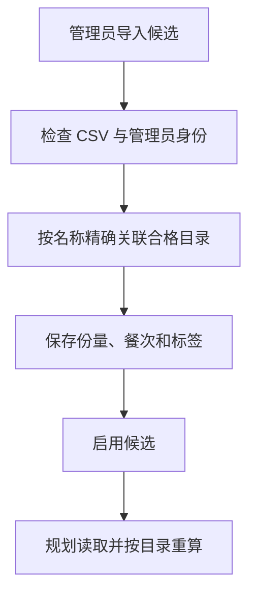

# 18 菜谱候选池：决定餐单有哪些菜可以选

[返回功能学习总目录](README.md)

管理员维护可用于餐单的成品菜候选，指定关联营养目录、单份重量、餐次和口味标签。规划服务从这些候选里组合餐单。

## 1. 核心能力

管理候选导入、启用、停用和删除；要求候选关联可计算目录，营养在使用时重算。

## 2. 业务背景

目录回答“这道菜每 100g 有什么营养”，候选池回答“这道菜是否作为一份午餐候选、每份多少克”。两者混成一张随意输入营养的表，会出现两套不一致的数值。

## 3. 整体执行流程



流程图展示主线；失败、追问等分支在下面对应步骤中说明。

## 4. 关键代码与设计理由

### 4.1 候选只引用营养来源

[service.py](../../backend/app/admin/service.py) 的 `import_recipe_candidates` 先解析 CSV，再按名称解析合格目录。找不到唯一条目时直接报错，不自动创建或猜一个关联。

字段结构见 [models.py](../../backend/app/planning/models.py) 的 `ManagedRecipeCandidate`：目录引用、版本、餐次、份量和标签，而不是复制一套营养值。

### 4.2 同一批导入重复发送不会反复新增

导入函数使用批次命令键和内容摘要。相同键与不同内容会冲突；相同命令重放复用结果。核心节选：

```python
preview = parse_recipe_candidate_csv(command.csv_text)
if preview.errors:
    raise RecipeCandidateCsvInvalid("文件存在错误，请修正全部错误后再导入。")
```

先完成格式检查，再进入带锁的导入与审计事务。候选启停和删除通过 `change_recipe_candidate_status`。

### 4.3 选中候选后仍需计算

[service.py](../../backend/app/planning/service.py) 的 `_compose_managed_candidates` 和 `_build_managed_meal` 使用份量与目录重新计算。历史轮换尽量减少最近三份计划的重复，并非无限保证每天都不重复：候选数量和约束会限制选择。

停用候选影响未来组合，不应改写已经存档的计划。

## 5. 难懂语法

`enumerate(rows, start=2)` 从 CSV 第 2 行开始编号，因为第 1 行是表头，报错才能与用户文件对应。`Idempotency-Key` 是同一次操作的身份标记，不是数据本身。

## 6. 怎么验证、怎么继续读

读 [test_managed_recipe_candidates.py](../../backend/tests/planning/test_managed_recipe_candidates.py)；数据库查询与资格检查见 [test_managed_recipe_candidate_repository.py](../../backend/tests/integration/test_managed_recipe_candidate_repository.py)。

读完试着回答：**目录已有每 100g 营养，为什么候选池还需要单份克数？**

---

本文解释当前代码行为；代码块为源码节选，省略外围逻辑，不能单独运行。示例用于讲解，不代表真实模型必然输出相同结果。测试执行范围见总目录。
