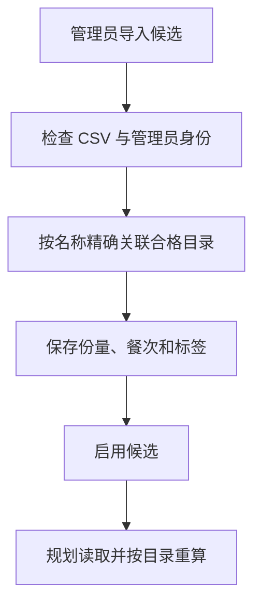

# 18 菜谱候选池：决定餐单有哪些菜可以选

[返回功能学习总目录](README.md)

管理员维护可用于餐单的成品菜候选，指定关联营养目录、单份重量、餐次和口味标签。规划服务从这些候选里组合餐单。

## 1. 先看一个实际例子

管理员导入一份午餐候选：关联某道目录菜，单份 200g。规划时应该从该目录重算营养，而不是把 CSV 里的另一份热量当真相。

这个例子贯穿下面的执行过程。示例数据用于理解代码，不是线上测量或真实模型效果证明。

## 2. 为什么需要这样实现

目录回答“这道菜每 100g 有什么营养”，候选池回答“这道菜是否作为一份午餐候选、每份多少克”。两者混成一张随意输入营养的表，会出现两套不一致的数值。

## 3. 一张图看懂全过程



图展示主线，失败与追问分支在第 5 节对照阅读。

## 4. 跟着这个例子读代码

以下为当前源码的连续节选，省略外围处理，不能单独运行。每一步都说明调用位置和数据去向。

### 4.1 先检查整份 CSV 和重复批次

**收到什么**

API 已校验管理员命令结构，Service 解析待导入 CSV。

**代码在哪里**

[backend/app/admin/service.py](../../backend/app/admin/service.py) 的 `import_recipe_candidates`。

```python
preview = parse_recipe_candidate_csv(command.csv_text)
if preview.errors:
    raise RecipeCandidateCsvInvalid("文件存在错误，请修正全部错误后再导入。")
self._repository.acquire_recipe_candidate_lock(command_key)
batch_key = f"recipe-import-batch:{command_key}"
request_hash = self._request_hash("recipe-import", command.model_dump())
replay = self._repository.get_audit_event_by_command_key(batch_key)
if replay is not None:
    if replay.after_diff.get("request_hash") != request_hash:
        raise RecipeCandidateConflict(
            "Idempotency-Key was reused for a different command"
        )
    return RecipeCandidateImportResponse(
        imported_count=len(replay.after_diff["candidate_ids"]),
        candidate_ids=[
            uuid.UUID(value) for value in replay.after_diff["candidate_ids"]
        ],
    )
```

**为什么这样写**

有错误先拒绝，再通过批次键与内容摘要处理重复提交。同键不同内容不能复用原成功结果。

**处理后变成什么，交给谁**

得到校验过的行；重复同批返回原 candidate_ids，新批继续逐行解析目录。

> 语法小注：`command.model_dump()` 提取命令字段以计算请求摘要。

### 4.2 候选必须指向唯一合格目录

**收到什么**

本例行中有目录名称、午餐、200g 和做法口味标签。

**代码在哪里**

[backend/app/admin/service.py](../../backend/app/admin/service.py) 的 `import_recipe_candidates`。

```python
foods = self._repository.resolve_qualified_food_by_name(
    row.catalog_food_name
)
if len(foods) != 1:
    raise RecipeCandidateCsvInvalid(
        f"第 {row_number} 行“{row.catalog_food_name}”在当前合格目录中"
        "不存在或营养值不一致，无法自动创建或猜测关联。"
    )
food = foods[0]
candidate = ManagedRecipeCandidate(
    id=uuid.uuid4(),
    food_catalog_item_id=(
        food.id if food.source_kind == "food_catalog_item" else None
    ),
    catalog_publication_id=(
        food.id if food.source_kind == "catalog_publication" else None
    ),
    catalog_food_name=food.canonical_name,
    nutrition_catalog_version=food.nutrition_catalog_version,
    meal_slot=row.meal_slot,
    portion_grams=row.portion_grams,
    portion_description=row.portion_description,
    method_tags="|".join(row.method_tags),
    flavour_tags="|".join(row.flavour_tags),
    status=row.status,
    revision=1,
    created_at=now,
    updated_at=now,
)
```

**为什么这样写**

必须唯一匹配合格目录，找不到不能自动造营养条目。候选保存引用和份量，避免多维护一套会漂移的营养数值。

**处理后变成什么，交给谁**

构建 ManagedRecipeCandidate，保存后写审计。启用的候选才可能被规划读取；CSV 导入成功不代表任意候选都满足本次忌口。

> 语法小注：两种来源引用按 source_kind 选择，不是同时绑定两个营养来源。

### 4.3 使用候选时仍需构造与计算

**收到什么**

规划读取候选，本例是 200g 午餐，另有用户已确认偏好。

**代码在哪里**

[backend/app/planning/service.py](../../backend/app/planning/service.py) 的 `_build_managed_meal`。

```python
def _build_managed_meal(self, candidate, preferences: PreferenceReview) -> PlannedMeal | None:
    calculation = self._nutrition_port.calculate_nutrition(NutritionCalculationInput(food_id=candidate.nutrition_item_id, catalog_version=candidate.catalog_version, grams=candidate.portion_grams))
    if calculation.action is not NutritionAction.PASS or calculation.food is None or calculation.nutrients is None:
        return None
    if any(value.casefold() in calculation.food.canonical_name.casefold() for value in preferences.exclusions):
        return None
    return PlannedMeal(slot=candidate.meal_slot, recipe_id=candidate.id, display_name=candidate.display_name, portion_description=candidate.portion_description, portion_grams=candidate.portion_grams, method_tags=candidate.method_tags, flavour_tags=candidate.flavour_tags, nutrients=PlanningNutritionValues(**calculation.nutrients.model_dump()))
```

**为什么这样写**

把候选转换成受控 recipe，再走同一个 _build_meal。后者按目录计算和检查排除项，不能直接相信列表里有这道菜就可用。

**处理后变成什么，交给谁**

得到可用 PlannedMeal 或 None。可用项进入整日组合；失败项排除。最近历史轮换只能尽量减少重复，不保证候选有限时永不重复。

> 语法小注：函数返回可选值时，`None` 表示这份候选不适合当前组合。

## 5. 换一种输入，会走哪条路

| 情况 | 判断与处理 | 应观察的结果 |
|---|---|---|
| 目录不存在或不唯一 | 导入拒绝 | 不猜关联 |
| 同批重发 | 返回原 ID | 不新增重复候选 |
| 触犯忌口 | 构造失败或排除 | 不进入餐单 |

## 6. 自己验证一次

在仓库根目录执行现有测试，使用后端已安装的测试环境：

```bash
cd backend
.venv/bin/python -m pytest tests/planning/test_managed_recipe_candidates.py -q
```

观察候选引用、按份量重算和餐次筛选，真实导入事务另看集成测试。把候选重量改变时，应重新计算而非读取旧总量。

本轮运行范围与结果见[总目录验证记录](README.md)。替身测试证明指定输入下的代码行为，不能替代真实模型效果、数据库并发或页面验收。

## 7. 读完应该能回答什么

1. 目录和候选池分别保存什么？
2. 为什么份量属于候选？
3. 启用的菜为何还可能被本次规划排除？

源码阅读顺序：[admin/service.py](../../backend/app/admin/service.py) → [planning/service.py](../../backend/app/planning/service.py)。先跟本例函数走一遍，再展开旁支。
