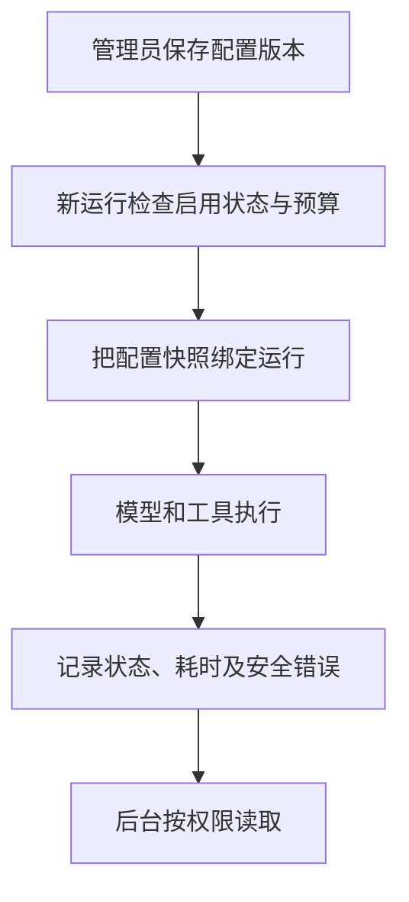

# 21 模型配置与运行记录：控制新调用，解释失败原因

[返回功能学习总目录](README.md)

管理员设置非密钥的运行策略，查看 Agent 运行状态、模型与工具调用次数、耗时、估算费用和失败阶段。新运行使用当时确认的配置快照。

## 1. 核心能力

版本化配置、检查新调用是否被允许、保留运行证据；公开最小必要字段，避免后台成为原始用户数据的导出入口。

## 2. 业务背景

一次分析失败，开发者需要知道是检索、模型还是保存环节出错；但不需要为了排查把原图、密码或完整对话展示在后台。配置改变后也要能解释旧运行用了哪一版。

## 3. 整体执行流程



流程图展示主线；失败、追问等分支在下面对应步骤中说明。

## 4. 关键代码与设计理由

### 4.1 配置修改追加版本

[service.py](../../backend/app/admin/service.py) 的 `configure_runtime` 检查管理员和预期版本，创建 `AgentRuntimeConfigVersion` 并写审计。旧运行保留旧快照，不因后来配置改变而失去解释依据。

后台输入是非密钥策略，实际供应商密钥仍来自环境配置；不能把后台配置表当密钥管理器。

### 4.2 调用前先检查是否允许

同文件 `admit_runtime_call`：

```python
if active is None or not active.enabled:
    raise RuntimeAdmissionDenied("reasoning provider is disabled")
if active.single_call_cap_usd <= 0 or active.period_cap_usd <= 0:
    raise RuntimeAdmissionDenied("reasoning provider has no callable budget")
```

这段检查启用状态和预算为正。不要把它单独解读成完整的周期累计扣费系统；每项费用限制是否覆盖实际调用，还要沿执行路径和测试核对。

### 4.3 后台只拿经过选择的运行字段

`_run_response` 返回状态、图版本、模型版本、次数、耗时、估算费用和失败类别；`_invocation_response` 返回节点名、尝试次数等窄字段。不会把整个 State 或原始 Provider 响应直接转 JSON。

`list_agent_runs`、`get_agent_run`、`get_run_metrics` 都检查管理员。费用字段标明估算值，不等同供应商最终账单。

## 5. 难懂语法

`expected_version` 用于检测并发修改，防止旧页面覆盖新配置。`model_dump(exclude=...)` 转为字典时排除指定字段；仅排除几个字段不自动保证安全，输出结构仍应明确列出。

## 6. 怎么验证、怎么继续读

读 [test_runtime_config_service.py](../../backend/tests/admin/test_runtime_config_service.py)、[test_admin_run_api.py](../../backend/tests/unit/test_admin_run_api.py)，检查版本、准入和输出字段限制。

读完试着回答：**为什么排查模型失败不需要暴露整段用户对话或供应商原始响应？**

---

本文解释当前代码行为；代码块为源码节选，省略外围逻辑，不能单独运行。示例用于讲解，不代表真实模型必然输出相同结果。测试执行范围见总目录。

### 重复命令引起的锁等待（2026-09-12 修复）

Agent 准入会锁定 thread/run。复用已有 command key 的分支也必须提交事务后返回：随后租约管理器使用独立连接锁定同一 run，如果前一个连接仍持锁，就会出现自己等待自己的情况。已完成运行的快捷返回也必须释放锁。

租约申请拥有独立 Session，放入工作线程执行；不能把同步 PostgreSQL 锁等待放在 HTTP 事件循环中。租约事务设置局部 5 秒锁等待上限，数据库繁忙返回 503；前端认证请求设置 15 秒截止时间，网络异常后结束加载，避免无限禁用登录按钮。超时不意味着服务端操作已撤销，不自动重放认证写请求。

验证包含：fake repository 提交次数、工作线程等待时事件循环可调度、真实 PostgreSQL 两个连接在命令复用后分别锁定 run/thread，以及认证请求超时转为 NETWORK_ERROR。该修复针对租约准入路径，不代表所有同步数据库调用已全面异步化。
