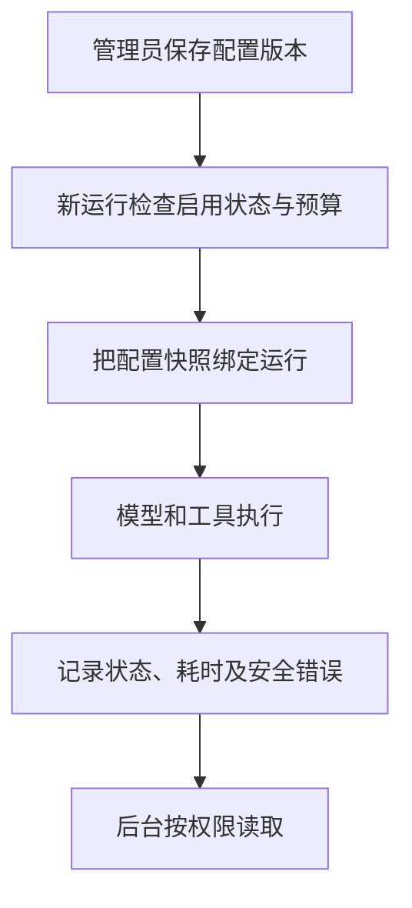

# 21 模型配置与运行记录：控制新调用，解释失败原因

[返回功能学习总目录](README.md)

管理员设置非密钥的运行策略，查看 Agent 运行状态、模型与工具调用次数、耗时、估算费用和失败阶段。新运行使用当时确认的配置快照。

## 1. 先看一个实际例子

管理员把运行配置从 v1 调到 v2。已经创建的运行仍要解释它用了 v1；新运行检查 v2 是否允许调用。管理员再查看一个失败运行，应该看到安全的失败阶段，而不是整段对话。

这个例子贯穿下面的执行过程。示例数据用于理解代码，不是线上测量或真实模型效果证明。

## 2. 为什么需要这样实现

一次分析失败，开发者需要知道是检索、模型还是保存环节出错；但不需要为了排查把原图、密码或完整对话展示在后台。配置改变后也要能解释旧运行用了哪一版。

## 3. 一张图看懂全过程



图展示主线，失败与追问分支在第 5 节对照阅读。

## 4. 跟着这个例子读代码

以下为当前源码的连续节选，省略外围处理，不能单独运行。每一步都说明调用位置和数据去向。

### 4.1 修改配置先检查版本

**收到什么**

后台提交非密钥策略、预期版本、原因与命令键。

**代码在哪里**

[backend/app/admin/service.py](../../backend/app/admin/service.py) 的 `configure_runtime`。

```python
payload = command.model_dump(exclude={"reason", "confirm"})
request_hash = self._request_hash(
    "runtime_config", payload | {"reason": command.reason}
)
actor = self.require_role(user_id=actor_user_id, required_role=UserRole.ADMIN)
self._repository.acquire_runtime_config_lock()
active = self._repository.get_active_runtime_config()
if expected_version is not None and expected_version != (
    active.version if active else 0
):
    raise RuntimeConfigConflict("runtime config version conflict")
existing = self._repository.get_runtime_config_command(command_key)
if existing is not None:
    if self._runtime_request_hash(existing) != request_hash:
        raise RuntimeConfigConflict(
            "runtime config idempotency key payload mismatch"
        )
    return self._runtime_response(existing)
```

**为什么这样写**

当前版本不匹配说明页面可能过期，不能覆盖别人修改。相同命令重放需内容一致。配置追加版本，密钥仍由环境提供。

**处理后变成什么，交给谁**

检查通过后创建新配置版本和审计；旧运行保留自己的快照，不会随当前配置变化而改写历史。

> 语法小注：`payload | {...}` 合并字典形成请求摘要输入。

### 4.2 新调用冻结一份准入快照

**收到什么**

用户发起新运行，进入准入逻辑；读取的是管理员已批准的当前配置，不要求普通用户成为管理员。

**代码在哪里**

[backend/app/admin/service.py](../../backend/app/admin/service.py) 的 `admit_runtime_call`。

```python
self._repository.acquire_runtime_config_lock()
active = self._repository.get_active_runtime_config()
if active is None or not active.enabled:
    raise RuntimeAdmissionDenied("reasoning provider is disabled")
if active.single_call_cap_usd <= 0 or active.period_cap_usd <= 0:
    raise RuntimeAdmissionDenied("reasoning provider has no callable budget")
response = self._runtime_response(active)
return RuntimeConfigAdmission(
    version_id=response.id, snapshot=self.runtime_snapshot(response)
)
```

**为什么这样写**

先检查启用和正预算，再绑定版本与安全快照。此段不是完整周期累计结算系统，不能仅凭两个正数检查就宣称费用绝不会越界。

**处理后变成什么，交给谁**

新运行携带配置快照进入 Provider 工厂与执行层；已有运行复用已绑定快照。来源明确，排查时能对上实际策略。

> 语法小注：snapshot 是本次认可字段的副本，不是指向可随时变化配置的引用。

### 4.3 返回经过挑选的运行信息

**收到什么**

管理员请求运行详情，前面的 get_agent_run 已重新检查角色。

**代码在哪里**

[backend/app/admin/service.py](../../backend/app/admin/service.py) 的 `_run_response`。

```python
invocations = (
    self._repository.list_run_invocations(run.id) if include_invocations else []
)
return AdminRunDetailResponse(
    id=run.id,
    status=cast(Literal["completed", "failed", "limit_reached"], run.status),
    graph_version=run.graph_version,
    model_provider=run.model_provider,
    model_version=run.model_version,
    graph_steps=run.graph_steps,
    model_calls=run.model_calls,
    tool_calls=run.tool_calls,
    elapsed_ms=run.elapsed_ms,
    estimated_cost_usd=run.estimated_cost_usd,
    failure_code=run.failure_code,
    failure_stage=run.failure_stage,
    failure_class=run.failure_class,
    finished_at=cast(datetime, run.finished_at),
    invocations=[
        self._invocation_response(invocation) for invocation in invocations
    ],
)
```

**为什么这样写**

显式列出状态、版本、次数、耗时、估算费用与安全错误，避免直接序列化整个 State。调用详情也经过窄响应结构投影。

**处理后变成什么，交给谁**

前端看到失败发生在哪一阶段等线索，不需要原图或完整模型回答。estimated_cost_usd 是估算，不是供应商结算账单。

> 语法小注：列表推导式逐个调用 _invocation_response，防止原始记录直接漏进响应。

## 5. 换一种输入，会走哪条路

| 情况 | 判断与处理 | 应观察的结果 |
|---|---|---|
| 过期页面提交配置 | 版本冲突 | 要求读取新版本 |
| 禁用或无可调用预算 | 准入拒绝 | 不进入新模型工作 |
| 查看失败详情 | 只选安全字段 | 不泄露原始用户内容 |

## 6. 自己验证一次

在仓库根目录执行现有测试，使用后端已安装的测试环境：

```bash
cd backend
.venv/bin/python -m pytest tests/admin/test_runtime_config_service.py tests/unit/test_admin_run_api.py -q
```

观察版本不可变、准入阻止与响应允许字段；测试不等于真实供应商账单核对。后面的锁等待说明保留了已有修复背景，不能把它当成本轮新执行的集成验收。

本轮运行范围与结果见[总目录验证记录](README.md)。替身测试证明指定输入下的代码行为，不能替代真实模型效果、数据库并发或页面验收。

## 7. 读完应该能回答什么

1. 为什么旧运行保留旧配置？
2. 准入预算检查证明到什么程度？
3. 排错需要哪些信息而不需要哪些原始数据？

源码阅读顺序：[admin/service.py](../../backend/app/admin/service.py)。先跟本例函数走一遍，再展开旁支。

## 补充：重复命令引起的锁等待


Agent 准入会锁定 thread/run。复用已有 command key 的分支也必须提交事务后返回：随后租约管理器使用独立连接锁定同一 run，如果前一个连接仍持锁，就会出现自己等待自己的情况。已完成运行的快捷返回也必须释放锁。

租约申请拥有独立 Session，放入工作线程执行；不能把同步 PostgreSQL 锁等待放在 HTTP 事件循环中。租约事务设置局部 5 秒锁等待上限，数据库繁忙返回 503；前端认证请求设置 15 秒截止时间，网络异常后结束加载，避免无限禁用登录按钮。超时不意味着服务端操作已撤销，不自动重放认证写请求。

验证包含：fake repository 提交次数、工作线程等待时事件循环可调度、真实 PostgreSQL 两个连接在命令复用后分别锁定 run/thread，以及认证请求超时转为 NETWORK_ERROR。该修复针对租约准入路径，不代表所有同步数据库调用已全面异步化。
