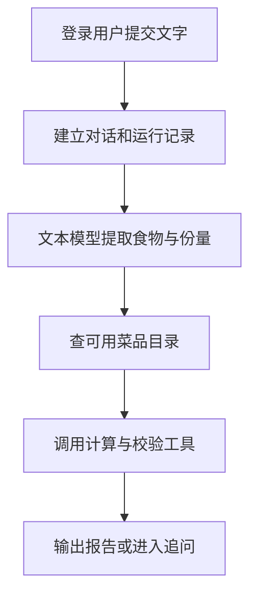

# 03 文字餐食分析：把一句话变成可计算的食物项

[返回功能学习总目录](README.md)

用户输入“我吃了米饭 100g”，系统让文本模型提取食物和份量，再查目录、计算并校验。结果可以是报告，也可以是请用户补充信息的问题。

## 1. 先看一个实际例子

小林输入“米饭 100g”。假设模型正确提取食物和重量，我们跟着它从自然语言走到目录计算，而不是直接把模型回答当报告。

这个例子贯穿下面的执行过程。示例数据用于理解代码，不是线上测量或真实模型效果证明。

## 2. 为什么需要这样实现

用户常说“一碗饭”，不会总按数据库字段填写。模型能帮助理解表达，但它给出的热量未必有依据，所以不能把模型回答直接当最终营养报告。

## 3. 一张图看懂全过程



图展示主线，失败与追问分支在第 5 节对照阅读。

## 4. 跟着这个例子读代码

以下为当前源码的连续节选，省略外围处理，不能单独运行。每一步都说明调用位置和数据去向。

### 4.1 调用模型提取字段

**收到什么**

Service 已建立对话和运行，文字放在 State 的 messages[0]，解析阶段进入此函数。

**代码在哪里**

[backend/app/agent/graph.py](../../backend/app/agent/graph.py) 的 `_parse_with_one_transient_retry`。

```python
current = state
for attempt in range(2):
    if current.budget.model_calls >= 4:
        return None, _limit_state(current)
    current = current.model_copy(
        update={"budget": current.budget.model_copy(update={"model_calls": current.budget.model_calls + 1})}
    )
    try:
        parsed = await self._provider.parse_meal(
            ParseMealRequest(meal_description=current.messages[0])
        )
    except ProviderCallError as error:
        if error.kind is ProviderFailureKind.TRANSIENT and attempt == 0:
            continue
        return None, current.model_copy(
            update={"status": AgentRuntimeStatus.FAILED, "next_action": AgentNextAction.STOP}
        )
```

**为什么这样写**

调用前计预算，统一 Provider 负责供应商通信。临时失败有限重试，其他失败停止；图层次数不等于供应商总 HTTP 次数。

**处理后变成什么，交给谁**

成功得到 ParseMealResult；失败得到停止状态。Provider 校验字段，但仍不能证明识别事实正确。

> 语法小注：`await` 等待结果；`range(2)` 限制这一层尝试次数。

### 4.2 转换为待处理的食物项

**收到什么**

本例返回菜名米饭、100g 和食物项 ID。

**代码在哪里**

[backend/app/agent/graph.py](../../backend/app/agent/graph.py) 的 `MealAnalysisGraph.ainvoke`。

```python
items = tuple(
    StateMealItem(
        item_id=item.item_id,
        normalized_name=item.food_name,
        grams=item.grams,
        portion_description=item.quantity_text,
        input_version="v1",
        is_dirty=True,
        search_query=item.catalog_query or item.food_name,
    )
    for item in parsed.value.items
)
```

**为什么这样写**

先保存查询信息，不直接认定目录 ID。is_dirty 表示还没核对目录和计算；独立 item_id 让追问能定位到具体菜。

**处理后变成什么，交给谁**

得到米饭、100g 的状态项，交给 _resolve；原文明确但模型漏提的重量可能由后续辅助规则补回。

> 语法小注：`tuple(... for item in ...)` 逐项转换成序列。

### 4.3 目录确定后计算并校验

**收到什么**

此前检索已选定合格 food_id 和 catalog_version。

**代码在哪里**

[backend/app/agent/graph.py](../../backend/app/agent/graph.py) 的 `MealAnalysisGraph._resolve`。

```python
calculation = self._tools.calculate_nutrition(
    NutritionCalculationInput(
        food_id=selected_food_id,
        catalog_version=catalog_version,
        grams=item.grams,
        portion_description=item.portion_description,
    )
)
tool_calls += 1
summaries.append(_summary(item.item_id, "calculate", calculation.action.value, calculation))
if tool_calls >= 12:
    return _limit_state(state)
validation = self._tools.validate_nutrition_result(NutritionValidationInput(calculation=calculation))
tool_calls += 1
summaries.append(_summary(item.item_id, "validate", validation.action.value, validation))
```

**为什么这样写**

计算和校验分开；有数值不代表通过校验。工具将调用交给 NutritionService，图不自己写 SQL，也不让模型覆盖结果。

**处理后变成什么，交给谁**

允许的通过或警告结果写入食物项并组合报告，其他结果进入补充或停止路径。这里输出的数值来源是目录与公式。

> 语法小注：`tool_calls += 1` 累计工具调用，供后续上限检查。

## 5. 换一种输入，会走哪条路

| 情况 | 判断与处理 | 应观察的结果 |
|---|---|---|
| 缺重量 | 先生成重量问题 | 等待用户 |
| 多候选 | 不自动选择 | 确认后计算 |
| 预算耗尽 | 限制状态 | 停止调用 |

## 6. 自己验证一次

在仓库根目录执行现有测试，使用后端已安装的测试环境：

```bash
cd backend
.venv/bin/python -m pytest tests/unit/test_runtime_foundation.py -q
```

重点看 test_graph_aggregates_questions_and_resume_does_not_repeat_parse 和 test_graph_partial_and_correction_recalculate_only_dirty_item，观察追问不重复解析，以及只重算变化项。

本轮运行范围与结果见[总目录验证记录](README.md)。替身测试证明指定输入下的代码行为，不能替代真实模型效果、数据库并发或页面验收。

## 7. 读完应该能回答什么

1. 模型字段与最终数值之间隔着什么？
2. 为什么给食物项独立 ID？
3. 状态和业务运行记录分别保存什么？

源码阅读顺序：[agent/graph.py](../../backend/app/agent/graph.py)。先跟本例函数走一遍，再展开旁支。

当前 MealAnalysisGraph 是自定义状态机，应用服务手动使用 LangGraph Checkpoint；不是用 StateGraph.add_node 编译的节点图。
