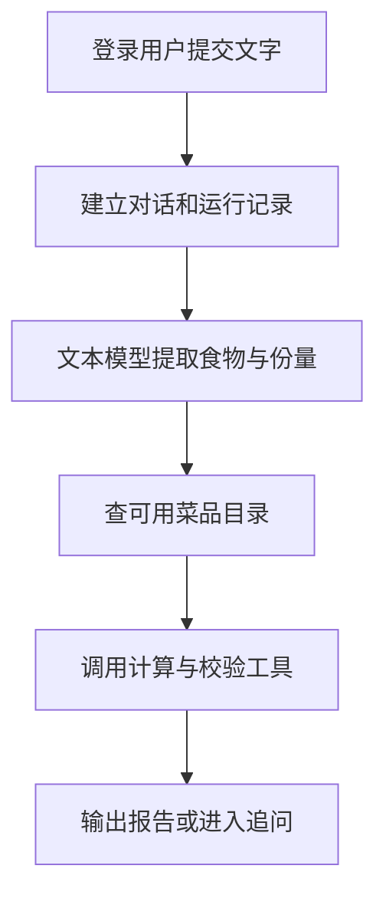

# 03 文字餐食分析：把一句话变成可计算的食物项

[返回功能学习总目录](README.md)

用户输入“我吃了米饭 100g”，系统让文本模型提取食物和份量，再查目录、计算并校验。结果可以是报告，也可以是请用户补充信息的问题。

## 1. 核心能力

把自然语言转换成结构化食物项，并组织工具调用。模型负责理解文字，后端决定哪些数据能计算以及下一步做什么。

## 2. 业务背景

用户常说“一碗饭”，不会总按数据库字段填写。模型能帮助理解表达，但它给出的热量未必有依据，所以不能把模型回答直接当最终营养报告。

## 3. 整体执行流程



流程图展示主线；失败、追问等分支在下面对应步骤中说明。

## 4. 关键代码与设计理由

### 4.1 先分清对话和本次运行

入口：[api.py](../../backend/app/agent/api.py)；业务编排：[service.py](../../backend/app/agent/service.py)。服务先检查用户归属。`thread_id` 表示这一段对话，`run_id` 表示一次处理；回答追问可以沿用对话，但形成新的运行记录。

### 4.2 模型只把文字拆成字段

位置：[graph.py](../../backend/app/agent/graph.py) 的 `_parse_with_one_transient_retry`。

```python
parsed = await self._provider.parse_meal(
    ParseMealRequest(meal_description=current.messages[0])
)
```

Provider 是统一模型接口，可换成真实模型或测试替身。[deepseek.py](../../backend/app/providers/reasoning/deepseek.py) 的 `parse_meal` 用 `ParsedMealDTO.model_validate(payload)` 检查输出结构。字段合格不等于识别事实一定正确。

### 4.3 后端组织工具，不让模型自由写数值

`MealAnalysisGraph.ainvoke` 把解析结果变成 `StateMealItem`，保存菜名、克数和待处理标记。`_resolve` 逐项执行检索、计算和校验；缺重量就追问，无法匹配的项可能被标记为未计入。

工具转接在 [tools.py](../../backend/app/agent/tools.py)，领域规则在 [service.py](../../backend/app/nutrition/service.py)。图不会直接查询数据库。

### 4.4 当前图实际如何执行

当前 `MealAnalysisGraph` 是自定义状态机，Service 手动读写 LangGraph Checkpoint，不是用 `StateGraph.add_node` 编译出的节点图。临时模型错误最多局部重试一次，未知处理结果不会盲目重发。

`_parse_with_one_transient_retry` 检查模型次数和费用，`_resolve` 检查工具次数，`_finish_transition` 检查耗时。存在限制代码不等于所有外部故障下都绝不会重复计费。

## 5. 难懂语法

`async def` 定义可等待网络操作的函数；`await` 等待调用结果。`model_validate` 校验外部数据结构；`model_copy(update=...)` 创建更新后的副本，不能替代完整的输入校验。

## 6. 怎么验证、怎么继续读

读 [test_runtime_foundation.py](../../backend/tests/unit/test_runtime_foundation.py)、[test_agent_multimodal.py](../../backend/tests/unit/test_agent_multimodal.py) 的状态和失败用例。Fake Provider 验证流程，真实识别质量另需样本评测。下一篇：[图片识别](feature-image-analysis.md)。

读完试着回答：**模型已经理解“米饭 100g”，为什么还要查询目录？**

---

本文解释当前代码行为；代码块为源码节选，省略外围逻辑，不能单独运行。示例用于讲解，不代表真实模型必然输出相同结果。测试执行范围见总目录。
