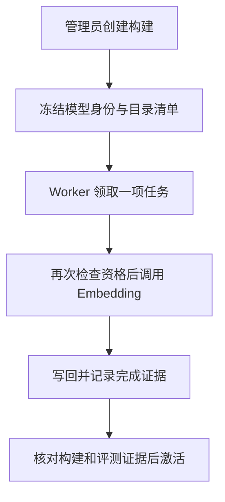

# 19 向量索引管理：把目录准备成可检索的数据

[返回功能学习总目录](README.md)

把受控目录名称转成向量写入数据库，管理构建、失败重试和激活。它是检索的数据准备过程，不是训练一个新的大模型。

## 1. 核心能力

冻结待构建清单，让后台任务按租约执行 Embedding，核对完成证据后才切换可用向量空间。

## 2. 业务背景

换模型或目录版本后，新向量可能还没全部准备好。若一部分新向量、一部分旧向量混着搜索，结果难以解释。因此构建与正式启用要分开。

## 3. 整体执行流程



流程图展示主线；失败、追问等分支在下面对应步骤中说明。

## 4. 关键代码与设计理由

### 4.1 先冻结这次到底构建什么

[service.py](../../backend/app/admin/service.py) 的 `create_catalog_vector_space_build` 绑定模型、维度、版本和清单。快照固定后，后来新增的目录不会悄悄被算进“这次已全部完成”。不同空间的向量不能随便混搜。

### 4.2 后台任务一次领一项

[index_worker.py](../../backend/app/nutrition/index_worker.py) 的 `run_once`：

```python
claimed = self._claim()
if claimed is None:
    self._reconcile_reused_space_if_scoped()
    return "idle"
document_name = self._recheck_before_io(claimed)
if document_name is None:
    return "cancelled"
```

领取后还要在外部调用前重查资格，已失格就取消。之后 Provider 把受控名称编码成向量；写回要核对租约及对象状态，失败按分类记录并有限重试。

### 4.3 完成构建不等于可以激活

`activate_vector_space` 在管理员校验和锁保护下，读取发布评测文件、目标空间及对应 build，执行 `_validate_activation_build`。清单、完成证据和实际向量都一致，才更新激活指向并写审计。

这篇说明激活条件的代码，不代表本次已运行真实 Embedding、完成构建或通过当前发布评测。查询端如何用向量，见[菜品检索](feature-food-search.md)。

## 5. 难懂语法

租约是“某个 Worker 在一段时间内拥有处理权”的记录，用于多进程协调。`text_type="document"` 表示编码目录条目；查询侧用 `query` 表示用户查询。

## 6. 怎么验证、怎么继续读

读 [test_embedding_provider.py](../../backend/tests/unit/test_embedding_provider.py) 检查 Provider 结构；实际任务领取、资格变化和写回见 [test_catalog_embedding_jobs.py](../../backend/tests/integration/test_catalog_embedding_jobs.py)。

读完试着回答：**为什么后台显示任务完成，还不能省掉激活前的证据核对？**

---

本文解释当前代码行为；代码块为源码节选，省略外围逻辑，不能单独运行。示例用于讲解，不代表真实模型必然输出相同结果。测试执行范围见总目录。
