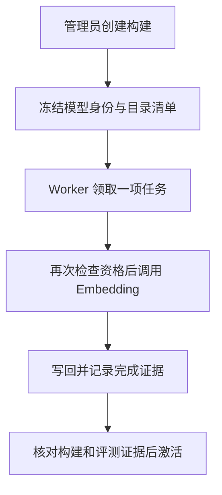

# 19 向量索引管理：把目录准备成可检索的数据

[返回功能学习总目录](README.md)

把受控目录名称转成向量写入数据库，管理构建、失败重试和激活。它是检索的数据准备过程，不是训练一个新的大模型。

## 1. 先看一个实际例子

管理员建立一批目录向量：先固定此次清单，再让后台逐项计算，最后验证证据后激活。期间新增的菜不能偷偷算作这批已经完成的内容。

这个例子贯穿下面的执行过程。示例数据用于理解代码，不是线上测量或真实模型效果证明。

## 2. 为什么需要这样实现

换模型或目录版本后，新向量可能还没全部准备好。若一部分新向量、一部分旧向量混着搜索，结果难以解释。因此构建与正式启用要分开。

## 3. 一张图看懂全过程



图展示主线，失败与追问分支在第 5 节对照阅读。

## 4. 跟着这个例子读代码

以下为当前源码的连续节选，省略外围处理，不能单独运行。每一步都说明调用位置和数据去向。

### 4.1 冻结此次任务范围

**收到什么**

模型、维度、适配器和检索版本已校验，空间已定位；下面开始冻结当前合格名称。

**代码在哪里**

[backend/app/admin/service.py](../../backend/app/admin/service.py) 的 `create_catalog_vector_space_build`。

```python
names = self._repository.list_current_eligible_catalog_search_names()
manifest = [
    {"publication_id": str(name.publication_id), "name_id": str(name.id),
     "search_version_id": str(name.search_version_id), "name_kind": name.name_kind}
    for name in names
]
snapshot_hash = hashlib.sha256(
    json.dumps(manifest, ensure_ascii=False, sort_keys=True, separators=(",", ":")).encode("utf-8")
).hexdigest()
build = self._repository.add_catalog_vector_space_build(CatalogVectorSpaceBuild(
    id=uuid.uuid4(), vector_space_id=space.id, requested_by=str(actor.id),
    reason=command.reason, command_key=normalized_key, retrieval_version=command.retrieval_version, snapshot_manifest=manifest,
    snapshot_hash=snapshot_hash, expected_name_count=len(names), requested_at=now,
))
```

**为什么这样写**

保存清单与 hash，明确此次到底要处理什么。不能激活时随便选择“最新任务”，否则评测对象和实际向量可能不是同一批。

**处理后变成什么，交给谁**

得到 build 与预期名称数量，后续为清单建立任务。构建只安排工作，此时不代表 Embedding 已执行。

> 语法小注：`sort_keys=True` 让同结构生成稳定 JSON，有助于内容摘要一致。

### 4.2 Worker 领取任务并调用 Embedding

**收到什么**

后台循环调用 run_once，本次最多处理一项到期任务。

**代码在哪里**

[backend/app/nutrition/index_worker.py](../../backend/app/nutrition/index_worker.py) 的 `CatalogEmbeddingWorker.run_once`。

```python
claimed = self._claim()
if claimed is None:
    self._reconcile_reused_space_if_scoped()
    return "idle"
document_name = self._recheck_before_io(claimed)
if document_name is None:
    return "cancelled"
try:
    result = asyncio.run(
        self._provider.embed(
            EmbeddingRequest(
                names=(document_name,),
                text_type="document",
                model_alias="catalog-embedding-worker-v1",
            )
        )
    )
except ProviderCallError as error:
    return self._record_provider_failure(claimed, error)
except (ConnectionError, TimeoutError):
    return self._record_transient_failure(claimed, "provider_unavailable")
return self._write_back(claimed, tuple(result.vectors[0].values))
```

**为什么这样写**

领取后再检查资格；失格就取消。Provider 将受控名称编码为 document 向量，异常分类记录，写回时还要检查租约和对象状态。

**处理后变成什么，交给谁**

返回 idle、cancelled 或本次处理结果；向量写回数据库并留下完成证据。它是在准备检索索引，不是在训练模型。

> 语法小注：`asyncio.run` 在这个同步 Worker 方法内运行异步 Provider，不能随意搬到已有事件循环中嵌套调用。

### 4.3 激活前重新核对构建证据

**收到什么**

管理员提交目标空间和明确 build_id，还要提供原因和命令键；前面已检查权限并加锁。

**代码在哪里**

[backend/app/admin/service.py](../../backend/app/admin/service.py) 的 `activate_vector_space`。

```python
release = self._load_phase063_release(release_path)
space = self._repository.get_catalog_vector_space_by_id(vector_space_id)
if space is None:
    raise CatalogVectorSpaceActivationConflict("target vector space is missing")
if any(getattr(space, field) != value for field, value in _PHASE063_RELEASE_SPACE.items()):
    raise CatalogVectorSpaceActivationConflict("target vector space does not match frozen release identity")

build = self._repository.get_catalog_vector_space_build_for_activation(build_id)
if build is None or build.vector_space_id != vector_space_id:
    raise CatalogVectorSpaceActivationConflict("target build does not belong to target vector space")
self._validate_activation_build(build=build, vector_space_id=vector_space_id)
```

**为什么这样写**

发布文件、目标空间身份与 build 必须一致，再验证完成清单和 live 数据。只提交一个“PASS”字符串不能绕过后端检查。

**处理后变成什么，交给谁**

检查通过才创建批准记录、切换当前向量指向并提交审计；不符合就拒绝。本文不代表已执行真实构建或发布评测。

> 语法小注：空间定义模型与维度等身份，build 定义一次固定任务范围，两者不能互换。

## 5. 换一种输入，会走哪条路

| 情况 | 判断与处理 | 应观察的结果 |
|---|---|---|
| 领取后目录失格 | 执行前重查 | 取消 |
| Provider 故障 | 按分类记录 | 有限重试而非无限循环 |
| build 与空间不符 | 激活拒绝 | 旧空间继续有效 |

## 6. 自己验证一次

在仓库根目录执行现有测试，使用后端已安装的测试环境：

```bash
cd backend
.venv/bin/python -m pytest tests/unit/test_embedding_provider.py -q
```

这条命令检查 Embedding DTO 与 Provider 边界，不覆盖数据库租约和激活。后两者需要 tests/integration/test_catalog_embedding_jobs.py 等真实 PostgreSQL 用例。

本轮运行范围与结果见[总目录验证记录](README.md)。替身测试证明指定输入下的代码行为，不能替代真实模型效果、数据库并发或页面验收。

## 7. 读完应该能回答什么

1. 空间与 build 的区别？
2. 为什么任务开始前还要重查资格？
3. 为什么完成数量不足以证明可以激活？

源码阅读顺序：[admin/service.py](../../backend/app/admin/service.py) → [nutrition/index_worker.py](../../backend/app/nutrition/index_worker.py)。先跟本例函数走一遍，再展开旁支。
