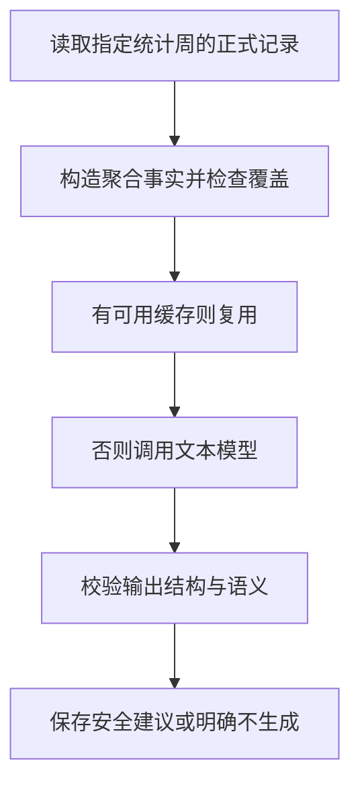

# 16 AI 每周复盘：先计算事实，再让模型解释

[返回功能学习总目录](README.md)

后端先汇总一周正式记录，确认记录覆盖足够，再让文本模型给出有限的文字建议。统计数值与建议分开，模型不能重写事实。

## 1. 先看一个实际例子

小林查看一周复盘。假设该周记录覆盖 4 天、共 8 餐，满足当前门槛。后端先汇总这些事实，再让模型写少量受限建议；再次打开时尝试复用缓存。

这个例子贯穿下面的执行过程。示例数据用于理解代码，不是线上测量或真实模型效果证明。

## 2. 为什么需要这样实现

记录不够时写整周结论会误导用户。即使记录足够，数值也应由后端先算好，模型只负责有限的文字解释。

## 3. 一张图看懂全过程



图展示主线，失败与追问分支在第 5 节对照阅读。

## 4. 跟着这个例子读代码

以下为当前源码的连续节选，省略外围处理，不能单独运行。每一步都说明调用位置和数据去向。

### 4.1 先判断数据足不足

**收到什么**

请求带用户与可选周开始日期。当前默认取本地当前周；显式指定历史周必须是已经结束的周一开始的自然周。

**代码在哪里**

[backend/app/dashboard/service.py](../../backend/app/dashboard/service.py) 的 `get_public_weekly_review`。

```python
today, start = self._review_window(user_id=user_id, week_start=week_start)
facts = self._facts(user_id=user_id, week_start=start)
base = dict(
    week_start=start,
    week_end=start + timedelta(days=6),
    coverage_days=facts.coverage_days,
    meal_count=facts.meal_count,
    totals=facts.totals,
)
if facts.coverage_days < 4 or facts.meal_count < 8:
    return WeeklyReviewPublicResponse(status="insufficient_coverage", suggestions=(), **base)
```

**为什么这样写**

先计算事实并检查覆盖，少于 4 天或 8 餐不请求模型。不能从一顿饭推断整周习惯。这里的门槛是项目政策，不是医学标准。

**处理后变成什么，交给谁**

本例通过，已有 coverage_days、meal_count 和 totals；下一步形成包含事实摘要和版本的缓存键。记录不够返回 insufficient_coverage，不强行编建议。

> 语法小注：`**base` 把已验证的基础统计字段展开进响应。

### 4.2 模型只解释经过校验的事实

**收到什么**

服务未找到可复用缓存，Graph 已构造并校验事实请求，检查启用与预算后进入调用循环。

**代码在哪里**

[backend/app/dashboard/weekly_review_graph.py](../../backend/app/dashboard/weekly_review_graph.py) 的 `WeeklyReviewGraph.ainvoke`。

```python
async with asyncio.timeout(remaining):
    result = await self._provider.generate_weekly_review(request)
calls += 1
cost += result.metadata.usage.cost_usd
if result.metadata.usage.completion_tokens > 360 or cost > self._config.per_run_cost_cap_usd:
    return self._abstain("BUDGET_DENIED", calls, facts_digest, metadata)
validate_weekly_review_semantics(result.value, request.facts)
```

**为什么这样写**

用剩余时间限制调用，累计次数和费用，返回后先校验语义。模型不能接管数据库统计，也不需要看整段聊天或身体资料。

**处理后变成什么，交给谁**

返回值通过结构与语义检查才形成建议；未知调用结果不盲目重试，格式或安全失败也只有有限修正机会。

> 语法小注：`asyncio.timeout` 对等待设截止；monotonic 适合计算经过时间。

### 4.3 不允许模型扩展事实或添加数字

**收到什么**

模型输出已符合字段结构，还需检查类别与文字内容。

**代码在哪里**

[backend/app/dashboard/weekly_review_graph.py](../../backend/app/dashboard/weekly_review_graph.py) 的 `validate_weekly_review_semantics`。

```python
if not facts.coverage_sufficient or output.disclaimer != _SAFE_DISCLAIMER:
    raise ValueError("weekly review cannot produce advice")
categories = [item.category for item in output.suggestions]
if len(categories) != len(set(categories)) or not set(categories) <= set(facts.allowed_patterns):
    raise ValueError("weekly review categories exceed deterministic facts")
joined = " ".join(item.text for item in output.suggestions).casefold()
if any(char.isdigit() for char in joined) or any(term in joined for term in _SAFETY_TERMS):
    raise ValueError("weekly review contains prohibited language")
```

**为什么这样写**

类别必须来自允许事实且不重复；文本含数字或禁用措辞会失败。合法 JSON 也可能胡编，结构校验不是最后一道检查。

**处理后变成什么，交给谁**

合格建议由服务缓存并返回；不合格最终可能 safety_abstain。缓存绑定用户、周、事实及版本，输入变化不能复用旧结论。

> 语法小注：`set(categories)` 去重，集合包含关系限制允许范围。

## 5. 换一种输入，会走哪条路

| 情况 | 判断与处理 | 应观察的结果 |
|---|---|---|
| 覆盖不足 | 直接返回不足状态 | 不调用模型 |
| 同事实同版本 | 读取缓存 | 减少重复调用 |
| 模型编数字 | 语义校验拒绝 | 不展示未经校验文本 |

## 6. 自己验证一次

在仓库根目录执行现有测试，使用后端已安装的测试环境：

```bash
cd backend
.venv/bin/python -m pytest tests/dashboard/test_weekly_review_graph.py tests/dashboard/test_weekly_review_cache_service.py -q
```

对照覆盖、缓存命中和安全拒绝，观察模型调用次数与返回状态。替身建议合格不代表真实模型建议始终有效。

本轮运行范围与结果见[总目录验证记录](README.md)。替身测试证明指定输入下的代码行为，不能替代真实模型效果、数据库并发或页面验收。

## 7. 读完应该能回答什么

1. 哪些事实是代码算的？
2. 为什么 JSON 合法仍要检查内容？
3. 缓存为什么包含版本？

源码阅读顺序：[dashboard/service.py](../../backend/app/dashboard/service.py) → [dashboard/weekly_review_graph.py](../../backend/app/dashboard/weekly_review_graph.py)。先跟本例函数走一遍，再展开旁支。
