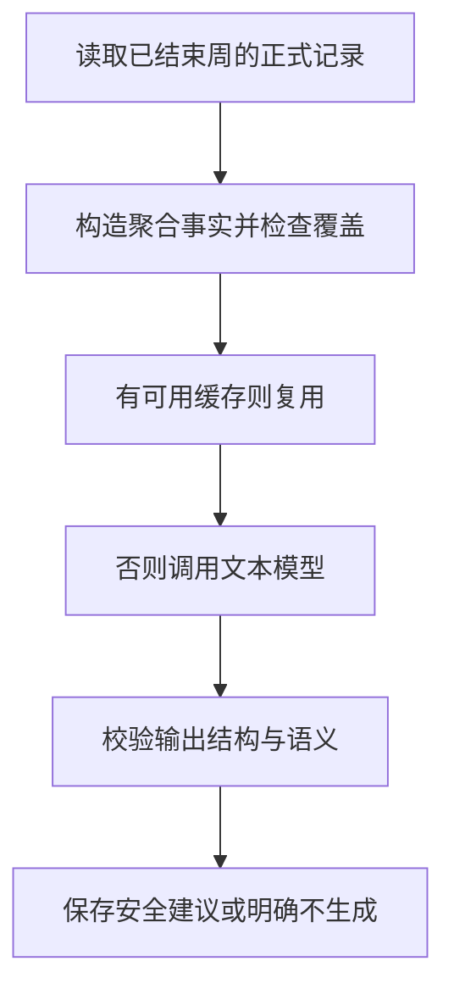

# 16 AI 每周复盘：先计算事实，再让模型解释

[返回功能学习总目录](README.md)

后端先汇总一周正式记录，确认记录覆盖足够，再让文本模型给出有限的文字建议。统计数值与建议分开，模型不能重写事实。

## 1. 核心能力

限制模型能看到的事实、能输出的建议类别与长度；检查内容是否越界；输入与版本一致时复用缓存，减少重复调用。

## 2. 业务背景

如果一周只记了一顿饭，模型写出“你本周一直怎样吃”就是无依据推断。即便记录足够，也应先算统计，再让模型解释，而不是把原始历史随意丢给它。

## 3. 整体执行流程



流程图展示主线；失败、追问等分支在下面对应步骤中说明。

## 4. 关键代码与设计理由

### 4.1 记录不够就不调用模型

[service.py](../../backend/app/dashboard/service.py) 的 `get_public_weekly_review`：

```python
if facts.coverage_days < 4 or facts.meal_count < 8:
    return WeeklyReviewResponse(facts=facts, abstention_code="INSUFFICIENT_COVERAGE")
```

这是当前项目的覆盖门槛。响应仍可包含已有统计，但不会因此强行生成建议。

### 4.2 模型只接收最小事实

[weekly_review_graph.py](../../backend/app/dashboard/weekly_review_graph.py) 的 `_request_from_facts` 用 DTO 校验事实，`ainvoke` 调 `generate_weekly_review`。最多两次调用，并有超时、预算和输出 token 检查；具体限制也受配置约束。

该功能确实使用文本模型，与当前确定性餐单组合不同。请求不需要用户完整对话、图片或身体资料。

### 4.3 语法合法还不够，内容也要过关

同文件 `validate_weekly_review_semantics` 检查建议类别必须来自允许事实，类别不能重复，文字不允许包含数字或禁用措辞：

```python
joined = " ".join(item.text for item in output.suggestions).casefold()
if any(char.isdigit() for char in joined) or any(term in joined for term in _SAFETY_TERMS):
    raise ValueError("weekly review contains prohibited language")
```

因此模型不能夹带自己编的热量数字。校验失败只允许有限修正；仍不合格时返回不生成建议的状态，不给用户展示未经检查的答案。

### 4.4 缓存绑定事实和版本

`WeeklyReviewCacheKey` 包含用户、周开始日期、事实摘要以及图、提示词、结构和运行配置版本。事实变了或版本变了，需要新的结果；不是只看“这周曾经生成过”就永久复用。

## 5. 难懂语法

DTO 是一份规定字段的传输结构。`facts_digest` 是事实内容的摘要，用于判断输入是否变化。`set` 去重，可检查类别是否重复或超出允许集合。

## 6. 怎么验证、怎么继续读

读 [test_weekly_review_graph.py](../../backend/tests/dashboard/test_weekly_review_graph.py)、[test_weekly_review_cache_service.py](../../backend/tests/dashboard/test_weekly_review_cache_service.py) 与 [test_weekly_review_eval.py](../../backend/tests/evals/test_weekly_review_eval.py)。它们检查拒绝、预算、缓存与输出限制；不能据此宣称真实建议总是有用。

读完试着回答：**为什么让模型只写文字建议，还要专门检查它有没有编数字？**

---

本文解释当前代码行为；代码块为源码节选，省略外围逻辑，不能单独运行。示例用于讲解，不代表真实模型必然输出相同结果。测试执行范围见总目录。
